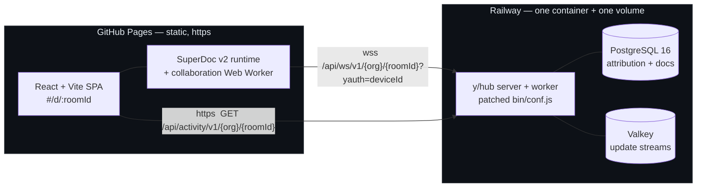
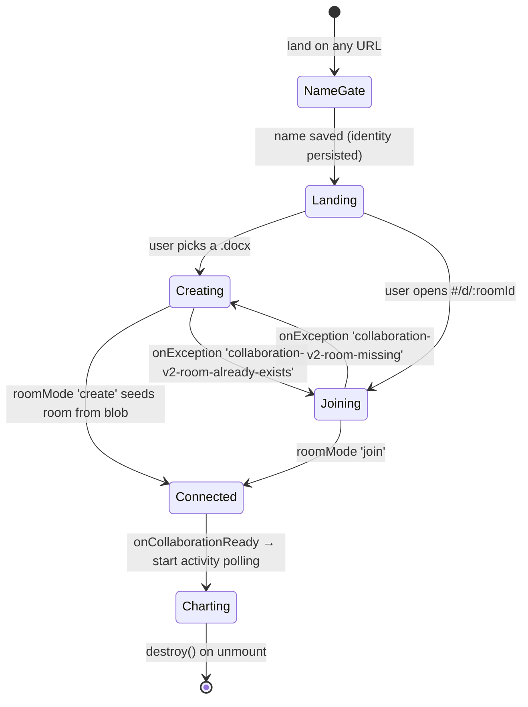
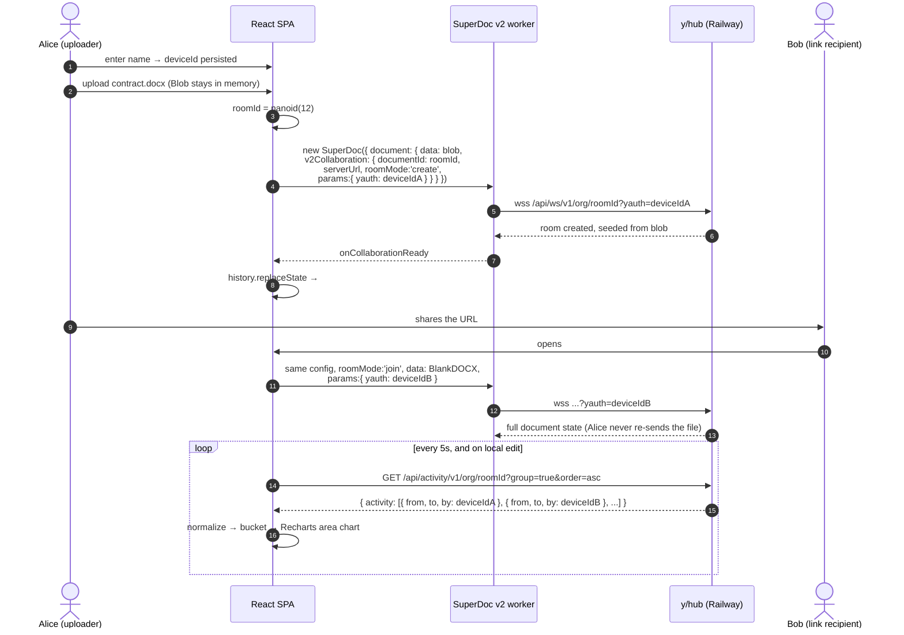
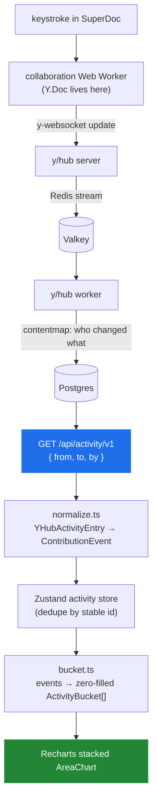
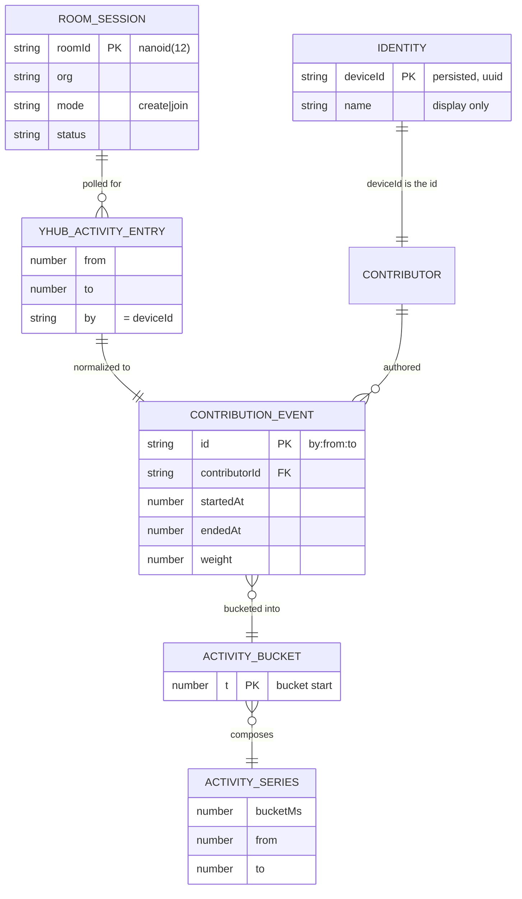

# SuperDoc Contributions Timeline

> [!TIP]
> **TL;DR** — Build the contribution chart on **y/hub's server-side Activity API**, not on
> client-side Yjs taps. SuperDoc v2 owns the `Y.Doc` inside an obfuscated Web Worker and has
> **removed** the v1 `modules.collaboration: { ydoc, provider }` contract, so every design that
> depends on a main-thread `ydoc.on('update')` handle is foreclosed. y/hub already records
> per-user, timestamped edit activity and serves it over CORS-open REST — that *is* the dataset
> the area chart wants. The one blocker is that the stock `yhub/standalone` image assigns every
> connection a **random cartoon-character user id**; a 3-line Dockerfile that replaces
> `bin/conf.js` fixes attribution and is the only backend code we write.

---

## Problem Statement

Build a full-stack collaborative DOCX experience on SuperDoc v2 that visualizes **who contributed
what, when**.

Required flow:

1. Land on the site, enter a name.
2. Upload a `.docx`.
3. App mints a unique, publicly shareable URL — no auth, no permissions model.
4. Anyone with the URL joins, enters their own name, and edits the same document in real time.
5. Every edit is attributed (device identity + user-supplied name).
6. An **Edits Panel** below the editor renders an **area chart** of edit volume over time by
   contributor.

### Constraints, as confirmed

| Constraint | Value | Notes |
| --- | --- | --- |
| Budget | ~4 focused hours, honor system | Not a product. A defensible system. |
| Editor | SuperDoc **v2** | `superdoc@2.5.1`, published 2026-08-11 |
| CRDT | Yjs | Owned by SuperDoc v2, not by us — see [Key Findings](#key-findings) |
| Backend | **y/hub** | `yjs/yhub`, beta, AGPL-or-proprietary |
| Frontend host | GitHub Pages | static, project subpath |
| Backend host | Railway | container + volume |
| DOCX handling | Native to SuperDoc | text is the priority; no image/media work |

**Out of scope (explicitly):** AI summarization or semantic labeling of edits; timeline scrubbing /
document rewind; private rooms or any permission model; section-aware chunking of concurrent
edits; polished visual design.

**In scope and highly valued:** clean readable TypeScript; a clear contribution-event data model; a
genuinely working multi-user session; an understandable area chart; and documentation of every
major decision and trade-off.

---

## Executive Summary

The naive plan — `new Y.Doc()`, `new WebsocketProvider(...)`, hand both to
`modules.collaboration`, tap `ydoc.on('update')`, count bytes per client id — is the plan almost
every tutorial and blog post on the internet will hand you, **and it does not work on SuperDoc v2**.

Three verified facts reshape the design:

1. **`modules.collaboration` is removed in v2.** The v2 migration table states the config
   typechecks and then "SuperDoc refuses to attach the provider and reports a terminal
   compatibility failure." The replacement is a declarative `document.v2Collaboration` target.
2. **v2 owns the `Y.Doc` and runs it in a Web Worker.** `@superdoc/docx-engine@0.4.0` ships
   `assets/collaboration-worker-entry-*.js` (7.4 MB, obfuscated with `javascript-obfuscator@5.4.7`);
   the y-websocket and Yjs machinery lives inside it. There is no supported main-thread update tap.
3. **y/hub already computes exactly what we want.** `GET /api/activity/v1/{org}/{docid}` returns
   `{ activity: [{ from, to, by }] }` — per-user, timestamped, optionally grouped into editing
   bursts, filterable by time range, served with `Access-Control-Allow-Origin: *`.

So: stop fighting the editor for the CRDT, and read the backend's own attribution index. This is
both the *less* code path and the *more* correct one — the chart shows the same history to a
late joiner as to the person who uploaded the file, because the server is the source of truth.

The one catch is a delightful piece of evidence from `bin/conf.js` in the y/hub repo:

```js
const userIdChoices = ['Calvin Hobbes', 'Charlie Brown', 'Dilbert Adams', 'Garfield']
// ...
async readAuthInfo (_req) { return { userid: random.oneOf(userIdChoices) } },
async getAccessType () { return 'rw' }
```

The stock standalone image assigns a **random cartoon character per connection**. Attribution from
the unmodified image is decorative. The fix is a 3-line Dockerfile layering a `conf.js` whose
`readAuthInfo` reads the `yauth` query parameter — which SuperDoc v2 will forward for us via
`v2Collaboration.params`.

> [!IMPORTANT]
> **The decision:** contribution data comes from y/hub's Activity API over HTTP polling, keyed on a
> `deviceId` we inject as the y/hub user id. Client-side Yjs introspection is not used at all.

---

## Current State In The Repository

This is a greenfield repo. Everything below is what exists at commit `9b637b0` ("Initial commit"):

| Path | Status | Notes |
| --- | --- | --- |
| [.gitignore](.gitignore) | ✅ Present | `.DS_Store`, `.calva`, `.lsp`, `.clj-kondo` |
| [.claude/skills/explore/SKILL.md](.claude/skills/explore/SKILL.md) | ✅ Present | the skill producing this document |
| [.claude/skills/implement/SKILL.md](.claude/skills/implement/SKILL.md) | ✅ Present | checklist-driven implementation driver |
| [.claude/skills/implement/driver.mjs](.claude/skills/implement/driver.mjs) | ✅ Present | — |
| `package.json` | ❌ Absent | created in Phase 1 |
| `src/` | ❌ Absent | created in Phase 1 |
| `server/` | ❌ Absent | created in Phase 2 (y/hub image) |
| `.github/workflows/deploy.yml` | ❌ Absent | created in Phase 6 |

No lockfile, no framework, no CI. Nothing here constrains the design — every file path in this
document is a proposal, not a description.

---

## External Research

### SuperDoc v2 — what the published artifacts actually say

Sources are the live docs (`docs.superdoc.dev` serves clean markdown at `/md/<path>.md`) and the
published npm tarballs, which are more authoritative than the prose.

<details>
<summary>Registry metadata and why it matters for package selection</summary>

```
superdoc                dist-tags: latest 2.5.1  (published 2026-08-11), next 2.6.0-next.4
                        peerDeps:  yjs ^13.6.19, react >=16.8.0,
                                   @hocuspocus/provider ^2.13.6, @liveblocks/yjs ^3.15.5
                        deps:      y-websocket ^3.0.0, vue ^3.5.11, @superdoc/docx-engine 0.4.0

@superdoc-dev/react     dist-tags: latest 1.16.2  → depends on superdoc >=1.0.0   (v1 era)
                                   next   2.0.0-next.4 → pins superdoc 2.4.0-next.6 EXACTLY
```

> [!WARNING]
> The official React wrapper is a **trap for this project**. Its `latest` is a v1-era release, and
> its v2 prerelease pins `superdoc` to the exact version `2.4.0-next.6` — installing it would drag
> the editor off `2.5.1` and onto a prerelease. Use the vanilla `superdoc` package and mount it in
> a `useEffect`, exactly as SuperDoc's own [Mount SuperDoc in React](https://docs.superdoc.dev/editor/frameworks/react)
> guide does. That guide does not use the wrapper either.

</details>

**The v2 collaboration contract** ([docs](https://docs.superdoc.dev/editor/collaboration)):

> SuperDoc v2 can synchronize one DOCX through a y-websocket, Hocuspocus, or Liveblocks provider.
> The browser editor owns the provider and Y.Doc lifecycle after your application supplies a
> `v2Collaboration` target on the document.

The shipped types (`package/dist/superdoc/src/core/types/index.d.ts`) give the exact shape:

```ts
export interface V2YWebsocketCollaborationConfig {
  /** Provider family selector. Optional; defaults to 'y-websocket'. */
  providerType?: 'y-websocket';
  /** Stable shared document identity. Both actors that pass the same
   *  documentId join the same room and converge on the same root Y.Doc. */
  documentId: string;
  /** WebSocket server URL for the single-doc y-websocket provider. */
  serverUrl?: string;
  /** Alias for serverUrl; `url` wins when both are present. */
  url?: string;
  /** Optional connection query params forwarded to the provider
   *  (for example an auth token). Values are strings. */
  params?: Record<string, string> | null;
  /** Explicit room operation. Defaults to 'join'; 'create' never joins an existing room. */
  roomMode?: 'join' | 'create';
}
```

Two details in there are load-bearing for this project:

- **`params` is forwarded verbatim as connection query params.** That is our injection point for a
  real user id — no fork of SuperDoc required.
- **`roomMode` is explicit and unforgiving.** From the migration guide: *"V2 does not provide a
  join-or-create mode. Creating an existing room or joining a missing room fails."* Failures surface
  through `onException` with the stable codes `collaboration-v2-room-missing` and
  `collaboration-v2-room-already-exists` (both present in the shipped bundle).

**The removal**, from the v2 removed-APIs table:

| v1 API | v2 replacement | Severity | Failure mode |
| --- | --- | --- | --- |
| `modules.collaboration` | `document.v2Collaboration` | Redesign | "The config typechecks, then SuperDoc refuses to attach the provider and reports a terminal compatibility failure." |

> [!CAUTION]
> `docs.superdoc.dev` **302-redirects several collaboration paths to `docs-v1.superdoc.dev`**, and
> those v1 pages still document `modules: { collaboration: { ydoc, provider } }` as current. Every
> third-party integration post (including Liveblocks' "5 minutes" guide) documents the v1 contract.
> Following any of them costs an hour and produces a terminal compatibility failure. Read
> `/md/editor/collaboration.md` and the shipped `.d.ts`, nothing else.

**Where the CRDT lives.** `@superdoc/docx-engine@0.4.0` ships three worker entry points:

```text
package/dist/assets/browser-worker-entry-DF3wyxyk.js       6.3 MB   non-collaborative documents
package/dist/assets/collaboration-worker-entry-Yvxkj6QO.js 7.4 MB   collaboration rooms
package/dist/assets/review-index-worker-entry-BW5OJ3wK.js    —      comments / tracked changes
```

`manifest.json` declares the whole set is obfuscated (`javascript-obfuscator@5.4.7`). Grepping the
collaboration worker finds `y-websocket` (9×) and `clientID` (49×); the main `superdoc.es.js`
bundle contains **zero** `new Worker(`, `new Y.Doc`, or `encodeStateAsUpdate` occurrences — it only
installs a `__SUPERDOC_V2_BROWSER_RUNTIME__` global and side-effect-imports `y-websocket`.

The main-thread event surface that *is* public is thin:

```ts
export interface EditorUpdateEvent {
  editor?: Editor;
  sourceEditor?: Editor;
  surface: EditorSurface;
  headerId: string | null;
  sectionType: string | null;
}
```

No delta. No author. No size. `onEditorUpdate` can tell you *that* the document changed and
nothing else. `onAwarenessUpdate` gives `{ states, added, removed, superdoc }` — presence, not
authorship of past edits.

### y/hub — what it stores and what it will tell us

`yjs/yhub` (294★, default branch `master`, pushed 2026-08-12), **AGPL-3.0 or proprietary**, and the
README's first line is: *"This is beta software!"*

Architecture, per the README: a **server** component accepts WebSocket connections and fans updates
through Redis streams without holding a `Y.Doc` in memory; a **worker** compacts Redis streams into
Postgres (+ optional S3). The Postgres schema is where the attribution story becomes visible:

```sql
CREATE TABLE yhub_ydoc_v1 (
    org text, docid text, branch text, t text, created INT8,
    gcDoc bytea,        -- garbage-collected update
    nongcDoc bytea,     -- full-history update
    contentmap bytea,   -- Attribution content map      ← per-change authorship
    contentids bytea,   -- Attributed content ids
    PRIMARY KEY (org, docid, branch, t)
);
```

y/hub keeps a durable, per-change attribution map. The REST surface exposes it:

| Endpoint | Returns | Use here |
| --- | --- | --- |
| `GET /api/activity/v1/{org}/{docid}` | `{ activity: [{ from, to, by, ... }] }` | ✅ **the chart's data source** |
| `GET /api/changeset/v1/{org}/{docid}` | `{ ydoc?, attributions?, delta? }` | 🛑 out of scope (that's timeline scrubbing) |
| `POST /api/rollback/v1/{org}/{docid}` | undo by user / time range | 🛑 out of scope |
| `GET`/`PATCH`/`DELETE /api/ydoc/v1/{org}/{docid}` | raw doc state | ⚠️ see [Risks](#risks-and-open-questions) |

Activity parameters worth knowing: `from`, `to`, `by`, `limit`, `order` (`asc`/`desc`),
`group` (bundle consecutive same-user changes), `groupMaxGap` (default `1000` ms),
`groupMaxDuration`, `delta`, `attributions`, `customAttributions`. Responses are lib0-encoded by
default and plain JSON when the request sends `Accept: application/json` — **no lib0 dependency
needed in the browser**.

Connection shape (`GETTING-STARTED.md`):

```
ws://localhost:4400/api/ws/v1/{org}/{docid}?yauth={token}&branch={branch}
```

`y-websocket` appends `/{room}` to its base URL, so `serverUrl = wss://host/api/ws/v1/{org}` plus
`documentId = {docid}` composes correctly with zero glue.

**CORS is already handled.** `src/api.js` sets `Access-Control-Allow-Origin: *` on every REST
response, and `src/server.js` answers `OPTIONS /*` with a reflected preflight. A GitHub Pages
origin can call the Activity API directly.

**The standalone image.** `docker run -p 4400:4400 -v yhub-data:/data ghcr.io/yjs/yhub/standalone:latest`
runs Postgres 16 + Valkey + y/hub in one Ubuntu container, `VOLUME /data`, `EXPOSE 4400`, entrypoint
initializes the DB on first boot. The README labels it development-only because it uses open auth —
and `bin/conf.js` shows what "open auth" means in practice:

```js
const userIdChoices = ['Calvin Hobbes', 'Charlie Brown', 'Dilbert Adams', 'Garfield']
async readAuthInfo (_req) { return { userid: random.oneOf(userIdChoices) } }
async getAccessType () { return 'rw' }
```

> [!IMPORTANT]
> Attribution on the stock image is **randomized demo data**. Every architecture in this document
> depends on replacing those four lines. It is the only backend code in the project.

---

## Key Findings

1. **`modules.collaboration` is dead in v2** — and the v1 docs it appears in are still live and
   still reachable by redirect from the v2 domain. This is the single largest time-sink risk.
2. **The `Y.Doc` is inside a Web Worker, and the worker is obfuscated.** Client-side update taps,
   shared-`Y.Array` ledgers, and clientID→user mapping are all off the table via supported APIs.
3. **`v2Collaboration.params` forwards arbitrary query params to the provider** — the sanctioned
   hook for injecting identity into y/hub.
4. **y/hub's Activity API is purpose-built for this exact feature.** Its own docs describe
   "visualize editing trail of the past day" as the worked example.
5. **The stock standalone image randomizes user ids.** A 3-line Dockerfile fixes it.
6. **y/hub REST is CORS-open (`*`)** — GitHub Pages → Railway works with a plain `fetch`.
7. **v2 has no join-or-create**, but it fails with *named, stable* error codes — so we can implement
   join-or-create in the app layer in ~15 lines, which is what makes browser refresh survivable.
8. **`roomMode: 'create'` seeds the room from the document's `data`** — which means joiners never
   need the original `.docx`. The upload problem solves itself.
9. **The official React wrapper would pin us off `superdoc@2.5.1`.** Mount vanilla.
10. **y/hub is AGPL** — we deploy a modified image, so the modification must be published. Our repo
    is public anyway; putting `server/` in it discharges the obligation. Worth one README line.

---

## 🧭 Architecture

### Deployment topology



Two channels, deliberately separate:

- **The document channel** is SuperDoc's. We hand it a URL and never touch the socket again.
- **The attribution channel** is ours. Plain HTTP polling against a REST endpoint. It can fail
  entirely without breaking the editor, which is the property that makes this safe to build in
  four hours.

### Room lifecycle — solving create-vs-join



> [!NOTE]
> The two diagonal transitions are the app-layer join-or-create. v2 refuses to guess, and it is
> right to refuse — but a user who hits <kbd>Cmd</kbd> + <kbd>R</kbd> on a room they created must
> not get a dead editor. Each retry needs a **fresh mount**: "retrying with a different room mode
> requires a fresh editor instance."

### The create / join sequence



### Contribution data flow



**Pragmatic shortcuts, called out explicitly** (each is defended in
[Options And Tradeoffs](#options-and-tradeoffs)):

| # | Shortcut | Why it is acceptable here |
| --- | --- | --- |
| S1 | Polling, not websockets/webhooks, for activity | 5s latency on a chart is invisible; y/hub *does* support webhooks but that needs a second service |
| S2 | Identity = `deviceId` in a query param, unverified | The brief says no auth and no permissions model. Spoofing a chart nobody is authorized against is not a threat. |
| S3 | Fixed time buckets, no section awareness | Explicitly out of scope in the brief |
| S4 | "Volume" = grouped edit bursts, not characters | Character counts need `delta=true` and a delta walk; upgrade path documented |
| S5 | Display name carried as a y/hub custom attribution | Renaming mid-session creates a second identity; documented, not fixed |
| S6 | Single all-in-one y/hub container, no S3 | The standalone image is the *documented* quick-start; a take-home is exactly its use case |
| S7 | No document persistence outside y/hub | The `.docx` blob is never stored by us; the room *is* the document |

---

## Data Model

Concrete interfaces, in the files they belong in.

### `src/types/identity.ts`

```ts
/** Stable per-browser-profile identity. Persisted; never sent anywhere but y/hub. */
export interface Identity {
  /** crypto.randomUUID(), written once, persisted via zustand/middleware persist.
   *  This is the value that becomes y/hub's `yuserid`, and therefore the
   *  `by` field on every activity entry. */
  deviceId: string;
  /** User-supplied, editable. Display only — identity never depends on it. */
  name: string;
}

/** Alias so call sites read honestly: this string IS the deviceId. */
export type ContributorId = string;

export interface Contributor {
  id: ContributorId;
  /** Last name seen for this id. May change; the id may not. */
  name: string;
  /** Deterministically derived from `id` so every client colours the chart identically. */
  color: string;
}
```

**Why `deviceId` and not a user id:** there is no account system, so "user" is not a thing that
exists. A device is. Two tabs in one browser are correctly one contributor; the same person on a
phone is correctly a second one. That is a *stated limitation*, not a bug — and it is exactly why
the brief said "device identity + user-supplied name".

**Deliberately not tracked:** email, IP, geo, user agent, cursor position, selection ranges,
per-keystroke timing, undo lineage, document content in our own store.

### `src/types/activity.ts`

```ts
/** Wire shape of GET /api/activity/v1/{org}/{docid} with Accept: application/json.
 *  Mirrors y/hub's documented response; fields we don't request are absent. */
export interface YHubActivityEntry {
  /** Unix ms, start of the (optionally grouped) editing burst. */
  from: number;
  /** Unix ms, end of the burst. Equals `from` for a single change. */
  to: number;
  /** y/hub's `yuserid` — our deviceId. Optional: y/hub types it as `by?`. */
  by?: string;
  /** Present only when the request sets customAttributions=true.
   *  We use it to carry the display name: [{ k: 'name', v: 'Alice' }]. */
  customAttributions?: Array<{ k: string; v: string }>;
}

export interface YHubActivityResponse {
  activity: YHubActivityEntry[];
}
```

### `src/types/contribution.ts`

```ts
/** Our normalized unit of contribution. One editing burst by one contributor. */
export interface ContributionEvent {
  /** Stable, content-derived key: `${contributorId}:${startedAt}:${endedAt}`.
   *  Polling re-fetches overlapping windows, so dedupe must not rely on
   *  arrival order or a client-side counter. */
  id: string;
  contributorId: ContributorId;
  /** Unix ms. */
  startedAt: number;
  /** Unix ms. >= startedAt. */
  endedAt: number;
  /** The chart metric. See "Choosing the volume metric" below. */
  weight: number;
}
```

**Why `weight` is a single opaque number:** it lets the metric change (burst count → active
seconds → inserted characters) without touching the store, the bucketer, or the chart. The
decision about *what volume means* is isolated to one function in `normalize.ts`.

**Deliberately not on `ContributionEvent`:** the text that changed, the position in the document,
the section, the paragraph id, whether it was an insert or a delete. All are reachable through
`changeset`/`delta` and all are out of scope.

### `src/types/series.ts`

```ts
/** One x-axis point. Recharts wants contributor values as sibling keys on a flat
 *  object, so this is an index signature by design, not laziness. */
export interface ActivityBucket {
  /** Bucket start, unix ms — the x value. */
  t: number;
  /** weight per contributor id. ZERO-FILLED for every known contributor:
   *  a stacked area chart with holes renders as a broken ribbon. */
  [contributorId: string]: number;
}

export interface ActivitySeries {
  /** Bucket width in ms; adaptive so the chart holds ~60 points. */
  bucketMs: number;
  buckets: ActivityBucket[];
  /** Chart draws one <Area> per contributor, in this order. */
  contributors: Contributor[];
  /** Inclusive bounds actually covered, for axis domain. */
  from: number;
  to: number;
}
```

### `src/types/room.ts`

```ts
export type RoomStatus =
  | 'idle' | 'connecting' | 'connected' | 'reconnecting' | 'error';

export interface RoomSession {
  /** nanoid(12). The shareable identity, and y/hub's `docid`. */
  roomId: string;
  /** y/hub namespace. One constant for the whole app: 'superdoc-timeline'. */
  org: string;
  /** Which room mode this mount used. Drives the join-or-create retry. */
  mode: 'create' | 'join';
  status: RoomStatus;
  /** Set from onException; surfaced in the UI rather than swallowed. */
  lastError: string | null;
}
```

### How the pieces relate



---

## Options And Tradeoffs

### Where does contribution data come from?

This is *the* architectural decision. Four candidates, evaluated against the verified facts about
SuperDoc v2.

| # | Option | Attribution quality | Late joiners see history? | Est. cost | Verdict |
| --- | --- | --- | --- | --- | --- |
| A | `onEditorUpdate` on the main thread | ❌ none — payload has no author, no delta, no size | ❌ no | 10 min | 🛑 Rejected as a source |
| B | Tap `ydoc.on('update')`, decode structs, map `clientID` → user via awareness | ⚠️ good for live peers, blind to departed ones | ❌ no | ~60 min | 🛑 **Blocked** — no supported main-thread `Y.Doc` |
| C | Shared `Y.Array` event ledger inside the same `Y.Doc` | ✅ self-reported, CRDT-replicated, free persistence | ✅ yes | ~45 min | 🛑 **Blocked** — same reason as B |
| D | **y/hub `GET /api/activity/v1`** | ✅ recorded server-side from the attribution `contentmap` | ✅ yes | ~50 min | ✅ **Recommended** |

Options B and C are the designs I would have reached for first, and both die on the same fact: the
`Y.Doc` is in an obfuscated worker and v2 explicitly refuses an externally supplied `{ ydoc,
provider }` pair. Recording that dead end is worth more in an interview than pretending the
recommendation was obvious.

<details>
<summary>Why not C-with-a-second-Y.Doc (our own room alongside SuperDoc's)?</summary>

You *could* open a second, app-owned `Y.Doc` on a second y/hub room (`{roomId}-contributions`) with
your own `y-websocket` provider, and append self-reported events there. It works, it gives a shared
ledger, and it dodges the worker problem entirely.

It was rejected because it costs a second websocket connection, a second provider lifecycle to tear
down, `y-websocket` as a direct dependency, and a second failure mode — all to reproduce, less
accurately, data the server is already computing. It also makes the chart *client-asserted* rather
than *server-observed*, which is strictly the weaker claim.

Keep it as the contingency if [Spike 1](#spike-1-does-superdoc-v2-actually-talk-to-yhub-20-min)
fails and we fall back to Hocuspocus, which has no attribution API at all.

</details>

> [!TIP]
> Option A is not useless — it is just not a *data source*. `onEditorUpdate` is the right trigger to
> **debounce-refresh the poll** so your own edits show up in a second instead of five. Use it as a
> signal, never as a measurement.

### Choosing the volume metric

`GET /api/activity/v1` returns `{ from, to, by }` per entry — a time span, not a size. "Edit volume"
must therefore be derived.

| Metric | How | Fidelity | Cost | Verdict |
| --- | --- | --- | --- | --- |
| Burst count | 1 per grouped entry | Coarse but monotone with effort | free | ✅ **v1 metric** |
| Active duration | `max(to - from, floorMs)` | Rewards long sessions, not volume | free | ⚠️ misleading for fast typists |
| Inserted characters | `delta=true`, walk the delta ops | True "volume" | +1 param, delta walk, bigger payloads | 🚧 upgrade if time remains |

Recommendation: ship **burst count** with `group=true&groupMaxGap=5000`, and label the chart axis
honestly as *"edit bursts"* rather than implying characters. A 5-second gap means continuous typing
collapses into one burst and a genuine pause starts a new one — which is a reasonable operational
definition of "an edit". If Phase 4 finishes early, switch `weight` to the delta character count;
the change is confined to `normalize.ts`.

### Chunking strategy

Fixed time buckets, adaptive width:

$$\text{bucketMs} = \max\left(5000,\ 2^{\lceil \log_2(\frac{t_{max} - t_{min}}{60}) \rceil}\right)$$

Targets ~60 buckets across whatever span the room has lived, snapped to a power of two so the
x-axis doesn't jitter on every poll. Zero-fill every known contributor in every bucket.

Section-aware chunking is explicitly out of scope, and rightly so: it needs the `changeset` API,
position→section resolution against the DOCX structure, and a concurrent-edit merge policy. That is
a day of work, not an hour.

### Frontend framing decisions

| Decision | Chosen | Alternative | Why |
| --- | --- | --- | --- |
| React binding | vanilla `superdoc` in `useEffect` | `@superdoc-dev/react` | Wrapper pins an incompatible `superdoc` version; SuperDoc's own React doc uses vanilla |
| Routing | `HashRouter` — `#/d/:roomId` | `BrowserRouter` + `404.html` | GitHub Pages has no rewrite rules; hash routing needs zero deploy config |
| Chart | Recharts stacked `AreaChart` | Visx | Recharts is declarative and ~15 lines here; Visx is a toolkit, not a chart |
| Room id | `nanoid(12)` | `crypto.randomUUID()` | 12 chars vs 36 in a URL people paste into Slack |
| State | Zustand + `persist` for identity only | Context, Redux | `persist` is the whole reason; room/activity state is plain stores |

---

## Recommendation

Build **Option D**: the Edits Panel renders y/hub's own activity index, polled over HTTPS.

### The frontend

```text
┌──────────────────────────────────────────────────────────────┐
│  SuperDoc Timeline        Alice ✎        [ Copy share link ] │  ShareBar
├──────────────────────────────────────────────────────────────┤
│                                                              │
│                  SuperDoc v2 editor                          │  EditorPane
│                  (built-in toolbar + document)               │
│                                                              │
├──────────────────────────────────────────────────────────────┤
│  Edits Panel                        ● Alice  ● Bob  ● Carol  │  EditsPanel
│  ┌────────────────────────────────────────────────────────┐  │
│  │           ▁▂▅█▇▅▂▁  ▁▃▆█▅▂        ▂▅▇█▆▃▁              │  │  ContributionChart
│  └────────────────────────────────────────────────────────┘  │
│   09:14                    09:31                    09:48    │
└──────────────────────────────────────────────────────────────┘
```

Screens, minimal set:

| Screen | Component | Responsibility |
| --- | --- | --- |
| Name entry | `NameGate.tsx` | Blocks until `identity.name` exists. Mints `deviceId` on first run. Shown on *any* route. |
| Landing / upload | `UploadPanel.tsx` | `<input type="file" accept=".docx">` → mint roomId → navigate to `#/d/:roomId` carrying the Blob in memory |
| Room | `RoomView.tsx` | Composes `ShareBar` + `EditorPane` + `EditsPanel` |
| — | `EditorPane.tsx` | Owns the SuperDoc lifecycle: mount, `onCollaborationReady`, join-or-create retry, `destroy()` |
| — | `EditsPanel.tsx` | Polling lifecycle + legend; renders `ContributionChart` |
| — | `ContributionChart.tsx` | Pure: `ActivitySeries` in, Recharts out. No fetching. |

shadcn components used: `button`, `input`, `card`, `skeleton`. Nothing else — the brief deprioritizes
visual polish, and every extra component is scaffolding to review.

### The backend

Three files, ~40 lines total, in `server/`:

```dockerfile
# server/Dockerfile
FROM ghcr.io/yjs/yhub/standalone:latest
# Replace the demo auth plugin, which assigns a random cartoon-character
# user id per connection and would make all attribution meaningless.
COPY conf.js /usr/src/app/bin/conf.js
```

```js
// server/conf.js — derived from yjs/yhub bin/conf.js (AGPL-3.0).
// Only readAuthInfo differs: the demo picks random.oneOf(['Calvin Hobbes', ...]).
import * as env from 'lib0/environment'
import * as number from 'lib0/number'
import * as types from '../src/types.js'

/** @type {import('../src/types.js').YHubConfig} */
export const conf = {
  redis: {
    url: env.ensureConf('redis'),
    prefix: env.getConf('redis-prefix') || 'yhub',
    taskDebounce: number.parseInt(env.getConf('redis-task-debounce') || '10000'),
    minMessageLifetime: number.parseInt(env.getConf('redis-min-message-lifetime') || '60000')
  },
  postgres: env.ensureConf('postgres'),
  persistence: [], // no S3: the standalone image stores blobs in Postgres
  server: {
    port: number.parseInt(env.getConf('port') || '4400'),
    auth: types.createAuthPlugin({
      // Open by design: this take-home has no accounts and no permission model.
      // The client asserts its own deviceId; we take it at face value and record it,
      // which is exactly enough to attribute a chart nobody is authorized against.
      async readAuthInfo (req) {
        const claimed = req.getQuery('yauth')
        return { userid: claimed && claimed.length <= 64 ? claimed : 'anonymous' }
      },
      async getAccessType () { return 'rw' }
    })
  },
  worker: { taskConcurrency: 5 }
}
```

> [!WARNING]
> `readAuthInfo` reads the **live uWS request** synchronously — `req.getQuery` must be called before
> any `await`, or uWS will have recycled the request object. The code above does this correctly by
> reading first and returning immediately. Do not add an `await` above that line.

### Client wiring, end to end

```ts
// src/collab/yhub.ts
const ORG = 'superdoc-timeline';
const WS  = import.meta.env.VITE_YHUB_WS_URL;   // wss://<app>.up.railway.app
const HTTP = WS.replace(/^ws/, 'http');

/** y-websocket appends `/{documentId}`, composing /api/ws/v1/{org}/{docid}. */
export const wsServerUrl = () => `${WS}/api/ws/v1/${ORG}`;

export async function fetchActivity(
  roomId: string,
  from: number,
  signal?: AbortSignal,
): Promise<YHubActivityResponse> {
  const qs = new URLSearchParams({
    from: String(from),
    order: 'asc',
    group: 'true',
    groupMaxGap: '5000',
    customAttributions: 'true',
    limit: '2000',
  });
  const res = await fetch(
    `${HTTP}/api/activity/v1/${ORG}/${roomId}?${qs}`,
    { headers: { Accept: 'application/json' }, signal },   // JSON opt-in: no lib0 in the browser
  );
  if (!res.ok) throw new Error(`activity ${res.status}`);
  return res.json();
}
```

```ts
// src/collab/superdoc-mount.ts (shape only — the join-or-create retry is the point)
export function mountRoom(opts: {
  el: HTMLElement;
  roomId: string;
  identity: Identity;
  data: Blob;                    // uploaded file, or BlankDOCX for a cold join
  mode: 'create' | 'join';
  onReady: () => void;
  onRetry: (nextMode: 'create' | 'join') => void;   // caller REMOUNTS; v2 requires a fresh instance
  onError: (message: string) => void;
}): SuperDoc {
  return new SuperDoc({
    selector: opts.el,
    user: { id: opts.identity.deviceId, name: opts.identity.name },
    document: {
      id: opts.roomId,
      type: 'application/vnd.openxmlformats-officedocument.wordprocessingml.document',
      data: opts.data,
      v2Collaboration: {
        documentId: opts.roomId,                 // providerType defaults to 'y-websocket'
        serverUrl: wsServerUrl(),
        roomMode: opts.mode,
        params: {
          yauth: opts.identity.deviceId,                        // → y/hub `yuserid` → activity.by
          customAttributions: `name:${sanitize(opts.identity.name)}`,  // → activity.customAttributions
        },
      },
    },
    onCollaborationReady: opts.onReady,
    onException: ({ error }) => {
      const code = String((error as { code?: string })?.code ?? error);
      if (code.includes('collaboration-v2-room-missing')) return opts.onRetry('create');
      if (code.includes('collaboration-v2-room-already-exists')) return opts.onRetry('join');
      opts.onError(code);
    },
  });
}
```

`sanitize()` strips `,` and `:` — y/hub parses `customAttributions` as comma-separated `key:value`
pairs, so an unsanitized name like `Smith, Jr.` would corrupt the attribution map.

---

## Example Code

### Bucketing — the one piece of real logic

```ts
// src/contributions/bucket.ts
import type { ContributionEvent, Contributor } from '@/types/contribution';
import type { ActivityBucket, ActivitySeries } from '@/types/series';

const MIN_BUCKET_MS = 5_000;
const TARGET_BUCKETS = 60;

/** Snap to a power of two so the axis doesn't re-scale on every poll. */
function chooseBucketMs(spanMs: number): number {
  const ideal = Math.max(MIN_BUCKET_MS, spanMs / TARGET_BUCKETS);
  return 2 ** Math.ceil(Math.log2(ideal));
}

export function toSeries(
  events: ContributionEvent[],
  contributors: Contributor[],
  now = Date.now(),
): ActivitySeries {
  if (events.length === 0) {
    return { bucketMs: MIN_BUCKET_MS, buckets: [], contributors, from: now, to: now };
  }

  const from = Math.min(...events.map((e) => e.startedAt));
  const to = Math.max(now, ...events.map((e) => e.endedAt));
  const bucketMs = chooseBucketMs(to - from);
  const start = Math.floor(from / bucketMs) * bucketMs;

  // Zero-fill EVERY contributor in EVERY bucket. A stacked area chart with
  // missing keys renders as a torn ribbon, which reads as data loss.
  const buckets = new Map<number, ActivityBucket>();
  for (let t = start; t <= to; t += bucketMs) {
    const bucket = { t } as ActivityBucket;
    for (const c of contributors) bucket[c.id] = 0;
    buckets.set(t, bucket);
  }

  for (const event of events) {
    const t = Math.floor(event.startedAt / bucketMs) * bucketMs;
    const bucket = buckets.get(t);
    if (bucket) bucket[event.contributorId] += event.weight;
  }

  return { bucketMs, buckets: [...buckets.values()], contributors, from: start, to };
}
```

### The chart

```tsx
// src/components/ContributionChart.tsx
import { Area, AreaChart, CartesianGrid, ResponsiveContainer, Tooltip, XAxis, YAxis } from 'recharts';
import type { ActivitySeries } from '@/types/series';

const clock = (t: number) =>
  new Date(t).toLocaleTimeString([], { hour: '2-digit', minute: '2-digit' });

export function ContributionChart({ series }: { series: ActivitySeries }) {
  return (
    <ResponsiveContainer width="100%" height={220}>
      <AreaChart data={series.buckets}>
        <CartesianGrid strokeDasharray="3 3" strokeOpacity={0.2} />
        <XAxis dataKey="t" type="number" domain={[series.from, series.to]}
               tickFormatter={clock} scale="time" />
        <YAxis allowDecimals={false} label={{ value: 'edit bursts', angle: -90, position: 'insideLeft' }} />
        <Tooltip labelFormatter={clock} />
        {series.contributors.map((c) => (
          <Area key={c.id} type="monotone" dataKey={c.id} name={c.name}
                stackId="contributions" stroke={c.color} fill={c.color} fillOpacity={0.55} />
        ))}
      </AreaChart>
    </ResponsiveContainer>
  );
}
```

---

## Project Scaffolding Plan

The repo already exists with a `.gitignore` and `.claude/`, so scaffold **in place** (Vite accepts
`.` as the target and will not clobber existing dotfiles):

```bash
pnpm create vite@latest . --template react-ts
```

```bash
pnpm add superdoc zustand recharts nanoid react-router-dom
```

```bash
pnpm add -D @tailwindcss/vite tailwindcss @types/node
```

```bash
pnpm dlx shadcn@latest init && pnpm dlx shadcn@latest add button input card skeleton
```

> [!NOTE]
> Tailwind v4 has no `tailwind.config.ts` by default — it is driven by `@import "tailwindcss";` in
> `src/index.css` plus the `@tailwindcss/vite` plugin. `shadcn init` detects v4 and writes the
> right CSS variables. Don't hand-write a v3-style config.

### Target structure

```text
superdoc-timeline/
├── .github/workflows/deploy.yml      # build + publish to Pages
├── docs/explorations/0001_[_]_SUPERDOC_CONTRIBUTIONS_TIMELINE.md
├── server/                           # the entire backend
│   ├── Dockerfile                    # 3 lines, FROM yhub/standalone
│   └── conf.js                       # patched auth plugin (AGPL notice at top)
├── src/
│   ├── main.tsx                      # HashRouter root
│   ├── App.tsx                       # NameGate wrapper + routes
│   ├── components/
│   │   ├── NameGate.tsx
│   │   ├── UploadPanel.tsx
│   │   ├── RoomView.tsx
│   │   ├── ShareBar.tsx
│   │   ├── EditorPane.tsx            # SuperDoc lifecycle lives here, and only here
│   │   ├── EditsPanel.tsx
│   │   ├── ContributionChart.tsx
│   │   └── ui/                       # shadcn output
│   ├── collab/
│   │   ├── yhub.ts                   # URL builders + fetchActivity
│   │   └── superdoc-mount.ts         # mountRoom() + join-or-create retry
│   ├── contributions/
│   │   ├── normalize.ts              # YHubActivityEntry -> ContributionEvent
│   │   ├── bucket.ts                 # events -> ActivitySeries
│   │   └── useActivityPolling.ts     # interval + AbortController + edit-triggered refresh
│   ├── store/
│   │   ├── identity.ts               # zustand + persist  (deviceId, name)
│   │   ├── room.ts                   # RoomSession
│   │   └── activity.ts               # Map<eventId, ContributionEvent>
│   ├── lib/
│   │   ├── color.ts                  # deterministic hue from deviceId
│   │   └── utils.ts                  # cn()
│   └── types/                        # identity.ts activity.ts contribution.ts series.ts room.ts
├── .env.example
├── vite.config.ts
└── package.json
```

### Environment variables

One variable, and it is not a secret:

```bash
# .env.example
VITE_YHUB_WS_URL=wss://superdoc-timeline-yhub.up.railway.app
```

The HTTP base is derived (`ws → http`) rather than configured twice — two URLs that must agree is
two URLs that will eventually disagree. Locally, `VITE_YHUB_WS_URL=ws://localhost:4400`.

Because it is baked into a public static bundle, it is a **repository variable**, never a secret.
Marking a public URL secret creates false confidence; say so in the README.

```ts
// vite.config.ts
export default defineConfig({
  base: '/superdoc-timeline/',   // GitHub Pages project subpath
  plugins: [react(), tailwindcss()],
  resolve: { alias: { '@': path.resolve(__dirname, 'src') } },
});
```

---

## Deployment Plan

### Frontend → GitHub Pages

| Concern | Approach |
| --- | --- |
| Build | `pnpm build` → `dist/`, `base: '/superdoc-timeline/'` |
| Publish | `actions/upload-pages-artifact` + `actions/deploy-pages` from `main` |
| Config injection | `VITE_YHUB_WS_URL` as a repo **variable**, read in the build step's `env:` |
| Deep links | `HashRouter` → `…/superdoc-timeline/#/d/<roomId>` — no rewrites needed |
| SuperDoc workers | Same-origin by construction; Vite emits and rewrites them under `base` |
| `wss://` from `https://` | Railway terminates TLS, so no mixed-content block |

> [!WARNING]
> SuperDoc v2 loads three Web Worker bundles (the collaboration one is ~7.4 MB). They must be
> **same-origin** with the app — the docs provide a `workerUrls: { document, collaboration,
> reviewIndex }` escape hatch specifically for split-origin bundles. Serving everything from Pages
> keeps us same-origin, but **verify in the deployed build** that worker requests resolve under
> `/superdoc-timeline/` and not `/`. A `base`-relative worker URL bug is invisible in `pnpm dev`
> and fatal in production. This is validation item V7 and it is not optional.

<details>
<summary>Pretty URLs without the hash, if it turns out to matter</summary>

Copy the built shell so unknown paths still boot the SPA:

```yaml
- run: pnpm build && cp dist/index.html dist/404.html
```

GitHub Pages serves `404.html` for any unmatched path (with an HTTP 404 status, which the SPA
ignores). Then switch to `BrowserRouter basename="/superdoc-timeline"`. It costs one line, but it
also costs a real 404 status on every deep link — bad for anything that gets crawled, irrelevant
for a take-home. **Not recommended for this build.**

</details>

### Backend → Railway

Minimal viable option: **the standalone image, patched**. Not the full server+worker+Redis+Postgres
+S3 topology.

| Choice | Standalone (chosen) | Full stack |
| --- | --- | --- |
| Railway services | 1 | 4 (server, worker, Redis, Postgres) |
| Setup time | ~15 min | ~90 min |
| Persistence | one volume at `/data` | managed PG + Redis |
| Horizontal scale | ❌ none | ✅ yes |
| Fit for a take-home | ✅ it is literally the documented quick-start | 🛑 spends the entire budget |

Steps:

1. New Railway service → **Deploy from repo**, root directory `server/` (so it builds our patched
   Dockerfile rather than pulling the stock image).
2. Attach a **Volume mounted at `/data`**. Without it, Postgres and Valkey are reinitialized on
   every redeploy and **every document and all attribution history is destroyed**. This is the
   single easiest way to lose the demo five minutes before the interview.
3. `Generate Domain` → `https://<app>.up.railway.app`, TLS terminated, WebSocket upgrades pass
   through with no special configuration.
4. Target port `4400` (the Dockerfile both `EXPOSE`s and defaults `PORT` to it).
5. Memory: the container runs Postgres 16 + Valkey + Node in one process tree. Give it **≥1 GB**;
   the default hobby allocation is tight and OOM shows up as mysterious socket drops.

Auth approach: **open, deliberately**. `getAccessType` returns `'rw'` unconditionally. Justification
for the README:

- The brief specifies public shareable URLs, no authentication, no permissions model.
- The only identity claim is a `deviceId` used to *label* a chart. There is nothing to escalate to.
- Implementing the real thing means an ECDSA keypair, a JWT-minting endpoint, and a
  `/auth/perm/:room/:userid` callback — i.e. a whole second service, to protect nothing.

> [!CAUTION]
> Open auth has one consequence worth naming out loud rather than discovering in the interview:
> `DELETE /api/ydoc/v1/{org}/{docid}` and `POST /api/rollback/v1/...` are **also** unauthenticated.
> Anyone who can read a room URL can destroy or rewind that document with `curl`. For a demo whose
> rooms are unguessable `nanoid(12)` strings this is an accepted risk; in anything real it is the
> first thing to fix. It belongs in "what I'd do with more time".

---

## Implementation Phases

**Budget: ~4h.** Each phase has a binary done-criterion. If a phase overruns, the *next* phase is
cut, not the phase after it — Phase 6 (deploy + README) is protected, because an undeployed,
undocumented system scores worse than a smaller deployed one.

### Phase 0 — De-risking spikes · 30 min · 🚧 do not skip

Two questions can each invalidate a whole afternoon. Answer both before writing app code.

#### Spike 1: does SuperDoc v2 actually talk to y/hub? (20 min)

y/hub is beta, describes itself as y-websocket-compatible, and internally uses `@y/y` v14 with
"attribution-laden updates"; SuperDoc peer-depends on `yjs ^13.6.19`. Protocol compatibility across
that boundary is **asserted, not verified**.

```bash
docker run -p 4400:4400 ghcr.io/yjs/yhub/standalone:latest
```

Then a single throwaway HTML file: SuperDoc with `v2Collaboration: { documentId: 'spike',
serverUrl: 'ws://localhost:4400/api/ws/v1/superdoc-timeline', roomMode: 'create' }`, opened in two
tabs (second tab `roomMode: 'join'`).

- **Done:** typing in tab A appears in tab B.
- **If it fails:** fall back to `providerType: 'hocuspocus'` on Railway. That kills the Activity API
  and forces Option C-with-a-second-`Y.Doc`. Decide this at minute 20, not minute 200.

#### Spike 2: what does a cold joiner pass as `data`? (10 min)

The docs' `roomMode: 'join'` example still shows `data: docxBlob`, but a joiner following a link has
no blob. Try, in order: omit `data`; `data: null`; `data: BlankDOCX` (exported from `superdoc`).

- **Done:** a second browser profile with no file joins the room and sees the document.

Also confirm in the same spike: does `superdoc.ydoc` exist after `onCollaborationReady`? If it
does, Option C becomes available as a bonus — but **do not** re-plan around it. The recommendation
stands either way.

### Phase 1 — Scaffold, identity, routing · 35 min

Scaffold; `identity` store with `persist`; `NameGate`; `UploadPanel`; `HashRouter` with `/` and
`/d/:roomId`; room id minting.

- **Done:** entering a name and picking a file navigates to `#/d/<nanoid>` and the name survives a
  hard refresh.

### Phase 2 — y/hub on Railway · 25 min

`server/Dockerfile` + `server/conf.js`; deploy; attach the `/data` volume; generate the domain.

- **Done:** `curl https://<app>.up.railway.app/api/activity/v1/superdoc-timeline/nonexistent -H 'Accept: application/json'`
  returns `200` with `{"activity":[]}` rather than a connection error or a 401.

### Phase 3 — Collaborative editing · 45 min

`EditorPane` owning mount/`destroy()`; `mountRoom()` with `params.yauth`; the join-or-create retry;
`ShareBar` with copy-to-clipboard.

- **Done:** two different browser profiles on the deployed Railway backend edit the same document
  simultaneously, and a refresh in either reconnects without a mode error.

### Phase 4 — Attribution → chart · 50 min

`fetchActivity`; `normalize.ts`; `bucket.ts`; `useActivityPolling` (5s interval + `onEditorUpdate`
debounced refresh); `activity` store keyed by event id; `ContributionChart`; legend.

- **Done:** two contributors typing produce two distinctly coloured stacked bands whose peaks line
  up with when each person actually typed.

### Phase 5 — Polish · 20 min

Connection status; empty/loading states; the "you are X" affordance; contributor legend with names
resolved from `customAttributions`.

- **Done:** every state (connecting, empty room, single contributor, error) renders something
  deliberate rather than a blank box.

### Phase 6 — Deploy + document · 35 min · 🔒 protected

Pages workflow; `VITE_YHUB_WS_URL` repo variable; README per the skeleton below.

- **Done:** a link shared from one machine opens, joins, and charts on another machine's browser,
  with nothing running locally.

**Status:** `░░░░░░░░░░ 0/7 phases`

---

## README Skeleton

```markdown
# SuperDoc Contributions Timeline

Live: https://<user>.github.io/superdoc-timeline/

## Problem
Upload a DOCX, get a shareable URL, edit it with anyone who has the link, and see who
contributed what over time in an area chart.

## Architecture
[topology diagram]
- Frontend: React + Vite + TypeScript on GitHub Pages
- Editor: SuperDoc v2, which owns the Y.Doc and the y-websocket provider
- Backend: y/hub (standalone image, patched auth) on Railway
- Chart data: y/hub's Activity API, polled over HTTPS

## Key decisions & trade-offs        ← the section that matters
1. Why the chart reads y/hub's Activity API instead of tapping Yjs
   (SuperDoc v2 owns the Y.Doc in an obfuscated Web Worker; `modules.collaboration` is removed)
2. Why identity is an unverified deviceId in a query param
3. Why the y/hub image is patched (the stock one attributes edits to Garfield)
4. Why "edit volume" means grouped bursts, not characters
5. Why time buckets instead of document sections
6. Why open auth, and exactly what that exposes (`DELETE /api/ydoc/v1` is public)
7. Why HashRouter
8. Why not @superdoc-dev/react

## Running locally
[docker run ... ; pnpm install ; pnpm dev]

## How the deployed version works
[GitHub Actions → Pages; Railway service + /data volume; the single env var]

## Intentionally left out
AI edit summarization · timeline scrubbing · permissions · section-aware chunking ·
visual polish · tests beyond the bucketing logic

## With more time
Character-accurate volume via `delta=true` · real JWT auth so rollback/delete aren't public ·
WebSocket or webhook push instead of polling · section attribution via the changeset API ·
per-contributor filtering and brush-to-zoom

## Licensing
`server/` derives from yjs/yhub (AGPL-3.0); modifications are published here accordingly.
```

---

## Risks And Open Questions

| # | Risk | Impact | Likelihood | Mitigation |
| --- | --- | --- | --- | --- |
| R1 | SuperDoc v2's y-websocket client and y/hub (beta, `@y/y` v14) don't interoperate | 🛑 Fatal to the whole design | Medium | **Spike 1**, minute 0. Fallback: Hocuspocus + client-side capture |
| R2 | `roomMode: 'join'` requires a `data` blob a joiner doesn't have | High | Medium | **Spike 2**; `BlankDOCX` is exported from `superdoc` for exactly this shape of problem |
| R3 | Activity `by` is per-connection, so one person on two devices reads as two contributors | Low | Certain | Documented as a stated limitation of device identity |
| R4 | Worker asset URLs break under the Pages `base` path | High | Low-Med | Validation V7 against the deployed build, not the dev server |
| R5 | Railway container OOMs (Postgres + Valkey + Node in one) | Medium | Medium | ≥1 GB; watch for socket drops as the symptom |
| R6 | No `/data` volume → total data loss on redeploy | 🛑 Demo-ending | Medium | Phase 2 done-criterion includes the volume |
| R7 | y/hub is beta; an undocumented Activity edge case eats time | Medium | Low | The chart degrades to empty; the editor is unaffected by design |
| R8 | Renaming mid-session forks the display name | Low | Low | Last-name-wins per `deviceId`; documented |
| R9 | Open auth exposes `DELETE`/`rollback` publicly | Medium | Low (unguessable ids) | Named explicitly in the README |
| R10 | AGPL obligations on the patched image | Low | Certain | Publish `server/` in the public repo; one README line |

### Open questions to close during Phase 0

- [ ] Does `superdoc.ydoc` / `superdoc.provider` resolve to anything usable on the main thread after
      `onCollaborationReady` in the v2 path? (Nice-to-know; changes nothing.)
- [ ] Does `onEditorUpdate` fire for **remote** edits, or only local ones? Determines whether it is
      a good poll trigger or just a local-echo signal.
- [ ] Does y/hub's `group=true` grouping behave sensibly at `groupMaxGap=5000`, or does it collapse
      an entire session into one entry?
- [ ] Does `customAttributions` set on the WS connection actually surface on activity entries with
      `customAttributions=true`? (Fallback: encode the name into `yauth` as `deviceId|name`.)
- [ ] Exact `error.code` string shape in `onException` — the retry logic string-matches it.

---

## Implementation Checklist

**Status:** `░░░░░░░░░░ 0/34 items`

### Phase 0 — Spikes
- [x] Run `ghcr.io/yjs/yhub/standalone:latest` locally on `:4400`
- [x] Two-tab SuperDoc v2 ↔ y/hub sync proven with `roomMode` create/join
- [x] Determine what a cold joiner passes as `document.data`
- [x] Confirm `GET /api/activity/v1/...` returns entries after typing (note the cartoon `by` values)

### Phase 1 — Scaffold
- [x] `pnpm create vite . --template react-ts`; deps installed
- [x] Tailwind v4 (shadcn skipped — four styled elements didn't justify the scaffolding)
- [x] `vite.config.ts`: `base`, `@` alias
- [x] `src/types/*` — all five type modules
- [x] `store/identity.ts` with `persist`; `deviceId` minted once
- [x] `NameGate`, `UploadPanel`, `HashRouter` routes

### Phase 2 — Backend
- [x] `server/yhub.js` with `yauth`-reading `readAuthInfo` + AGPL notice (image inlines config in bin/yhub.js, not conf.js)
- [x] `server/Dockerfile`
- [ ] Railway service deployed from `server/`
- [ ] Volume attached at `/data`
- [ ] Domain generated; `wss://` reachable

### Phase 3 — Collaboration
- [x] `collab/yhub.ts` URL builders
- [x] `collab/superdoc-mount.ts` with `params.yauth` + `customAttributions`
- [x] `EditorPane` mount/`destroy()` lifecycle
- [x] Join-or-create retry on the two named exception codes
- [x] `ShareBar` copy-link

### Phase 4 — Attribution
- [x] `fetchActivity` with `Accept: application/json`
- [x] `normalize.ts` — stable event ids, weight metric
- [x] `bucket.ts` — adaptive width, zero-fill
- [x] `store/activity.ts` keyed by event id
- [x] `useActivityPolling` — interval + abort + edit-triggered refresh
- [x] `lib/color.ts` deterministic per-`deviceId` colour
- [x] `ContributionChart` + legend

### Phase 5 — Polish
- [ ] Connection status indicator
- [ ] Empty / loading / error states
- [ ] Names resolved from `customAttributions`

### Phase 6 — Ship
- [ ] `.github/workflows/deploy.yml`
- [ ] `VITE_YHUB_WS_URL` repo variable wired into the build
- [ ] README written against the skeleton
- [ ] Two-machine end-to-end verification

---

## Validation Checklist

- [x] **V1** Two browser profiles edit the same room simultaneously; text converges both ways
- [x] **V2** A cold joiner (never had the `.docx`) sees the full document
- [ ] **V3** Refreshing a room you created reconnects — the join-or-create retry fires, no dead editor
- [ ] **V4** `activity.by` values are real `deviceId`s, **not** `Garfield` — proves the image patch took
- [ ] **V5** The chart shows ≥2 distinctly coloured stacked bands whose peaks match who typed when
- [x] **V6** A late joiner sees the *full* history, including edits from before they arrived
- [ ] **V7** In the **deployed Pages build**, DevTools → Network shows SuperDoc worker chunks
      resolving under `/superdoc-timeline/` and returning `200`
- [ ] **V8** Railway redeploy → documents and history survive (proves the `/data` volume)
- [ ] **V9** Killing the Railway service leaves the editor usable-ish and the chart empty — no crash,
      no unhandled rejection
- [x] **V10** `bucket.ts` unit test: empty input, single contributor, and a gap that must zero-fill
- [ ] **V11** Chart is legible at 1280px and doesn't overflow the page horizontally at 768px

---

## Recommended First Coding Steps

In order. The first three are the spikes, and nothing else should start until they pass.

1. **`docker run -p 4400:4400 ghcr.io/yjs/yhub/standalone:latest`** and confirm
   `curl 'localhost:4400/api/activity/v1/x/y' -H 'Accept: application/json'` answers.
2. **One throwaway HTML file**: SuperDoc v2 + `v2Collaboration` pointed at that container, two tabs,
   create then join. **This is the go/no-go for the entire architecture.**
3. **Same file**, second browser profile with no `data` blob — settle the cold-join question.
4. **Scaffold** (`pnpm create vite . --template react-ts` + deps + Tailwind/shadcn), then write
   `src/types/*` first. The types are the design; everything else is filling them in.
5. **`server/conf.js` + `server/Dockerfile`**, deploy to Railway, **attach the `/data` volume**,
   generate the domain. Do this early — Railway's first build is slow and unattended.
6. **`EditorPane`** with the real Railway URL, including `destroy()` in the effect cleanup from the
   very first version. Retrofitting teardown into a `useEffect` is how you get two live sockets and
   a duplicated chart.
7. **`fetchActivity` → `console.table`** before any chart code. Confirm `by` is a `deviceId` and not
   a cartoon character. This is the moment the whole design is validated or isn't.
8. **`bucket.ts` with a unit test**, then `ContributionChart`. It is the only non-trivial logic in
   the app and the only thing worth a test in four hours.
9. **README as you go**, not at the end. The trade-off list is the deliverable that is actually
   being graded.

---

## References

**SuperDoc v2**
- [Real-time collaboration](https://docs.superdoc.dev/editor/collaboration) — the `v2Collaboration` contract
- [Mount SuperDoc in React](https://docs.superdoc.dev/editor/frameworks/react) — vanilla mount pattern
- [Migrate from v1](https://docs.superdoc.dev/editor/migrate-from-v1/overview) — `document.v2Collaboration`, `roomMode`, `instance.provider`
- [Removed in v2](https://docs.superdoc.dev/editor/migrate-from-v1/removed-apis) — the `modules.collaboration` removal
- [Editor quickstart](https://docs.superdoc.dev/editor/quickstart)
- [`superdoc` on npm](https://www.npmjs.com/package/superdoc) — 2.5.1, and the shipped `.d.ts` (the real source of truth)
- ⚠️ [docs-v1.superdoc.dev](https://docs-v1.superdoc.dev/editor/collaboration/overview) — v1 only; several v2 URLs still redirect here

**y/hub**
- [yjs/yhub](https://github.com/yjs/yhub) — README: architecture, standalone image, licensing, beta status
- [`API.md`](https://github.com/yjs/yhub/blob/master/API.md) — Activity, Changeset, Rollback, JSON encoding, error bands
- [`GETTING-STARTED.md`](https://github.com/yjs/yhub/blob/master/GETTING-STARTED.md) — WS URL shape, auth plugin
- [`DEPLOYMENT.md`](https://github.com/yjs/yhub/blob/master/DEPLOYMENT.md) — required services, eviction policy
- [`bin/conf.js`](https://github.com/yjs/yhub/blob/master/bin/conf.js) — **the random cartoon user ids**
- [`docker-standalone/`](https://github.com/yjs/yhub/tree/master/docker-standalone) — Dockerfile + entrypoint
- [`src/api.js`](https://github.com/yjs/yhub/blob/master/src/api.js) / [`src/server.js`](https://github.com/yjs/yhub/blob/master/src/server.js) — CORS headers

**Platform**
- [Railway: WebSockets](https://docs.railway.com/guides/sse-vs-websockets)
- [Yjs docs](https://docs.yjs.dev/)
