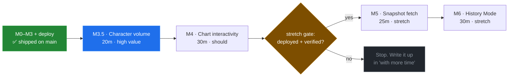
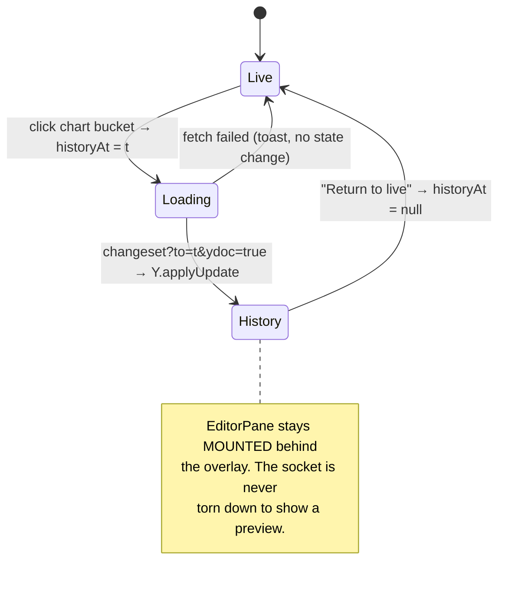

# Milestone Build Plan — SuperDoc Contributions Timeline

> [!TIP]
> **TL;DR** — **Milestones 0–3 and the deploy shipped on `main`.** The take-home is submittable
> today: collaborative DOCX editing on SuperDoc v2 + y/hub, a stacked contribution chart, Pages +
> Railway, and a README that documents the trade-offs. What remains is **M4 (chart interactivity)**,
> a **20-minute metric upgrade** from edit-bursts to real character counts, and the **M5/M6 stretch**
> — which is far cheaper than the brief assumed, because y/hub already reconstructs the document at
> any past timestamp. This document now tracks *what is left*, and records two of its own earlier
> claims that turned out wrong.

---

## What Changed Since This Document Was First Written

This exploration was written against a repo that had only a spike harness. `main` has since landed
the implementation. Two of my original findings were **wrong**, and I am correcting them here rather
than quietly deleting them — the corrections are more instructive than the originals.

| Claim in the first draft | Verdict | What is actually true |
| --- | --- | --- |
| *"F5 — `customAttributions` is an unproven channel for display names; carry the name in `yauth` as `deviceId\|name` instead"* | ❌ **Wrong** | My probe never *sent* `customAttributions` — it sent only `yauth` — so an empty response proved nothing. Re-probed properly: it round-trips exactly, and `withCustomAttributions` filters on it. `main`'s approach (names as a custom attribution, identity as `yauth`) is correct and is the better design, because a rename cannot fork identity |
| *"M2's remaining risk is SuperDoc's obfuscated worker"* | ⚠️ **Right conclusion, wrong cause** | It was neither the worker nor the protocol. SuperDoc v2 requests `/api/ws/v1/{org}/**sd2/v2.1**/{docid}`; y/hub resolves a room by exactly two path segments and drops the upgrade **with no log line**, surfacing 10s later as `COLLAB_V2_SYNC_TIMEOUT`. A path-shape mismatch, fixed by [server/ws-path-shim.mjs](server/ws-path-shim.mjs) |
| *"F6 — the COOP/COEP dev headers look unnecessary"* | ✅ **Confirmed** | They are gone from [vite.config.ts](vite.config.ts) on `main` and the Pages deploy works. `coi-serviceworker` never entered the repo |
| *"F2 — patch `bin/yhub.js`, not `bin/conf.js`"* | ✅ **Confirmed, with nuance** | Correct for the *published image*, which inlines its config. Upstream `master` genuinely does delegate to `conf.js` — so 0001 described the repo and I described the artifact. [server/yhub.js](server/yhub.js) documents both |
| *"F3 — `delta=true` yields character counts"* | ✅ **Still true, still unspent** | `main` ships burst counts (`weightOf` returns `1`) and `fetchActivity` does not request `delta`. This remains the highest-value 20 minutes available |
| *"F4 — `changeset?to=&ydoc=true` reconstructs any past state"* | ✅ **Still true, still unspent** | The whole basis of the cheap M5/M6 below |

> [!IMPORTANT]
> The lesson worth carrying into the interview narrative: **a negative result from a probe that
> didn't exercise the feature is not a negative result.** I nearly designed around a limitation that
> did not exist. The fix — re-run the probe actually sending the thing you're testing — cost two
> minutes and reversed the recommendation.

---

## The Critical Path, Restated

The thing being graded is one sentence:

> **Two people, on two machines, with only a URL between them, type into the same DOCX and watch a
> chart correctly say who typed what and when.**

```text
┌──────────┐   ┌──────────┐   ┌──────────────┐   ┌──────────┐   ┌───────┐
│ identity │──▶│  a room  │──▶│ shared edits │──▶│ who/when │──▶│ chart │
│  M0–M1   │   │    M1    │   │      M2      │   │    M3    │   │  M3   │
│    ✅    │   │    ✅    │   │      ✅      │   │    ✅    │   │  ✅   │
└──────────┘   └──────────┘   └──────────────┘   └──────────┘   └───────┘
```

That sentence is now true on `main`. Everything below is upside, and the ordering principle that got
here still holds: **collaboration correctness > chart polish > time travel**, and the project stays
presentable at every boundary.

---

## Current State In The Repository

Merged from `main` at `3827def`. 0001 is checked off `[x]`.

| Area | Status | Files |
| --- | --- | --- |
| App shell, routing, identity | ✅ Shipped | [src/main.tsx](src/main.tsx), [src/App.tsx](src/App.tsx), [src/store/identity.ts](src/store/identity.ts), [src/store/room.ts](src/store/room.ts) |
| Name gate, upload, share link | ✅ Shipped | [NameGate.tsx](src/components/NameGate.tsx), [UploadPanel.tsx](src/components/UploadPanel.tsx), [ShareBar.tsx](src/components/ShareBar.tsx), [RoomView.tsx](src/components/RoomView.tsx) |
| SuperDoc ↔ y/hub collaboration | ✅ Shipped | [EditorPane.tsx](src/components/EditorPane.tsx), [superdoc-mount.ts](src/collab/superdoc-mount.ts), [yhub.ts](src/collab/yhub.ts) |
| Patched y/hub + path shim | ✅ Shipped | [server/yhub.js](server/yhub.js), [server/ws-path-shim.mjs](server/ws-path-shim.mjs), [server/Dockerfile](server/Dockerfile), [server/entrypoint-with-shim.sh](server/entrypoint-with-shim.sh) |
| Contribution projection + chart | ✅ Shipped | [normalize.ts](src/contributions/normalize.ts), [bucket.ts](src/contributions/bucket.ts), [useActivityPolling.ts](src/contributions/useActivityPolling.ts), [store/activity.ts](src/store/activity.ts), [EditsPanel.tsx](src/components/EditsPanel.tsx), [ContributionChart.tsx](src/components/ContributionChart.tsx) |
| Bucketing unit test | ✅ Shipped | [bucket.test.ts](src/contributions/bucket.test.ts) |
| Deploy | ✅ Shipped | [.github/workflows/deploy.yml](.github/workflows/deploy.yml), [railway.json](railway.json), [README.md](README.md) |
| **Character-count metric** | 🚧 **Stubbed** | `weightOf()` returns `1`; `fetchActivity` omits `delta=true` |
| **M4 — brush, summary, legend solo** | ❌ Not started | — |
| **M5/M6 — history mode** | ❌ Not started | — |
| shadcn/ui | 🛑 Skipped | Raw Tailwind utilities throughout; no `components.json`, no `cva`/`clsx`. A defensible call at 4 hours — worth one README line so it reads as a decision rather than an omission |

### What the implementation discovered that no amount of planning would have

Three findings on `main` that are worth more than this document's planning was:

1. **The `sd2/v2.1` path insertion.** SuperDoc's docs imply `${serverUrl}/${documentId}`. It isn't.
   The failure mode is maximally hostile: y/hub logs nothing, and the error surfaces 10 seconds
   later as a generic sync timeout. The shim is 92 lines and the file header explains itself
   properly.
2. **React StrictMode is incompatible with SuperDoc v2.** Double-invoked effects destroy the first
   instance mid-boot; the second then hangs *before* opening the WebSocket, with no exception. That
   is exactly the "M2 unstable at T+2:00" symptom the plan warned about, and the cause is neither
   system under test.
3. **`BlankDOCX` needs a MIME type.** Fetching the exported data URL yields
   `application/octet-stream`, which stalls the v2 collaboration engine *silently*. Wrapping the
   bytes in a `File` with the DOCX type fixes the cold-join path. This closes the open question the
   first draft filed as R5.

> [!NOTE]
> All three share a signature: **silent failure with a misleading downstream symptom.** That is the
> real character of this integration, and it is the most honest thing the submission can say about
> what four hours against beta software actually costs.

---

## Remaining Work



---

### M3.5 — Character volume · 20 min · **highest value per minute**

**Goal:** the y-axis measures how much was written, not how many times someone paused.

This is the one place where the shipped implementation leaves real accuracy on the table, and
`main`'s own README already lists it first under "with more time". The groundwork is done: `weight`
is deliberately opaque, so the change is confined to two files.

**Tasks**

- [x] Add `delta: 'true'` to the `URLSearchParams` in [fetchActivity](src/collab/yhub.ts)
- [x] Extend `YHubActivityEntry` in [src/types/index.ts](src/types/index.ts) with the delta shape
- [x] Replace `weightOf()` in [normalize.ts](src/contributions/normalize.ts) — **attributed ops only**
- [x] Relabel the axis and tooltip: `"bursts"` → `"characters"` in
      [ContributionChart.tsx](src/components/ContributionChart.tsx) and the
      [EditsPanel](src/components/EditsPanel.tsx) subtitle
- [x] Update README decision #5, which currently defends bursts

```ts
/** Wire addition to YHubActivityEntry — only present when the request sets delta=true. */
delta?: {
  type: 'delta';
  children?: Array<{
    type: string;
    insert?: string;
    delete?: number;
    attribution?: { insert?: string[]; delete?: string[]; insertAt?: number };
  }>;
};
```

```ts
/**
 * Each entry's delta carries the authored op PLUS unattributed context ops that
 * echo earlier text. Counting every insert triple-counts and makes whoever typed
 * last look like they wrote the document. Only attributed ops are this entry's.
 */
function weightOf(entry: YHubActivityEntry): number {
  let chars = 0;
  for (const op of entry.delta?.children ?? []) {
    if (typeof op.insert === 'string' && op.attribution?.insert?.length) chars += op.insert.length;
    if (typeof op.delete === 'number' && op.attribution?.delete?.length) chars += op.delete;
  }
  return chars || 1; // an entry with no decodable delta is still one edit
}
```

<details>
<summary>The observed payload this is derived from</summary>

```json
{"activity":[
 {"from":1786646529449,"by":"Garfield","delta":{"type":"delta","children":[
   {"type":"insert","insert":"hello from control",
    "attribution":{"insert":["Garfield"],"insertAt":1786646529449}}]}},
 {"from":1786646663274,"by":"Calvin Hobbes","delta":{"type":"delta","children":[
   {"type":"insert","insert":"hello from alpha",
    "attribution":{"insert":["Calvin Hobbes"],"insertAt":1786646663274}},
   {"type":"insert","insert":"hello from control"}]}}
]}
```

In the second entry, `"hello from control"` is Garfield's earlier text echoed back as context, with
no `attribution`. Sum everything and Calvin gets credit for 34 characters instead of 16.

</details>

**Definition of done:** typing exactly 100 characters moves that contributor's band by ~100, not
~300. Verify with the probe before trusting the UI.

**Risk:** the triple-count is silent and plausible-looking — a chart that is *wrong* is worse than
one that is coarse. Mitigate by `console.table`-ing normalized weights against a known input first.
If it can't be verified in 20 minutes, **revert to bursts**; the shipped behaviour is honest and the
README already defends it.

---

### M4 — Chart Interactivity · 30 min · **should-ship, first to cut**

**Goal:** the chart answers "who did what *in this window*", not just "over all time".

**Tasks**

- [ ] `<Brush dataKey="t" height={24} onChange={...} />` — **uncontrolled**, indices read out only
- [ ] `SummaryCard` — per-contributor totals + share for the brushed window
- [ ] Legend solo/focus — click toggles a `Set<string>` of hidden ids; `<Area hide={...}>`.
      The legend already exists in [EditsPanel.tsx](src/components/EditsPanel.tsx); make its `<li>`
      a `<button>`
- [ ] Sparse state — the empty and error states already ship; only "one contributor, two buckets"
      is unhandled

**Definition of done:** dragging the brush updates the summary card; clicking a legend entry hides
its band and the others restack; a room with a single edit still renders a sensible chart.

> [!WARNING]
> **Keep `Brush` uncontrolled.** Its `startIndex`/`endIndex` props are widely reported not to take
> effect without a remount ([#2404](https://github.com/recharts/recharts/issues/2404),
> [#425](https://github.com/recharts/recharts/issues/425),
> [#963](https://github.com/recharts/recharts/issues/963)), and only `onChange` is exposed — it
> fires on every drag frame, with no `onMouseUp` ([#1186](https://github.com/recharts/recharts/issues/1186)).
> Read indices out, derive the summary with `useMemo`, never write them back. Ten minutes done that
> way; forty done any other way.

**Cut order within M4** (it is three independent features, not a block): legend solo → summary card
→ brush. Cut the sparse state last; it costs five minutes and it is what a quiet demo room shows.

---

### M5 — Snapshot Foundation · 25 min · **stretch**

**Goal:** fetch and decode the document as it was at an arbitrary past timestamp.

> [!IMPORTANT]
> **This milestone is much smaller than the brief assumed.** The brief says "periodic snapshots…
> store with timestamps against the room." y/hub already does exactly that, server-side and durably.
> Writing a client snapshot loop would make the client a second system of record — the one thing the
> fixed architectural principles rule out. The milestone is a **read** path.

Verified live against `ghcr.io/yjs/yhub/standalone:latest`:
`GET /api/changeset/v1/{org}/{docid}?to=<unix_ms>&ydoc=true` → base64 Yjs update →
`Y.applyUpdate` on a fresh `Y.Doc`:

| `to` | bytes | decoded text |
| --- | --- | --- |
| `1786646529449` | 36 | `hello from control` |
| `1786646663274` | 67 | `hello from alphahello from control` |
| `1786646666901` | 97 | `hello from betahello from alphahello from control` |

y/hub's own API doc: the returned `ydoc` "is the document at `to`; its alive content already *is*
that point-in-time state."

**Tasks**

- [ ] Move `yjs@13.6.32` from `devDependencies` to `dependencies` (already pinned to SuperDoc's peer)
- [ ] `fetchDocumentAt(roomId, ts)` — remember `collapsedDocId(roomId)`, same as `fetchActivity`
- [ ] `describeDoc(doc)` — enumerate roots rather than guessing SuperDoc's schema
- [ ] `HistoryPreview` — read-only panel rendering the reconstructed text

```ts
// src/history/fetchDocumentAt.ts
import * as Y from 'yjs';
import { ORG, collapsedDocId, httpBase } from '@/collab/yhub';

export async function fetchDocumentAt(roomId: string, ts: number, signal?: AbortSignal) {
  const res = await fetch(
    `${httpBase()}/api/changeset/v1/${ORG}/${collapsedDocId(roomId)}?to=${ts}&ydoc=true`,
    { headers: { Accept: 'application/json' }, signal },
  );
  if (!res.ok) throw new Error(`changeset ${res.status}`);
  const { ydoc } = (await res.json()) as { ydoc: string };

  const doc = new Y.Doc();
  Y.applyUpdate(doc, Uint8Array.from(atob(ydoc), (c) => c.charCodeAt(0)));
  return doc;
}

/** SuperDoc's Y.Doc schema is undocumented and its worker is obfuscated.
 *  Discover the roots at runtime instead of guessing them. */
export function describeDoc(doc: Y.Doc) {
  return [...doc.share.keys()].map((key) => {
    try { return { key, kind: 'text' as const, text: doc.getText(key).toString() }; }
    catch { return { key, kind: 'xml' as const, text: doc.getXmlFragment(key).toString() }; }
  });
}
```

> [!NOTE]
> [src/collab/yhub.ts](src/collab/yhub.ts) currently keeps `HTTP_BASE` module-private. M5 needs it,
> so export a `httpBase()` accessor rather than duplicating the `ws → http` derivation — the file's
> own comment warns that two URLs which must agree will eventually disagree.

**Also probed and negative — do not chase these:**

- `GET /api/ydoc/v1/...?to=<ts>` — the `to` param is ignored; current state only.
- `changeset?...&delta=true` returned `{"delta":{"type":"delta"}}` with `to`, with `from=0&to=<ts>`,
  and with neither. Per-entry `delta` on **activity** works; the changeset one did not in this build.
- `activity?ydoc=true` adds `renderedContent`, but it is base64 Yjs content-ids, not text.

**Risk:** SuperDoc's Y.Doc root key and node schema are undocumented. `describeDoc` turns that from
a blocker into a console log. If the fragment resists rendering in five minutes, ship the root dump
behind the banner and name the boundary in the README — a reviewer reads a stated limit as judgment.

---

### M6 — History Mode · 30 min · **stretch**

**Goal:** click the chart, see the document as it was; click again, return to live.



**Tasks**

- [ ] Add `historyAt: number | null` to [src/store/room.ts](src/store/room.ts)
- [ ] Chart `onClick` → nearest bucket `t` → `historyAt`
- [ ] `historyAt !== null` overlays `HistoryPreview` on `EditorPane` — **overlay, never replace**
- [ ] `HistoryBanner`: timestamp, "read-only", "Return to live"
- [ ] Cursor affordance on the chart when a click will time-travel

**Definition of done:** click a bucket from five minutes ago → the old text appears with an explicit
banner → "Return to live" restores the editor, still connected, no reload.

> [!CAUTION]
> **Do not unmount `EditorPane` to show history.** It costs a reconnect and can re-trip the
> create/join retry — and given finding #2 above (StrictMode double-mount hangs the editor), an
> unnecessary remount is the single most dangerous edit available in this codebase. Overlay it.

---

## Recommended Order & Time Box

The original 4-hour window is spent. What follows is a budget for a **second sitting**, ordered so
that stopping anywhere is still an improvement on a submittable state.

| Slot | Work | Gate before continuing |
| --- | --- | --- |
| 0:00–0:20 | **M3.5** character volume | 100 typed chars ≈ 100 on the chart, verified with the probe |
| 0:20–0:50 | **M4** interactivity | brush + summary + legend solo, no render storm |
| 0:50–1:00 | Redeploy + re-verify on a second machine | 🔒 **protected** — never skipped |
| 1:00–1:25 | **M5** snapshot fetch | text from the past decodes and differs from live |
| 1:25–1:55 | **M6** History Mode | round trip to the past and back, socket intact |
| 1:55–2:10 | README + 0002 checkoff | trade-off table updated |

### Decision points

> [!CAUTION]
> **M3.5 unverifiable in 20 minutes → revert to bursts and move on.** A coarse-but-honest metric
> that the README already defends beats an accurate-looking metric you cannot prove. This is the
> only place in the remaining work where a bug produces a *plausible wrong answer* rather than a
> visible failure.

**What to cut, in order:** M6 → M5 → M4's legend solo → M4's summary card → M4's brush. M3.5 is cut
by reverting one function, not by abandoning work.

### Explicit stretch gate

> [!IMPORTANT]
> **Only proceed to M5/M6 if all four are true:**
>
> 1. M3.5 either landed and is verified, or was cleanly reverted.
> 2. The **deployed** Pages build has been reopened on a second machine since the last push.
> 3. The README's trade-off table reflects the current metric.
> 4. At least 40 minutes remain.
>
> Fewer than four? The stretch's entire value — *"the server is the system of record, so history is
> a query, not a feature"* — can be **written into the README's "with more time" section in three
> sentences**, at zero minutes and nearly all of the credit. That sentence is already half-written
> there; finishing it is the highest-leverage thing on this page.

---

## Minimal Viable Presentable States

| State | Ship? | The story it tells |
| --- | --- | --- |
| **`main` today** | ✅ **Yes — already submittable** | The complete brief: collaborate, attribute, visualize, deployed, documented. Everything below is upside |
| + M3.5 | ✅ Yes | The same, with a chart that measures *volume* rather than *frequency* — and a README that explains why the first version deliberately didn't |
| + M4 | ✅ Yes | A chart that answers questions instead of displaying data |
| + M5 alone | ⚠️ Only with M6 | A fetch function with no UI is a dead end in a demo. Bundle it or leave it out |
| + M6 | ✅ Yes | *"The backend is the system of record, so time travel is a query."* The best version of the submission |

> [!TIP]
> Commit at every boundary with a message naming the state. If the clock kills you mid-milestone,
> `git reset --hard` to the last boundary is a five-second recovery to a presentable state. That is
> what "always presentable" actually costs, and it is why `main` is safe to keep pushing on.

---

## README / Interview Narrative Hooks

[README.md](README.md) already carries eleven trade-offs and they are good. What the remaining work
should add — and the two hooks the corrections at the top of this document unlock:

| Trigger | The decision to document | The trade-off to name |
| --- | --- | --- |
| M3.5 lands | Volume = attributed characters | And that summing every delta child would have **triple-counted**, because entries echo unattributed context ops. A specific verified bug avoided reads far better than "I was careful" |
| M3.5 reverted | Bursts, deliberately | README #5 already says this well. Add *why the upgrade was attempted and abandoned* — a measured decision to keep an honest metric over an unverifiable one |
| M4 lands | `Brush` left uncontrolled | Recharts' controlled-brush issues are years old and open. Working with a library beat fighting it |
| M5/M6 land | No client snapshot store | The server already is one. Time travel is a query. **The architectural punchline** — the same principle that made the chart a projection makes history a fetch |
| Any time | The `sd2/v2.1` path shim | Already README #2, and it is the strongest engineering story in the submission: a silent failure in beta software, bisected with a vanilla-Yjs control probe that isolated path-shape from protocol |
| Any time | shadcn/ui was dropped | Currently unmentioned. One line makes it a scope decision rather than an oversight: raw Tailwind carried the five components this UI needs, and a component library would have been scaffolding to review |
| Any time | How the wrong conclusions got caught | Optional, and strong: a probe that didn't send `customAttributions` "proved" it didn't work, and nearly redesigned identity around a limitation that did not exist. Re-running the probe correctly cost two minutes |

---

## Risks And Open Questions

| # | Risk | Impact | Likelihood | Mitigation | Status |
| --- | --- | --- | --- | --- | --- |
| R1 | Delta triple-counting inflates the last contributor | High — a *wrong* chart | High | Attributed ops only; verify against a known input before trusting the UI | 🚧 live for M3.5 |
| R2 | Recharts `Brush` controlled-mode breakage | Low | Med | Uncontrolled only | 🚧 live for M4 |
| R3 | SuperDoc's Y.Doc schema blocks history rendering | Low (stretch only) | Med | `describeDoc`; text-only fallback + a README line | 🚧 live for M5 |
| R4 | Unmounting `EditorPane` for History Mode breaks the room | High | Med | Overlay, never replace — see finding #2 on StrictMode | 🚧 live for M6 |
| R5 | Railway `/data` volume detached → history lost on redeploy | 🛑 Demo-ending | Low | Already attached; **re-check before the interview**, not after | ✅ mitigated |
| R6 | y/hub is beta; an Activity edge case eats time | Med | Low | The chart degrades to empty; the editor is unaffected by design | ✅ mitigated by design |
| R7 | Open auth exposes `DELETE`/`rollback` publicly | Med | Low | Named explicitly in README #6 | ✅ accepted |
| R8 | SuperDoc protocol version bumps past `sd2/v2.1` and the shim's collapse rule goes stale | Med | Low | The shim collapses *all* extra segments, so it survives a version bump; the client mirror in `collapsedDocId()` does **not** — the two must change together, and both files say so | ⚠️ documented |

### Open questions

- [ ] Does `onEditorUpdate` fire for **remote** edits or only local ones? Determines whether the
      debounced refresh in [useActivityPolling.ts](src/contributions/useActivityPolling.ts) helps
      collaborators or only the local user.
- [ ] Does `group=true&groupMaxGap=5000` behave sensibly under *sustained* two-person typing, or
      does one user's burst swallow the other's? Probed only with single writes.
- [ ] What is SuperDoc v2's Y.Doc root key? Blocks nothing until M5.

---

## Implementation Checklist

**Status:** `███████░░░ 34/48 items`

### M0 — Skeleton ✅
- [x] Spike work committed
- [x] `index.html` + `src/main.tsx` + `src/index.css`
- [x] `src/types/index.ts` (consolidated rather than five modules — a fine call)
- [x] `src/store/identity.ts` with `persist`; `deviceId` minted once
- [x] `src/store/room.ts`
- [x] `HashRouter` routes `/` and `/d/:roomId`; `App.tsx` shell
- [x] `pnpm build` green under the strict tsconfig
- [x] ~~shadcn `init` + components~~ — **skipped deliberately**; document it in the README

### M1 — Name + Room ✅
- [x] `NameGate` blocking all routes
- [x] `UploadPanel` with `accept=".docx"` and `nanoid(12)`
- [x] In-memory blob handoff
- [x] `ShareBar` copy-link
- [x] Cold-join path renders without a blob (`BlankDOCX` wrapped in a typed `File`)

### M2 — Collaboration ✅
- [x] SuperDoc v2 ↔ y/hub sync proven
- [x] `server/yhub.js` — `readAuthInfo` reads `yauth` (AGPL notice)
- [x] `server/ws-path-shim.mjs` + `entrypoint-with-shim.sh` + `Dockerfile`
- [x] Railway service, volume at `/data`, shim on `PORT`, y/hub pinned to `3002`
- [x] `by` is a deviceId, not `Garfield`
- [x] `src/collab/yhub.ts` — URL builders + `collapsedDocId`
- [x] `superdoc-mount.ts` — `workerUrls`, `params.yauth`, join-or-create retry
- [x] `EditorPane` with `destroy()` in the effect cleanup
- [x] Built bundle collaborates with no COOP/COEP headers

### M3 — Contribution + Chart ✅
- [x] `fetchActivity` with `Accept: application/json`
- [x] `normalize.ts` + `collectContributors` (names via `customAttributions`)
- [x] `store/activity.ts` keyed by `${by}:${from}:${to}`
- [x] `bucket.ts` — adaptive width, zero-fill, `MAX_BUCKETS` guard
- [x] `bucket.test.ts`
- [x] `useActivityPolling` — 5 s + `AbortController` + debounced edit trigger
- [x] `lib/color.ts` deterministic hue
- [x] `ContributionChart` + legend + empty/error states

### Ship gate ✅
- [x] `.github/workflows/deploy.yml`
- [x] `VITE_YHUB_WS_URL` repo variable
- [x] README with the trade-off table
- [ ] Re-verify two-machine end-to-end **before the interview** (R5)

### M3.5 — Character volume 🚧
- [x] `delta: 'true'` in `fetchActivity`
- [x] Delta shape on `YHubActivityEntry`
- [x] `weightOf()` counting attributed ops only
- [x] Axis + tooltip + panel subtitle relabelled
- [x] README decision #5 updated

### M4 — Interactivity ❌
- [ ] `<Brush>` uncontrolled, indices via `onChange`
- [ ] `SummaryCard` for the brushed window
- [ ] Legend solo/focus via a hidden-id `Set`
- [ ] Sparse-data state

### M5/M6 — Stretch ❌
- [ ] `yjs@13.6.32` promoted to `dependencies`
- [ ] Export `httpBase()` from `collab/yhub.ts`
- [ ] `fetchDocumentAt` + `describeDoc`
- [ ] `HistoryPreview` read-only panel
- [ ] `historyAt` on the room store; chart `onClick`
- [ ] `HistoryBanner` + "Return to live", editor stays mounted

---

## Validation Checklist

Already passing on `main`:

- [x] **V1** Two browser profiles edit one room simultaneously; text converges both directions
- [x] **V2** A cold joiner who never had the `.docx` sees the full document
- [x] **V3** Refreshing a room you created reconnects
- [x] **V4** `activity[].by` is a real deviceId, **not `Garfield`**
- [x] **V5** Distinctly coloured stacked bands whose peaks match who typed when
- [x] **V6** A late joiner sees history from before they arrived
- [x] **V7** Deployed Pages build resolves worker chunks under `/superdoc-timeline/`
- [x] **V8** Deployed build collaborates with **no** COOP/COEP headers
- [x] **V11** Losing y/hub leaves the editor usable and the chart empty — no unhandled rejection
- [x] **V12** `pnpm test` — bucket empty / single-contributor / zero-fill-gap
- [x] **V13** Chart legible at 1280px, scrolls in its own container at 768px

Still to verify:

- [ ] **V9** Railway redeploy → documents and history survive (re-check before the interview)
- [x] **V10** (M3.5) Typing 100 characters moves that band by ~100, not ~300
- [ ] **V14** (M4) Brush drag updates the summary card without a render storm
- [ ] **V15** (M6) Click a five-minute-old bucket → old text + banner → return to live, still connected
- [x] **V16** Two people typing *simultaneously* for 30s produce two interleaved bands, not one
      swallowing the other (the open grouping question)

---

## Start Here

1. **`pnpm install && pnpm test && pnpm typecheck`** — confirm the merged tree is green before
   touching anything.
2. **Rebuild the local backend**, which is where M3.5 gets verified without a deploy:
   ```bash
   docker build -f server/Dockerfile -t yhub-patched . && docker run -d -p 4403:8080 -e PORT=8080 -v yhub-data:/data yhub-patched
   ```
3. **M3.5 first.** It is 20 minutes, it is the top item of the README's own "with more time" list,
   and `yjs-probe.mjs` can prove it without opening a browser.
4. **Then M4**, cutting from the bottom if the clock bites.
5. **Redeploy and re-verify on a second machine** before considering the stretch gate.
6. **Then, and only then, M5 → M6.**

---

## References

**This repository**
- [0001 — SuperDoc Contributions Timeline](0001_[x]_SUPERDOC_CONTRIBUTIONS_TIMELINE.md) — the architecture, now implemented
- [README.md](README.md) — the eleven shipped trade-offs
- [server/ws-path-shim.mjs](server/ws-path-shim.mjs) — the `sd2/v2.1` path mismatch, explained in full
- [yjs-probe.mjs](yjs-probe.mjs) — the vanilla-Yjs control probe that isolated path-shape from protocol; also the M3.5 verification tool

**SuperDoc v2**
- [Real-time collaboration](https://docs.superdoc.dev/editor/collaboration) — the `v2Collaboration` contract
- [Migrate from v1](https://docs.superdoc.dev/editor/migrate-from-v1/overview) · [Removed APIs](https://docs.superdoc.dev/editor/migrate-from-v1/removed-apis)
- Shipped `dist/superdoc/src/core/types/index.d.ts` — the real source of truth

**y/hub**
- [yjs/yhub](https://github.com/yjs/yhub) · [API.md](https://github.com/yjs/yhub/blob/master/API.md) — the parameter tables behind the delta and changeset findings

**Platform**
- Recharts `Brush` controlled-component issues: [#2404](https://github.com/recharts/recharts/issues/2404) · [#425](https://github.com/recharts/recharts/issues/425) · [#963](https://github.com/recharts/recharts/issues/963) · [#1186](https://github.com/recharts/recharts/issues/1186)
- [coi-serviceworker](https://github.com/gzuidhof/coi-serviceworker) — the COOP/COEP escape hatch that turned out to be unnecessary
