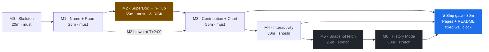
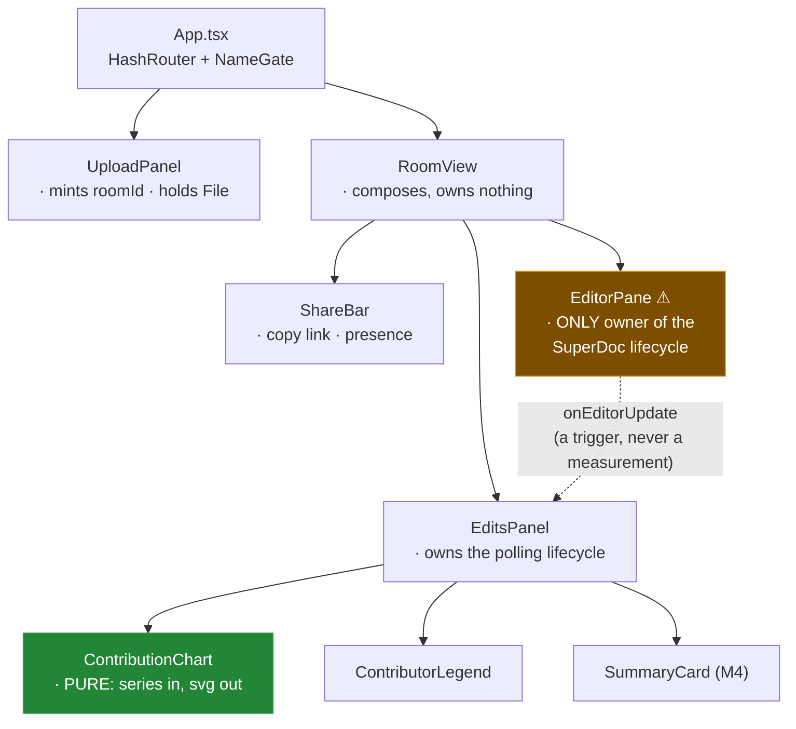
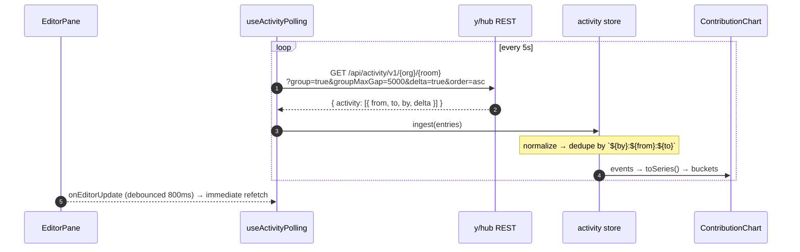
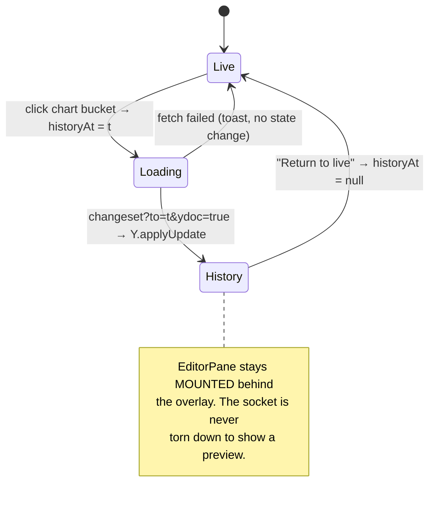

# Milestone Build Plan — SuperDoc Contributions Timeline

> [!TIP]
> **TL;DR** — Execute [0001](0001_[_]_SUPERDOC_CONTRIBUTIONS_TIMELINE.md)'s architecture in seven
> slices. Three live probes against a running `yhub/standalone` container changed the plan in ways
> worth acting on: **(1)** the file to patch is `bin/yhub.js`, not `bin/conf.js`; **(2)**
> `activity?delta=true` returns the actual inserted text, so the chart metric can be *characters*
> from day one instead of "bursts"; **(3)** `changeset?to=<ts>&ydoc=true` reconstructs the document
> at any past timestamp — **Milestone 5 needs no snapshot writer at all**, which turns the stretch
> from an hour of storage plumbing into ~25 minutes of fetch-and-decode.

---

## The Critical Path, Restated

Stripped of everything optional, the thing being graded is one sentence:

> **Two people, on two machines, with only a URL between them, type into the same DOCX and watch a
> chart correctly say who typed what and when.**

Everything decomposes from that:

```text
┌──────────┐   ┌──────────┐   ┌──────────────┐   ┌──────────┐   ┌───────┐
│ identity │──▶│  a room  │──▶│ shared edits │──▶│ who/when │──▶│ chart │
│  M0–M1   │   │    M1    │   │      M2      │   │    M3    │   │  M3   │
└──────────┘   └──────────┘   └──────────────┘   └──────────┘   └───────┘
                                    ▲
                          everything upstream of this
                          arrow is cheap; everything at
                          it is where the 4 hours go
```

The load-bearing observations:

1. **M2 is the only milestone that can fail outright.** M0, M1, M3, M4 are work; M2 is a *risk*.
   It sits between two systems (SuperDoc v2's obfuscated collaboration worker, and y/hub beta) that
   neither of us controls and that have never been proven to talk to each other in this repo.
2. **M3 does not depend on M2 succeeding through SuperDoc.** The chart reads y/hub's REST API. A
   `node yjs-probe.mjs` writer can generate real, attributed, charted data with SuperDoc entirely
   out of the loop. That decoupling is the whole reason this plan survives an M2 blowup.
3. **M4 is polish on a thing that already works.** Cut it without remorse.
4. **M5/M6 are nearly free now** — see [Stretch Path Detail](#stretch-path-detail). That does not
   promote them above M4; it just changes what "if there's time" buys you.
5. **Deployment is not a milestone, it is a deadline.** GitHub Pages + Railway are fixed context,
   not scope. They get a protected wall-clock slot, not a queue position.

> [!IMPORTANT]
> The one decision this document does **not** reopen: contribution data comes from y/hub's Activity
> API, not from a client-side Yjs tap. SuperDoc v2 owns the `Y.Doc` inside an obfuscated Web Worker.
> That was settled in 0001 and re-confirmed below.

---

## Problem Statement

0001 decided *what to build and why*. It does not say *what to type first, when to panic, or what
to delete when the clock runs out*. This document turns it into an executable, milestone-gated plan
against a ~4-hour honor-system budget, with the property that **stopping at any milestone boundary
leaves something worth submitting**.

Scope is fixed and not reopened here: pnpm/TS/React/Vite, Tailwind + shadcn/ui, Zustand as a UI
projection only, SuperDoc v2, Yjs + y-websocket, y/hub as the system of record, Recharts,
Pages + Railway. Out of scope stays out: AI labeling, keystroke replay, permissions, image tracking.

---

## Executive Summary

Since 0001 was written, a spike harness landed in the primary worktree and a `yhub/standalone`
container has been running locally. I drove it directly. Six things are now **verified fact rather
than plan**, and four of them change the milestone plan:

| # | Finding | Method | Effect on the plan |
| --- | --- | --- | --- |
| F1 | Plain Yjs 13.6.32 + y-websocket 3.1 syncs against y/hub | `node yjs-probe.mjs` → `synced:true` | ✅ De-risks M2's protocol half. Failure now isolates to SuperDoc's worker. |
| F2 | Stock image attributes every edit to a cartoon character | `activity` returned `by:"Charlie Brown"` for a probe that sent `yauth=probe-device` | ⚠️ Confirms the patch is mandatory — and the file is **`bin/yhub.js`**, not `bin/conf.js` |
| F3 | `activity?delta=true` returns the inserted **text** | live JSON, see below | 🎉 M3's metric becomes real character volume, not burst count |
| F4 | `changeset?to=<ts>&ydoc=true` reconstructs the doc at any past instant | decoded 3 timestamps with `Y.applyUpdate` | 🎉 **M5 has no snapshot writer.** Deletes an entire storage layer |
| F5 | `customAttributions` came back `null` / `[]` | live JSON | ⚠️ Display-name channel unproven — fold the name into `yauth` instead |
| F6 | Zero `SharedArrayBuffer` / `crossOriginIsolated` references in any SuperDoc bundle | grep of all three worker bundles + `superdoc.es.js` | ⚠️ The dev-server COOP/COEP headers may be a misdiagnosis — and **GitHub Pages cannot set them** |

The consequence: the plan below front-loads the two unknowns that remain (does SuperDoc's *worker*
speak to y/hub; do the Pages workers boot without cross-origin isolation) and treats everything
downstream as ordinary work.

---

## Current State In The Repository

> [!NOTE]
> The primary worktree at `/Users/crs/Code/superdoc-timeline` holds **uncommitted** spike work that
> is not visible from this branch. It is real and it is good; the plan below assumes it, so the
> first action of M0 is to get it committed rather than to re-derive it.

| Path | Status | What it establishes |
| --- | --- | --- |
| [package.json](package.json) | ✅ Present | `superdoc@2.5.1`, `zustand@5`, `recharts@3.2.1`, `react-router-dom@7`, `nanoid@5`; `yjs@13.6.32` + `y-websocket@3.1` pinned as devDeps for the probe |
| [vite.config.ts](vite.config.ts) | ✅ Present | `base` from `VITE_BASE`, `@` alias, **`optimizeDeps.exclude: ['superdoc', '@superdoc/docx-engine']`**, COOP/COEP dev headers, vitest config |
| [tsconfig.json](tsconfig.json) | ✅ Present | strict, `noUncheckedIndexedAccess`, `verbatimModuleSyntax` — genuinely strict, plan for it |
| [scripts/copy-superdoc-workers.mjs](scripts/copy-superdoc-workers.mjs) | ✅ Present | Copies the three engine bundles into `public/superdoc-workers/`; wired as `predev`/`prebuild` |
| [spike.html](spike.html) + [src/spike.ts](src/spike.ts) | ✅ Present | Worker-instrumenting harness driven by `?room=&mode=&user=&blank=` |
| [yjs-probe.mjs](yjs-probe.mjs) | ✅ Present | Headless Yjs writer — **this is the M3 data generator**, keep it |
| `public/superdoc-workers/*` | ✅ Generated | 7.8 MB collaboration, 6.3 MB document, 0.5 MB reviewIndex (gitignored) |
| `index.html`, `src/main.tsx`, `src/App.tsx` | ❌ Absent | There is no app yet — only the spike harness |
| `src/index.css`, shadcn deps | ❌ Absent | Tailwind installed, never imported; no `cva`/`clsx`/`tailwind-merge`/`lucide-react` |
| `src/store/`, `src/types/`, `src/collab/`, `src/contributions/` | ❌ Absent | Every module in 0001's tree is still a proposal |
| `server/` | ❌ Absent | The y/hub patch is unwritten |
| `.github/workflows/deploy.yml` | ❌ Absent | — |

Two details in the existing config are load-bearing and easy to accidentally delete:

- **`optimizeDeps.exclude`** — running the v2 DOCX engine through esbuild's dep optimizer breaks the
  worker handshake. The comment in `vite.config.ts` says so; believe it.
- **`workerUrls` + the copy script** — under pnpm the engine resolves its workers to a virtual-store
  path Vite will not serve. The copy script relocates them into `public/` and the app points at them
  via `import.meta.env.BASE_URL`, which *also* removes the Pages `base`-path risk that 0001 filed as
  R4. That risk is already mitigated; do not re-solve it.

---

## External Research

### Live probes against `ghcr.io/yjs/yhub/standalone:latest`

Everything in this section is output from a container running right now on `:4400`.

<details>
<summary>F1 — plain Yjs syncs (the protocol half of M2 is proven)</summary>

```bash
node yjs-probe.mjs 'ws://localhost:4400/api/ws/v1/superdoc-timeline' probe-room-1 probeA
```

```json
{ "label": "probeA", "synced": true, "text": "hello from probeA",
  "events": ["status:connected", "sync:true"] }
```

Yjs 13.6.32 (SuperDoc's exact peer version) + y-websocket 3.1 completes a sync and round-trips text.
0001 filed protocol incompatibility as risk **R1, "medium likelihood, fatal"**. It is now
substantially retired: whatever remains is SuperDoc's worker, not the wire format.

</details>

<details>
<summary>F2 — the cartoon-character attribution, confirmed, and the real file to patch</summary>

The probe connected with `params: { yauth: 'probe-device' }`. y/hub recorded:

```json
{"activity":[{"from":1786646564976,"to":1786646564976,"by":"Charlie Brown","customAttributions":null}]}
```

The stock image ignores `yauth` entirely. Inside the container:

```
/usr/src/app/bin/  →  auth-server-example.js   init-db.js   yhub.js
```

There is **no `bin/conf.js`**. 0001's Dockerfile would have copied a file nothing reads. The demo
auth lives inline in `bin/yhub.js`:

```js
const userIdChoices = ['Calvin Hobbes', 'Charlie Brown', 'Dilbert Adams', 'Garfield']
const port = number.parseInt(env.getConf('port') || '3002')
yhub.createYHub({
  redis: { url: env.ensureConf('redis'), prefix: 'yhub', taskDebounce: 10000, minMessageLifetime: 60000 },
  postgres: env.ensureConf('postgres'),
  persistence: [],
  server: { port, auth: {
    async readAuthInfo (req) { return { userid: random.oneOf(userIdChoices) } },
    async getAccessType () { return 'rw' }
  } },
  worker: { taskConcurrency: 5 }
})
```

Note also: **the internal port is `3002`**, not `4400`. The published `4400` is a host mapping. The
Railway service must target the port the process actually binds.

</details>

<details>
<summary>F3 — `delta=true` returns the inserted text (the metric upgrade)</summary>

```bash
curl -s 'localhost:4400/api/activity/v1/superdoc-timeline/probe-room-2?group=true&groupMaxGap=5000&delta=true&order=asc' \
  -H 'Accept: application/json'
```

```json
{"activity":[
 {"from":1786646529449,"to":1786646529449,"by":"Garfield","delta":{"type":"delta","children":[
   {"type":"insert","insert":"hello from control","attribution":{"insert":["Garfield"],"insertAt":1786646529449}}]}},
 {"from":1786646663274,"to":1786646663274,"by":"Calvin Hobbes","delta":{"type":"delta","children":[
   {"type":"insert","insert":"hello from alpha","attribution":{"insert":["Calvin Hobbes"],"insertAt":1786646663274}},
   {"type":"insert","insert":"hello from control"}]}}
]}
```

> [!WARNING]
> **The counting gotcha.** Each entry's `children` contains the newly authored op *plus surrounding
> context ops with no `attribution`*. In the second entry, `"hello from control"` is Garfield's
> earlier text echoed back as context. Summing every `insert` triple-counts and produces a chart
> where the last contributor always looks heroic. **Count only children carrying
> `attribution.insert`.** This is the single most likely silent bug in Milestone 3.

</details>

<details>
<summary>F4 — point-in-time reconstruction, decoded at three timestamps</summary>

`GET /api/changeset/v1/{org}/{docid}?to=<unix_ms>&ydoc=true` returns a base64 Yjs update. Fed to
`Y.applyUpdate` on a fresh `Y.Doc`:

| `to` | bytes | decoded text |
| --- | --- | --- |
| `1786646529449` | 36 | `hello from control` |
| `1786646663274` | 67 | `hello from alphahello from control` |
| `1786646666901` | 97 | `hello from betahello from alphahello from control` |

Three timestamps, three correct historical states, monotonically growing. y/hub's own API doc puts
it plainly: the returned `ydoc` "is the document at `to`; its alive content already *is* that
point-in-time state."

Also probed and **negative**, so don't chase them:

- `GET /api/ydoc/v1/...?to=<ts>` — the `to` param is ignored; that endpoint is current-state only.
- `changeset?...&delta=true` returned `{"delta":{"type":"delta"}}` (empty) with `to`, with
  `from=0&to=<ts>`, and with neither. The per-entry `delta` on **activity** works; the changeset one
  did not in this build. Use activity for deltas, changeset for `ydoc`.
- `activity?ydoc=true` adds `renderedContent` per entry, but it is base64 Yjs content-ids, not text.

</details>

<details>
<summary>F5 — `customAttributions` is an unproven channel for display names</summary>

Requested with `customAttributions=true`, entries returned `"customAttributions": []` (and `null`
without the flag) even though the probe sent `params: { customAttributions: 'name:...' }`. Whether
that is a client-side wiring gap or a server-side no-op was not worth the minutes to isolate.

**Plan accordingly:** carry the display name inside `yauth` as `deviceId|name`, split on read.
`by` becomes the stable key's left half, the label its right half. One line each way, zero unknowns.
0001 already listed this as the fallback; promote it to the default.

</details>

<details>
<summary>F6 — no SharedArrayBuffer anywhere, and Pages cannot set COOP/COEP</summary>

```text
collaboration.js  SharedArrayBuffer:0  Atomics:0  WebAssembly:0  crossOriginIsolated:0
document.js       SharedArrayBuffer:0  Atomics:0  WebAssembly:0
superdoc.es.js    SharedArrayBuffer:0                crossOriginIsolated:0
```

Also absent from the published docs: `docs.superdoc.dev/md/editor/collaboration.md` says nothing
about headers, cross-origin isolation, or `SharedArrayBuffer`. What the bundle *does* carry is
`worker-init-failed` and `workerStartupTimeoutMs` — whose shipped doc comment attributes the timeout
to "script download, parsing, evaluation" over "a slow connection or a cold dev-server cache". A
7.8 MB worker on a cold cache is a far better explanation for a 10-second `worker-init-failed` than
a missing security header.

This matters because **GitHub Pages cannot set response headers at all**. If cross-origin isolation
were genuinely required, the only route is [`coi-serviceworker`](https://github.com/gzuidhof/coi-serviceworker) —
a service worker that reloads the page once on first visit to inject the headers, which must be
served unbundled from your own origin. That is a real, working escape hatch, but it costs a forced
reload and a service-worker lifecycle in a 4-hour build.

**Resolution:** treat the dev-server headers as unfalsified-but-unnecessary. Keep them locally (they
cost nothing), and make "does the built bundle collaborate *without* them" an explicit M2 check —
`VITE_BASE=/ pnpm build && pnpm preview` serves no such headers. If it works there, Pages is fine
and `coi-serviceworker` never enters the repo.

</details>

### Recharts `<Brush>` — read this before Milestone 4

Recharts' `Brush` has a long, well-documented history of not behaving as a controlled component:
`startIndex` / `endIndex` changes are reported not to take effect without a remount
([#2404](https://github.com/recharts/recharts/issues/2404),
[#425](https://github.com/recharts/recharts/issues/425),
[#963](https://github.com/recharts/recharts/issues/963)), and only `onChange` is exposed — it fires
continuously during a drag, with no `onMouseUp` ([#1186](https://github.com/recharts/recharts/issues/1186)).

> [!TIP]
> **Use `Brush` uncontrolled.** Read indices out via `onChange`, derive the summary card from them,
> and never write them back. This is a 10-minute feature done that way and a 40-minute one done any
> other way. Milestone 4's own risk row says the same thing.

---

## Key Findings

1. **M2 is the only genuine risk, and it is now half-retired.** F1 proves the wire format;
   what is unproven is SuperDoc's worker path specifically.
2. **The chart's data source is independent of SuperDoc.** `yjs-probe.mjs` writes attributed
   activity that the chart can render. M3 is buildable and demoable even if M2 never lands.
3. **`bin/yhub.js`, port `3002`.** 0001's `bin/conf.js` Dockerfile would silently no-op — the worst
   possible failure, because the container still boots and the chart still shows *four contributors*.
4. **Character volume is free.** `delta=true` on the request you were already making.
5. **Snapshots already exist server-side.** M5's "periodic snapshots, store with timestamps"
   is redundant with `changeset?to=&ydoc=true`. Building it would be reimplementing the system of
   record on the client — precisely what the fixed architectural principles forbid.
6. **Name-in-`yauth` beats `customAttributions`.** Fewer unknowns, same result.
7. **Cross-origin isolation is probably a non-issue, and must be *proven* on a real build**, because
   the fix (`coi-serviceworker`) is cheap to add early and expensive to discover late.
8. **Recharts `Brush` must stay uncontrolled.**
9. **`BlankDOCX` is exported from `superdoc` and typed `string`** (not a `Blob`) — relevant to the
   cold-join question, which remains M2's second unknown.
10. **`tsconfig` is genuinely strict** (`noUncheckedIndexedAccess`, `noUnusedLocals`,
    `verbatimModuleSyntax`). Bucket code indexing `bucket[c.id]` will need non-null handling, and
    every type-only import needs `import type`. Budget for it rather than loosening the config at
    hour three.

---

## 🧭 Milestone-By-Milestone Breakdown



---

### Milestone 0 — Project Skeleton · 20 min · **must-ship**

**Goal:** turn the spike repo into an app repo that builds, routes, and renders a shell.

**Tasks**

- [ ] Commit the uncommitted spike work first (`package.json`, `vite.config.ts`, `scripts/`,
      `spike.html`, `src/spike.ts`, `yjs-probe.mjs`) — it is the foundation and it is untracked
- [ ] `index.html` with `<div id="root">` + `src/main.tsx`
- [ ] `src/index.css` → `@import "tailwindcss";` (v4 has no config file)
- [ ] `pnpm add class-variance-authority clsx tailwind-merge lucide-react`;
      `pnpm dlx shadcn@latest init` then `add button input card skeleton badge`
- [ ] `src/lib/utils.ts` (`cn()`), `src/types/*.ts` — write the types before the components
- [ ] `src/store/identity.ts` (zustand + `persist`), `src/store/room.ts`
- [ ] `HashRouter` with `/` and `/d/:roomId`; `App.tsx` shell (header + outlet)

**Files:** `index.html`, `src/main.tsx`, `src/App.tsx`, `src/index.css`, `src/lib/utils.ts`,
`src/types/{identity,activity,contribution,series,room}.ts`, `src/store/{identity,room}.ts`,
`src/components/ui/*`

**Definition of done:** `pnpm build` passes with the strict tsconfig, and
`#/d/anything` renders the shell rather than a blank page.

**Demo:** "It's a real app with routing and a design system." Weak, but honest.

**Risks:** `shadcn init` on Tailwind v4 wants `@tailwindcss/vite` already wired — it is. If init
stalls on prompts, hand-write `components.json` rather than debug the CLI. Do not hand-write a
v3-style `tailwind.config.ts`.

---

### Milestone 1 — Name + Shareable Room · 25 min · **must-ship**

**Goal:** a name and a file produce a URL you can paste to somebody else.

**Tasks**

- [ ] `NameGate` — blocks any route until `identity.name` exists; mints `deviceId` via
      `crypto.randomUUID()` on first run
- [ ] `UploadPanel` — `<input type="file" accept=".docx">`, mint `roomId = nanoid(12)`
- [ ] Hand the `File` to the room route **in memory** (module-level `Map<roomId, File>` or router
      state) — never serialize a DOCX through `sessionStorage`
- [ ] Navigate to `#/d/:roomId`; `ShareBar` with `navigator.clipboard.writeText(location.href)`
- [ ] Joining `#/d/:roomId` with no blob is a first-class path, not an error

**Files:** `src/components/{NameGate,UploadPanel,ShareBar,RoomView}.tsx`,
`src/store/identity.ts`, `src/lib/pending-upload.ts`

**Definition of done:** enter a name, pick a `.docx`, land on `#/d/<12 chars>`; hard-refresh keeps
the name; the copied link opens the same route in a second browser profile and prompts *that* user
for a name.

**Demo:** the full pre-collaboration flow, two profiles, one link. Genuinely shows the product idea.

**Risks:** clipboard API needs a user gesture and a secure context — fine on `localhost` and Pages,
silently broken over plain `http://` on a LAN IP. Keep a selectable `<input readOnly>` next to the
button as the fallback.

---

### Milestone 2 — SuperDoc + Y-Hub Collaboration · 55 min · **must-ship** · ⚠️ the risk

**Goal:** two browser profiles type into one DOCX through a deployed y/hub, attributed to real ids.

**Tasks**

- [ ] `server/Dockerfile` + `server/yhub.js` — patch `readAuthInfo` to read `yauth` **(F2: the target
      is `bin/yhub.js`)**; AGPL notice at the top of the file
- [ ] Deploy to Railway from `server/`, **attach a volume at `/data`**, generate a domain, target the
      port the process binds (`3002` unless `PORT` is set)
- [ ] Verify the patch took: `curl` activity after a probe write and confirm `by` is your device id
      and **not** `Garfield`
- [ ] `src/collab/yhub.ts` — `wsServerUrl()`, `httpBase()`, `ORG` constant
- [ ] `src/collab/superdoc-mount.ts` — `mountRoom()` carrying `workerUrls`, `params.yauth`,
      `roomMode`, and the join-or-create retry on `collaboration-v2-room-missing` /
      `collaboration-v2-room-already-exists`
- [ ] `EditorPane` — owns mount and `destroy()` in the effect cleanup **from the first version**
- [ ] Settle the cold-join question: `data: null` → `data: BlankDOCX` → omit `data`
- [ ] Confirm the built bundle collaborates with no COOP/COEP headers (`VITE_BASE=/ pnpm build && pnpm preview`)

**Files:** `server/{Dockerfile,yhub.js}`, `src/collab/{yhub,superdoc-mount}.ts`,
`src/components/EditorPane.tsx`, `.env.example`

**Definition of done:** two profiles against the **Railway** backend edit one document; a refresh in
either reconnects with no mode error; `activity` shows both device ids.

**Demo:** the take-home's headline. Everything else is commentary.

**Risks & mitigations**

| Risk | Mitigation |
| --- | --- |
| SuperDoc's worker doesn't sync through y/hub even though plain Yjs does | `src/spike.ts` already instruments every `Worker` message. Run the spike *first*, not `EditorPane` |
| Patch silently no-ops (wrong file / wrong path in the image) | The `by !== 'Garfield'` curl is a **hard gate**, not a nicety |
| No `/data` volume → total history loss on redeploy | Attach it in the same sitting you create the service |
| Container OOM (Postgres + Valkey + Node in one) | ≥1 GB; symptom is mysterious socket drops, not an OOM message |
| Cold-join `data` shape unknown | Three candidates, ~4 minutes to try all three |
| Cross-origin isolation actually required | `coi-serviceworker`, added early or not at all |

---

### Milestone 3 — Contribution Projection + Area Chart · 55 min · **must-ship**

**Goal:** the Activity API becomes a stacked area chart of character volume per contributor.

**Tasks**

- [ ] `fetchActivity()` — `Accept: application/json`, `order=asc`, `group=true`, `groupMaxGap=5000`,
      `delta=true`, `limit=2000`
- [ ] `normalize.ts` — entry → `ContributionEvent`; **count only children with `attribution.insert`**
      (F3); split `by` on `|` into id + display name (F5)
- [ ] `store/activity.ts` — `Map<eventId, ContributionEvent>`, keyed `${by}:${from}:${to}` so
      overlapping polls dedupe
- [ ] `bucket.ts` — adaptive width, zero-fill every contributor in every bucket
- [ ] **`bucket.test.ts`** — empty, single contributor, and a gap that must zero-fill
- [ ] `useActivityPolling` — 5 s interval, `AbortController`, plus a debounced refresh on
      `onEditorUpdate`
- [ ] `lib/color.ts` — deterministic hue from the contributor id
- [ ] `ContributionChart` — pure `ActivitySeries` → Recharts; legend with matching swatches

**Files:** `src/collab/yhub.ts`, `src/contributions/{normalize,bucket,useActivityPolling}.ts`,
`src/contributions/bucket.test.ts`, `src/store/activity.ts`, `src/lib/color.ts`,
`src/components/{EditsPanel,ContributionChart}.tsx`

**Definition of done:** two contributors typing produce two distinctly coloured stacked bands whose
peaks line up with who typed when; a late joiner sees the full history including pre-arrival edits;
`pnpm test` passes.

**Demo:** the differentiating feature. Type in one window, watch the other window's chart grow.

**Risks:** the triple-count bug (F3) — mitigate by `console.table`-ing normalized events before any
chart code exists. Chart holes from missing keys — mitigate by zero-filling, which the unit test
enforces. Poll storms on remount — mitigate with `AbortController` in the effect cleanup.

---

### Milestone 4 — Chart Interactivity · 30 min · **should-ship, first to cut**

**Goal:** the chart answers "who did what *in this window*", not just "over all time".

**Tasks**

- [ ] `<Brush dataKey="t" height={24} onChange={...} />` — **uncontrolled**, indices read out only
- [ ] `SummaryCard` — per-contributor totals + share for the brushed window
- [ ] Legend solo/focus — click toggles a `Set<string>` of hidden ids; `<Area hide={...}>`
- [ ] Empty state ("No edits yet — start typing"), sparse state, loading skeleton, error state

**Files:** `src/components/{ContributionChart,SummaryCard,ContributorLegend,EmptyState}.tsx`

**Definition of done:** dragging the brush updates the summary card; clicking a legend entry hides
its band and the others restack; a brand-new room renders a deliberate empty state, not a blank box.

**Demo:** "scrub to the last five minutes and see that Bob wrote 80% of it."

**Risks:** `Brush` as a controlled component (see research above) — stay uncontrolled. `onChange`
fires on every drag frame — derive, don't `setState` per frame, or memoize the summary computation.

---

### Milestone 5 — Snapshot Foundation · 25 min · **stretch**

**Goal:** fetch and decode the document as it was at an arbitrary past timestamp.

> [!IMPORTANT]
> **This milestone shrank.** The brief says "periodic snapshots… store with timestamps against the
> room." F4 shows y/hub already does exactly that, server-side, durably. Writing a client snapshot
> loop would duplicate the system of record — the one thing the fixed architectural principles rule
> out. The milestone becomes a **read** path, and it drops from ~60 min to ~25.

**Tasks**

- [ ] `pnpm add yjs@13.6.32` — promote from devDep, pinned to SuperDoc's peer version
- [ ] `fetchDocumentAt(roomId, ts)` → `changeset/v1?to=<ts>&ydoc=true` → base64 → `Y.applyUpdate`
- [ ] `describeDoc(doc)` — enumerate `doc.share` roots and extract text, so the SuperDoc schema is
      discovered rather than guessed
- [ ] `HistoryPreview` — read-only panel rendering the reconstructed text

**Files:** `src/history/{fetchDocumentAt,describeDoc}.ts`, `src/components/HistoryPreview.tsx`

**Definition of done:** given a timestamp from the chart, a panel shows document text that differs
from live and matches what existed then.

**Demo:** "the server is the history; the client just asks it a question."

**Risks:** SuperDoc's Y.Doc root key and node schema are undocumented and the worker is obfuscated —
`describeDoc` turns that from a blocker into a 5-minute discovery. If the fragment resists rendering,
the honest fallback is a text-only view plus a README line naming exactly what is missing.

---

### Milestone 6 — History Mode · 30 min · **stretch**

**Goal:** click the chart, see the document as it was; click again, return to live.

**Tasks**

- [ ] Chart `onClick` → nearest bucket `t` → `historyAt` in the room store
- [ ] `historyAt !== null` swaps `EditorPane` for `HistoryPreview` — the live editor **stays mounted**
      behind it; never tear down a working socket to show a preview
- [ ] A `HistoryBanner` that is impossible to miss: timestamp, "read-only", "Return to live"
- [ ] Cursor affordance on the chart when a click will time-travel

**Files:** `src/components/{HistoryBanner,RoomView,ContributionChart}.tsx`, `src/store/room.ts`

**Definition of done:** click a bucket from five minutes ago → the old text appears with an explicit
banner → "Return to live" restores the editor, still connected, no reload.

**Demo:** the closing move. Chart → past → back, in fifteen seconds.

**Risks:** unmounting `EditorPane` costs a reconnect and, worse, can trip the create/join retry.
Overlay, don't replace. Also: a user who edits during History Mode must not be able to — enforce
read-only by rendering a different component, not by trusting a prop.

---

## Recommended Build Order & Time Box

```mermaid
gantt
    dateFormat HH:mm
    axisFormat %H:%M
    title 4-hour honor-system window
    section Must
    M0 Skeleton            :m0, 00:00, 20m
    M1 Name + Room         :m1, after m0, 25m
    M2 SuperDoc + Y-Hub    :crit, m2, after m1, 55m
    M3 Contribution + Chart:m3, after m2, 55m
    section Should
    M4 Interactivity       :m4, after m3, 30m
    section Protected
    Ship gate (Pages+README):milestone, ship, 03:20, 30m
    section Stretch
    M5 + M6                :m5, 03:50, 10m
```



| Clock | Milestone | Gate to pass before continuing |
| --- | --- | --- |
| 0:00–0:20 | M0 | `pnpm build` green, routes render |
| 0:20–0:45 | M1 | link opens in a second profile |
| 0:45–1:40 | M2 | ⚠️ two profiles editing on Railway |
| 1:40–2:35 | M3 | two coloured bands matching reality |
| 2:35–3:05 | M4 | brush + summary + legend |
| **3:05–3:20** | **buffer** | absorbs the overrun that always happens |
| **3:20–3:50** | **🔒 Ship gate** | **never moved, never skipped** |
| 3:50–4:00 | M5/M6 | only if the ship gate finished early |

### Hard decision points

> [!CAUTION]
> **T+2:00 — M2 still unstable.** This is the plan's one true fork. Stop debugging and choose:
>
> 1. **Does the *spike* sync?** If `spike.html` in two tabs syncs but `EditorPane` doesn't, it is
>    a React lifecycle bug (double-mount in StrictMode, missing `destroy()`) — 10 more minutes, then
>    disable StrictMode and move on.
> 2. **Does neither sync, while `yjs-probe.mjs` does?** SuperDoc's worker is the problem, not y/hub.
>    **Take the fallback:** ship single-user SuperDoc (no `v2Collaboration`) *plus* a fully working
>    chart driven by the probe, and write the diagnosis up honestly. You still have F1's evidence
>    that the backend is sound.
> 3. **Does the probe fail too?** Railway, not code. Drop to local `docker run` for the demo, keep
>    Railway as a documented deployment target, and note the exact failure.
>
> In every branch, **M3 proceeds**. It never depended on M2.

**What to cut, in order:**

1. M6 (History Mode)
2. M5 (snapshot fetch)
3. M4's legend solo, then the summary card, then the brush — M4 is three independent features, cut
   them individually rather than as a block
4. M3's polling refinement (drop the `onEditorUpdate` trigger; the 5 s interval alone is fine)
5. M4's empty/sparse states — **cut last within M4**; they cost 5 minutes and are what an empty demo
   room actually shows a reviewer

**Never cut:** the ship gate, `bucket.test.ts`, the README trade-off list. An undeployed,
undocumented, untested system reads worse than a smaller complete one.

**When it is safe to start stretch work:** only when *all* of — M3's definition of done met, the
Pages deploy verified live from a second machine, and the README trade-off section written — are
true. Not "M3 works locally." The stretch gate is a deploy gate.

---

## Minimal Viable Presentable States

| Stop after | Ship? | The story it tells |
| --- | --- | --- |
| M1 | 🛑 No | A router and a name form. Not a submission. |
| **M2** | ✅ **Yes** | *"Real-time collaborative DOCX editing on SuperDoc v2 and y/hub, deployed."* Meets the core brief minus the chart. Defensible. |
| **M2 fallback + M3** | ✅ **Yes** | *"Working contribution analytics on the real server-side attribution index; here is precisely why live sync didn't land and what I'd do next."* An interviewer learns more from this than from a green demo. |
| **M3** | ✅ **Yes — the target** | The complete brief: collaborate, attribute, visualize. Everything after this is upside. |
| M4 | ✅ Yes | The same, with a chart that answers questions instead of just displaying. |
| M5 | ⚠️ Only with M6 | A fetch function with no UI is a dead end in a demo. Bundle it or hide it. |
| M6 | ✅ Yes | *"The backend is the system of record, so time travel is a query, not a feature."* The best version of the submission. |

> [!TIP]
> Commit at every boundary with a message naming the state (`feat(m2): collaborative editing live on
> y/hub`). If the clock kills you mid-milestone, `git reset --hard` to the last boundary is a
> 5-second recovery to a presentable state. This is what "always presentable" actually costs.

---

## Technical Task Detail For The Critical Path

### Component boundaries



Three rules that keep this from tangling:

1. **`EditorPane` is the only file that imports `superdoc`.** One owner, one `destroy()`.
2. **`ContributionChart` fetches nothing.** It takes an `ActivitySeries` and returns SVG. That is
   what makes `bucket.ts` unit-testable without a DOM.
3. **`onEditorUpdate` is a poll trigger, never a data source.** Repeating 0001's warning because it
   is the mistake most likely to be made under time pressure.

### Zustand state shape

Three small stores. Zustand is a **UI projection**, per the fixed principles — it holds nothing that
y/hub could not regenerate.

```ts
// src/store/identity.ts — the ONLY persisted store
interface IdentityState {
  deviceId: string;            // crypto.randomUUID(), minted once, never changes
  name: string;                // display only
  setName: (name: string) => void;
}
export const useIdentity = create<IdentityState>()(
  persist(
    (set) => ({ deviceId: crypto.randomUUID(), name: '', setName: (name) => set({ name }) }),
    { name: 'superdoc-timeline:identity' },
  ),
);

// src/store/room.ts — per-session, never persisted
interface RoomState {
  roomId: string | null;
  mode: 'create' | 'join';
  status: 'idle' | 'connecting' | 'connected' | 'reconnecting' | 'error';
  lastError: string | null;
  historyAt: number | null;    // M6; null = live
  set: (patch: Partial<RoomState>) => void;
}

// src/store/activity.ts — the projection
interface ActivityState {
  events: Map<string, ContributionEvent>;   // keyed by stable id → polls dedupe
  names: Map<ContributorId, string>;        // last display name seen per id
  ingest: (entries: YHubActivityEntry[]) => void;
  reset: () => void;                        // on roomId change
}
```

> [!WARNING]
> A `Map` in Zustand does not trigger re-renders on mutation. `ingest` must
> `set({ events: new Map(prev) })`. The alternative — a plain array plus a dedupe on read — is
> slower but harder to get wrong; either is fine, but pick one deliberately.

### Y-Hub connection approach

```ts
// src/collab/yhub.ts
export const ORG = 'superdoc-timeline';
const WS = import.meta.env.VITE_YHUB_WS_URL;      // wss://<app>.up.railway.app
const HTTP = WS.replace(/^ws/, 'http');           // derived, never configured twice

/** y-websocket appends `/{documentId}` → /api/ws/v1/{org}/{docid}. Verified by yjs-probe.mjs. */
export const wsServerUrl = () => `${WS}/api/ws/v1/${ORG}`;

/** Identity travels in `yauth` as `deviceId|name` (F5: customAttributions is unproven). */
export const encodeAuth = (deviceId: string, name: string) =>
  `${deviceId}|${name.replace(/\|/g, ' ').slice(0, 40)}`;

export const decodeAuth = (by: string | undefined) => {
  const [id = 'unknown', name] = (by ?? 'unknown').split('|');
  return { id, name: name || id.slice(0, 8) };
};
```

The mount call, with the pieces this repo has already proven necessary:

```ts
new SuperDoc({
  selector: el,
  // Required under pnpm — see scripts/copy-superdoc-workers.mjs. Also removes the
  // Pages base-path risk, because these URLs are ours.
  workerUrls: {
    document:      `${import.meta.env.BASE_URL}superdoc-workers/document.js`,
    collaboration: `${import.meta.env.BASE_URL}superdoc-workers/collaboration.js`,
    reviewIndex:   `${import.meta.env.BASE_URL}superdoc-workers/reviewIndex.js`,
  },
  workerStartupTimeoutMs: 60_000,        // 7.8 MB worker on a cold cache; default is 30s
  user: { id: deviceId, name },
  document: {
    id: roomId,
    type: 'application/vnd.openxmlformats-officedocument.wordprocessingml.document',
    data,                                 // File on create; see M2 for the cold-join answer
    v2Collaboration: {
      documentId: roomId,                 // providerType defaults to 'y-websocket'
      serverUrl: wsServerUrl(),
      roomMode,
      params: { yauth: encodeAuth(deviceId, name) },
    },
  },
  onCollaborationReady: onReady,
  onException: ({ error }) => {
    const code = String((error as { code?: string })?.code ?? error);
    if (code.includes('collaboration-v2-room-missing')) return onRetry('create');
    if (code.includes('collaboration-v2-room-already-exists')) return onRetry('join');
    if (code.includes('collaboration-v2-room-initializing')) return;   // transient — third code, verified in the bundle
    onError(code);
  },
});
```

> [!NOTE]
> `collaboration-v2-room-initializing` is a **third** code present in `superdoc.es.js` that 0001
> did not list. Treat it as transient and ignore it — retrying a mode change on it would remount
> the editor during normal startup.

### Contribution event shape and capture strategy



```ts
// src/contributions/normalize.ts
export function toEvent(entry: YHubActivityEntry): ContributionEvent {
  const { id, name } = decodeAuth(entry.by);
  return {
    id: `${entry.by ?? 'unknown'}:${entry.from}:${entry.to}`,
    contributorId: id,
    displayName: name,
    startedAt: entry.from,
    endedAt: entry.to,
    weight: weightOf(entry),
  };
}

/**
 * F3: each entry's delta carries the authored op PLUS unattributed context ops
 * echoing earlier text. Counting every insert triple-counts and makes whoever
 * typed last look like they wrote the document. Only attributed ops are ours.
 */
function weightOf(entry: YHubActivityEntry): number {
  let chars = 0;
  for (const op of entry.delta?.children ?? []) {
    if (typeof op.insert === 'string' && op.attribution?.insert?.length) chars += op.insert.length;
    if (typeof op.delete === 'number' && op.attribution?.delete?.length) chars += op.delete;
  }
  return chars || 1;   // an entry with no decodable delta is still one edit
}
```

`weight` stays a single opaque number precisely so this function is the only place the definition of
"volume" lives. If characters turn out to read badly on the chart, swapping back to burst count is a
one-line change with no downstream edits.

### Chart data pipeline

```text
YHubActivityEntry[]  ──normalize──▶  ContributionEvent[]  ──dedupe──▶  Map<id, event>
                                                                            │
                                                                        toSeries()
                                                                            ▼
                                        ActivitySeries { bucketMs, buckets[], contributors[] }
                                                                            │
                                                              <AreaChart data={buckets}>
                                                              one <Area dataKey={c.id}> each
```

Bucketing is 0001's `toSeries()` unchanged — adaptive width targeting ~60 points, snapped to a power
of two so the axis stops jittering on every poll, zero-filled across all contributors so the stacked
ribbon has no tears. Two strict-mode adjustments for this repo's `tsconfig`:

```ts
const bucket = buckets.get(t);
if (bucket) bucket[event.contributorId] = (bucket[event.contributorId] ?? 0) + event.weight;
//                                          ^^^^^^^^^^^^^^^^^^^^^^^^^^^^^^^^^ noUncheckedIndexedAccess
```

and every `import type { … }` spelled out, because `verbatimModuleSyntax` is on.

---

## Stretch Path Detail

The smallest useful version of snapshots + History Mode, given F4.



```ts
// src/history/fetchDocumentAt.ts
import * as Y from 'yjs';

/** F4: y/hub returns the document AS IT WAS at `to`. No client snapshot store exists,
 *  and none should — the server already is one. */
export async function fetchDocumentAt(roomId: string, ts: number, signal?: AbortSignal) {
  const url = `${httpBase()}/api/changeset/v1/${ORG}/${roomId}?to=${ts}&ydoc=true`;
  const res = await fetch(url, { headers: { Accept: 'application/json' }, signal });
  if (!res.ok) throw new Error(`changeset ${res.status}`);
  const { ydoc } = (await res.json()) as { ydoc: string };

  const doc = new Y.Doc();
  Y.applyUpdate(doc, Uint8Array.from(atob(ydoc), (c) => c.charCodeAt(0)));
  return doc;
}

/** SuperDoc's Y.Doc schema is undocumented and the worker is obfuscated.
 *  Discover the roots at runtime instead of guessing them. */
export function describeDoc(doc: Y.Doc) {
  return [...doc.share.keys()].map((key) => {
    try { return { key, kind: 'text', text: doc.getText(key).toString() }; }
    catch { return { key, kind: 'xml', text: doc.getXmlFragment(key).toString() }; }
  });
}
```

**What this deliberately does not do**, and why each omission is defensible in an interview:

| Not built | Why |
| --- | --- |
| Periodic client snapshot writer | y/hub already stores every version. Writing our own would make the client a second system of record — the exact thing the architecture forbids |
| Continuous scrubbing | Every drag frame is an HTTP round trip. Click-to-jump is one request and reads as deliberate |
| DOCX re-render of history | SuperDoc v2 owns its `Y.Doc`; you cannot hand it a historical one. Text-level preview is the honest 25-minute version |
| Editing from History Mode | It would need a rollback API call — `POST /api/rollback/v1` exists, and is out of scope |

> [!NOTE]
> The single open unknown in the stretch is SuperDoc's Y.Doc root key and node schema. `describeDoc`
> converts it from a blocker into a console log. If the fragment doesn't render as readable text in
> five minutes, ship the root-key dump behind the History banner and say so in the README — a
> reviewer reads that as a known boundary, not a failure.

---

## README / Interview Narrative Hooks

One decision per boundary. Write each line **when you pass the boundary**, not at the end — the
reasoning is perishable and the trade-off list is the part actually being graded.

| Boundary | The decision to document | The trade-off to name |
| --- | --- | --- |
| M0 | Vanilla `superdoc` in `useEffect`, not `@superdoc-dev/react` | The wrapper's `latest` is v1-era and its v2 prerelease pins an exact prerelease `superdoc` |
| M0 | `HashRouter` | Pages has no rewrites; hash routing costs one ugly `#` and zero deploy config |
| M0 | `workerUrls` + a copy script | pnpm's virtual store isn't servable; the same fix pre-empts the Pages `base`-path bug |
| M1 | Identity is a `deviceId`, not a user | There are no accounts. Two tabs = one contributor; phone + laptop = two. A stated limitation, not a bug |
| M1 | The DOCX blob never leaves memory | The room *is* the document; we store no files. `roomMode: 'create'` seeds y/hub from the upload |
| M2 | Patching `bin/yhub.js` | The stock image attributes every edit to Garfield. Show the four cartoon names — it's the most memorable slide in the submission |
| M2 | Open auth, deliberately | The brief says no permissions. Then name the cost out loud: `DELETE /api/ydoc/v1` and `POST /api/rollback/v1` are public. First thing to fix in anything real |
| M2 | AGPL | `server/` derives from yjs/yhub; modifications are published in this repo |
| M3 | Chart reads the Activity API, not a Yjs tap | v2 owns the `Y.Doc` in an obfuscated worker; `modules.collaboration` is removed. **Document the dead ends** — the rejected options are the strongest evidence of judgment in the whole submission |
| M3 | Volume = attributed characters | And why summing every delta child would have triple-counted. A specific, verified bug avoided reads better than a generic "I was careful" |
| M3 | Fixed time buckets, not document sections | Section attribution needs the changeset API, position→section resolution, and a concurrent-merge policy. A day, not an hour |
| M4 | `Brush` left uncontrolled | Recharts' controlled-brush issues are years old and open; working with the library beat fighting it |
| M5/M6 | No client snapshot store | The server already is one. Time travel is a query. **This is the architectural punchline** — the same principle that made the chart a projection makes history a fetch |

---

## Risks And Open Questions

| # | Risk | Impact | Likelihood | Mitigation | Δ from 0001 |
| --- | --- | --- | --- | --- | --- |
| R1 | SuperDoc's collaboration worker won't sync through y/hub | 🛑 Fatal to M2 | Low-Med | Spike first; F1 proves the wire format is fine | ⬇️ downgraded |
| R2 | Patch applied to the wrong file → silent cartoon attribution | 🛑 Demo-ending, **invisible** | Med | `by !== 'Garfield'` curl as a hard gate | ⬆️ **new, from F2** |
| R3 | Delta triple-counting inflates the last contributor | High — a *wrong* chart | High | Count only attributed ops; `console.table` before charting | ⬆️ **new, from F3** |
| R4 | Cross-origin isolation actually required on Pages | High | Low | `pnpm preview` check in M2; `coi-serviceworker` if needed | ⬆️ **new, from F6** |
| R5 | Cold-join `data` shape unknown | High | Med | Three candidates, 4 minutes, in M2 | ↔️ unchanged |
| R6 | No `/data` volume → history lost on redeploy | 🛑 Demo-ending | Med | Attach at service creation | ↔️ unchanged |
| R7 | Recharts `Brush` controlled-mode breakage | Low | Med | Uncontrolled only | ⬆️ new |
| R8 | Railway container OOM | Med | Med | ≥1 GB; symptom is socket drops | ↔️ unchanged |
| R9 | Strict tsconfig friction at hour three | Low | Med | Write `src/types/*` in M0, before components | ⬆️ new |
| R10 | SuperDoc's Y.Doc schema blocks history rendering | Low (stretch only) | Med | `describeDoc`; text-only fallback + README line | ⬆️ new, M5-scoped |

### Open questions to close during M2

- [ ] Does `spike.html` in two tabs actually sync through y/hub? **(the go/no-go)**
- [ ] What does a cold joiner pass as `document.data` — `null`, `BlankDOCX`, or omitted?
- [ ] Does the built bundle collaborate without COOP/COEP (`VITE_BASE=/ pnpm build && pnpm preview`)?
- [ ] Does `onEditorUpdate` fire for **remote** edits or only local ones? (Determines whether it is a
      poll trigger or merely a local echo.)
- [ ] Exact `error.code` shape in `onException` — the retry string-matches it.

---

## Implementation Checklist

**Status:** `░░░░░░░░░░ 0/48 items`

### M0 — Skeleton (must)
- [ ] Commit the untracked spike work in the primary worktree
- [ ] `index.html` + `src/main.tsx` + `src/index.css` (`@import "tailwindcss";`)
- [ ] shadcn deps + `init` + `add button input card skeleton badge`
- [ ] `src/types/{identity,activity,contribution,series,room}.ts`
- [ ] `src/lib/utils.ts` (`cn`)
- [ ] `src/store/identity.ts` with `persist`; `deviceId` minted once
- [ ] `src/store/room.ts`
- [ ] `HashRouter` routes `/` and `/d/:roomId`; `App.tsx` shell
- [ ] `pnpm build` green under the strict tsconfig

### M1 — Name + Room (must)
- [ ] `NameGate` blocking all routes
- [ ] `UploadPanel` with `accept=".docx"` and `nanoid(12)`
- [ ] In-memory blob handoff (`src/lib/pending-upload.ts`)
- [ ] `ShareBar` copy-link + selectable fallback input
- [ ] Cold-join path renders without a blob

### M2 — Collaboration (must) ⚠️
- [ ] Run `spike.html` two-tab create/join — **go/no-go**
- [ ] Settle the cold-join `data` shape
- [ ] `server/yhub.js` — `readAuthInfo` reads `yauth` (AGPL notice)
- [ ] `server/Dockerfile` — `COPY yhub.js /usr/src/app/bin/yhub.js`
- [ ] Railway service from `server/`, **volume at `/data`**, domain generated, correct target port
- [ ] `curl` activity → `by` is a deviceId, **not `Garfield`**
- [ ] `src/collab/yhub.ts` — URL builders + `encodeAuth`/`decodeAuth`
- [ ] `src/collab/superdoc-mount.ts` — `workerUrls`, `params.yauth`, join-or-create retry, ignore `room-initializing`
- [ ] `EditorPane` with `destroy()` in the effect cleanup
- [ ] `VITE_BASE=/ pnpm build && pnpm preview` collaborates with no COOP/COEP headers

### M3 — Contribution + Chart (must)
- [ ] `fetchActivity` with `Accept: application/json` + `delta=true`
- [ ] `normalize.ts` — attributed-ops-only weight, `deviceId|name` split
- [ ] `console.table` the normalized events **before** writing chart code
- [ ] `store/activity.ts` keyed by `${by}:${from}:${to}`
- [ ] `bucket.ts` — adaptive width, zero-fill
- [ ] `bucket.test.ts` — empty / single / gap
- [ ] `useActivityPolling` — 5 s + `AbortController` + debounced edit trigger
- [ ] `lib/color.ts` deterministic hue
- [ ] `ContributionChart` + `ContributorLegend`

### M4 — Interactivity (should)
- [ ] `<Brush>` uncontrolled, indices via `onChange`
- [ ] `SummaryCard` for the brushed window
- [ ] Legend solo/focus via a hidden-id `Set`
- [ ] Empty / sparse / loading / error states

### 🔒 Ship gate (protected)
- [ ] `.github/workflows/deploy.yml` (Pages)
- [ ] `VITE_YHUB_WS_URL` repo **variable** (not a secret — it's in a public bundle)
- [ ] README with the trade-off table from the narrative hooks section
- [ ] Two-machine end-to-end verification with nothing running locally

### M5/M6 — Stretch
- [ ] `pnpm add yjs@13.6.32` (promote from devDep)
- [ ] `fetchDocumentAt` + `describeDoc`
- [ ] `HistoryPreview` read-only panel
- [ ] Chart `onClick` → `historyAt`
- [ ] `HistoryBanner` + "Return to live", editor stays mounted

---

## Validation Checklist

- [ ] **V1** Two browser profiles edit one room simultaneously; text converges both directions
- [ ] **V2** A cold joiner who never had the `.docx` sees the full document
- [ ] **V3** Refreshing a room you created reconnects — the join-or-create retry fires
- [ ] **V4** `activity[].by` is a real deviceId, **not `Garfield`** — proves the image patch took
- [ ] **V5** ≥2 distinctly coloured stacked bands whose peaks match who typed when
- [ ] **V6** A late joiner sees history from before they arrived
- [ ] **V7** In the deployed Pages build, worker chunks resolve under `/superdoc-timeline/` and 200
- [ ] **V8** Deployed build collaborates with **no** COOP/COEP headers present (Network tab)
- [ ] **V9** Railway redeploy → documents and history survive (proves the `/data` volume)
- [ ] **V10** Typing 100 characters moves that contributor's band by ~100, not ~300 (the F3 bug)
- [ ] **V11** Killing Railway leaves the editor usable-ish and the chart empty — no unhandled rejection
- [ ] **V12** `pnpm test` — `bucket.ts` empty / single-contributor / zero-fill-gap cases
- [ ] **V13** Chart legible at 1280px, no horizontal overflow at 768px
- [ ] **V14** (M4) Brush drag updates the summary card without a render storm
- [ ] **V15** (M6) Click a five-minute-old bucket → old text + banner → return to live, still connected

---

## Final Recommended Execution Plan

### First coding actions, in order

1. **`cd /Users/crs/Code/superdoc-timeline && git add -A && git commit`** — the spike work is
   untracked. Everything below assumes it exists.
2. **`docker run -p 4400:4400 -v yhub-data:/data ghcr.io/yjs/yhub/standalone:latest`** (already up).
3. **`pnpm dev` → open `spike.html?room=t1&mode=create&user=a` and `…&mode=join&user=b` in two tabs.**
   This is the **go/no-go for the entire architecture** and it costs 10 minutes. Nothing else starts
   until it answers.
4. **Write `server/yhub.js` + `server/Dockerfile` and push to Railway *immediately* after** — the
   first build is slow and unattended, so it should run while you scaffold.
5. **Scaffold M0, `src/types/*` first.** The types are the design; the components are data entry.

### Order of implementation

`M0 → M1 → M2 → M3 → M4 → 🔒 ship → M5 → M6`, with the M2 fork at T+2:00 able to reroute directly to
M3 using `yjs-probe.mjs` as the data source.

### Checkpoint criteria

| After | Must be true, or stop and reassess |
| --- | --- |
| M0 | `pnpm build` green; `#/d/x` renders |
| M1 | A copied link opens in a second profile and asks for a name |
| M2 | Two profiles editing on **Railway**; `by` is a deviceId, not a cartoon |
| M3 | Two coloured bands; peaks match reality; `pnpm test` green |
| M4 | Brush + summary + legend, no render storm |
| Ship | A second machine loads the Pages URL and joins a room, nothing local running |

### Explicit stretch gate

> [!CAUTION]
> **Only proceed to M5/M6 if all four are true:**
>
> 1. M3's definition of done is met — a correct chart, not a chart-shaped thing.
> 2. The **deployed** Pages build has been opened on a second machine and worked.
> 3. The README's trade-off table is written.
> 4. At least 40 minutes remain.
>
> Fewer than four? Spend the time on M4's empty states and the README instead. A polished complete
> submission beats an ambitious partial one, and the stretch's whole value — *"the server is the
> system of record, so history is a query"* — can be **written down** in the README's "with more
> time" section in three sentences, at a cost of zero minutes and nearly all of the credit.

---

## References

**This repository**
- [0001 — SuperDoc Contributions Timeline](0001_[_]_SUPERDOC_CONTRIBUTIONS_TIMELINE.md) — the architecture this plan executes
- [scripts/copy-superdoc-workers.mjs](scripts/copy-superdoc-workers.mjs) — why `workerUrls` exists
- [src/spike.ts](src/spike.ts) — the worker-instrumenting go/no-go harness
- [yjs-probe.mjs](yjs-probe.mjs) — headless Yjs writer; also the M3 fallback data generator

**SuperDoc v2**
- [Real-time collaboration](https://docs.superdoc.dev/editor/collaboration) — the `v2Collaboration` contract
- [Migrate from v1](https://docs.superdoc.dev/editor/migrate-from-v1/overview) · [Removed APIs](https://docs.superdoc.dev/editor/migrate-from-v1/removed-apis)
- Shipped `dist/superdoc/src/core/types/index.d.ts` — the real source of truth for `V2YWebsocketCollaborationConfig`, `workerUrls`, `workerStartupTimeoutMs`

**y/hub**
- [yjs/yhub](https://github.com/yjs/yhub) · [API.md](https://github.com/yjs/yhub/blob/master/API.md) — the parameter tables behind F3/F4
- `bin/yhub.js` **inside the standalone image** — the actual cartoon-user-id source (F2)

**Platform**
- [coi-serviceworker](https://github.com/gzuidhof/coi-serviceworker) — COOP/COEP on hosting you don't control
- [Setting COOP/COEP on static hosting](https://blog.tomayac.com/2025/03/08/setting-coop-coep-headers-on-static-hosting-like-github-pages/)
- [Allow setting COOP and COEP headers in GitHub Pages](https://github.com/community/community/discussions/13309) — still open
- Recharts `Brush` controlled-component issues: [#2404](https://github.com/recharts/recharts/issues/2404) · [#425](https://github.com/recharts/recharts/issues/425) · [#963](https://github.com/recharts/recharts/issues/963) · [#1186](https://github.com/recharts/recharts/issues/1186)
