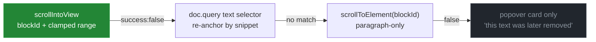

# Timeline Hover → Edit Spotlight

> [!TIP]
> **TL;DR** — Hovering a burst on the timeline can scroll the **live** editor to the exact
> paragraph that changed and paint a track-changes-style highlight over it, **without writing a
> single byte into the shared document**. The pipeline is fully grounded: reconstruct the document
> just before and just after the burst from y/hub's changeset API (already shipped as
> `fetchDocumentAt` in 0002's M5), diff per-block — every SuperDoc block carries a stable native
> `blockId` — then drive SuperDoc's public `ui.viewport.scrollIntoView({ blockId, range })` and
> `ui.viewport.getRect(...)` to scroll and to draw our own overlay. Every step was verified this
> session against a live local y/hub with real SuperDoc v2 rooms, except the final live-editor
> viewport call, which is the one **P0 probe** gating implementation. Fallback tier: a popover
> diff card anchored to the chart, which ships value even if the editor-side spotlight never lands.

## Problem Statement

The contribution chart says **who** edited and **when**. It cannot say **where** or **what**.
The ask: hovering the timeline should scroll the document to the place the edit was made and make
the change legible — "this was inserted here, by this person"; for a deletion, "something was
removed here". Ideally it reads like an inline tracked change; if inline is infeasible for
data-model or performance reasons, a popover/tooltip presentation is acceptable.

The hard constraints, inherited from the architecture 0001/0002 fixed:

1. **The client must not become a second system of record**, and must not mutate the shared
   Y.Doc for presentation. A hover is ephemeral; the document is durable. Anything that writes
   (tracked-change marks, anchored metadata, temporary spans) pollutes every collaborator's
   document and its DOCX export.
2. **y/hub's activity API cannot say what was typed.** 0002's M3.5 established — and this
   session's probe re-confirmed — that for real SuperDoc v2 traffic, `activity?delta=true`
   returns the room's content-unit *metadata* map (`bootstrap`, `contentDigest`,
   `contentUnitIds`), never the typed text. Location and content must come from somewhere else.
3. **SuperDoc's editor is a paginated, virtualized, worker-backed surface** with no
   contenteditable (0002, M3.5 outcome note). Pages may not even be in the DOM until scrolled to.
   Anything built on DOM text search is built on sand — and SuperDoc's own docs say so:
   *"Do not derive mutation locations from rendered DOM nodes or copied text offsets."*

## Executive Summary

Three facts, all verified this session, make the "ideally inline" version viable rather than
wishful:

| # | Fact | Verified how |
| --- | --- | --- |
| 1 | The document at any past instant is one HTTP GET away (`changeset?to=&ydoc=true`), and 0002's M5 already ships `fetchDocumentAt` + the decoded schema walk | Live probe against `yhub-patched-local`, rooms `sd2__v2.1__v14x` / `sparse1` |
| 2 | Every story block carries a **stable, native `blockId`** (`"41964671"`, `nativeIdStatus: "native"`, with `splitFromBlockId` lineage tracking) — so a before/after diff keyed by blockId names the changed paragraph and the changed character range | Same probe: straddling the last burst showed exactly one block's `Y.Text` changing (`"" → "ssssssssssss"`) |
| 3 | SuperDoc v2 ships a public, **non-mutating** geometry surface: `superdoc.ui.viewport.scrollIntoView({ target: { kind: 'text', blockId, range } })` (mounts virtualized pages), `ui.viewport.getRect({ target, relativeTo })` (per-line pixel rects), `ui.viewport.observe(cb)` (relayout invalidation), plus `superdoc.scrollToElement(nodeId)` whose documented example id (`'5AF80E61'`) is the same 8-hex shape as our observed `blockId` | Shipped type declarations in `superdoc@2.5.1` (the "real source of truth" per 0002) |

Chain them: **hover → reconstruct before/after → blockId-keyed diff → scroll + overlay rects →
author-colored highlight chip.** Nothing touches the Y.Doc; the overlay is our DOM, absolutely
positioned over the editor host.

The one seam not yet exercised is whether the *live mounted editor* resolves a `blockId` taken
from a *server-reconstructed* doc. They are the same identifier namespace — the id is native to
the DOCX paragraph and lives in the same Yjs content the editor renders — so confidence is high,
but it is beta software with a documented habit of silent failure. Hence a five-minute **P0
probe** before any UI work, in the repo's `describeDoc` tradition.

---

## Current State In The Repository

This exploration **assumes 0002's M5/M6 land first** (they are in flight on the
`superdoc-collab-implementation` worktree: `src/history/fetchDocumentAt.ts` and
`src/components/HistoryPreview.tsx` exist there uncommitted, with `historyAt` already wired
through the room store and `RoomView`). Paths below name files as they will exist post-merge.

| Piece | Status | Where | Relevance here |
| --- | --- | --- | --- |
| Chart + hover surface | ✅ Shipped (M4) | [ContributionChart.tsx](../../src/components/ContributionChart.tsx), [EditsPanel.tsx](../../src/components/EditsPanel.tsx) | `AreaChart` already receives mouse events; `onClick` reads `state.activeLabel` (bucket `t`) — hover reads the same field from `onMouseMove` |
| Per-burst events | ✅ Shipped (M3) | [normalize.ts](../../src/contributions/normalize.ts), [store/activity.ts](../../src/store/activity.ts) | `ContributionEvent { contributorId, startedAt, endedAt }` is the hover target's data; bucket→bursts is a filter over the store |
| Contributor names + colors | ✅ Shipped (M3) | [collectContributors](../../src/contributions/normalize.ts), [lib/color.ts](../../src/lib/color.ts) | The spotlight chip reuses `colorForContributor` so document highlight and chart band agree |
| Point-in-time reconstruction | 🚧 M5, in flight | `src/history/fetchDocumentAt.ts` | The exact fetch+decode this feature needs; also proves the schema walk |
| Decoded v2 schema | 🚧 M5, in flight | `extractParagraphs` in the same file | Walks `content` → story shards → `blocks` → `Y.Text`; this feature extends the walk to keep `blockId` |
| History Mode overlay | 🚧 M6, in flight | `HistoryPreview.tsx`, `store/room.ts` (`historyAt`) | Interaction rule needed: spotlight targets the live editor, so suppress it while `historyAt != null` |
| SuperDoc mount | ✅ Shipped (M2) | [superdoc-mount.ts](../../src/collab/superdoc-mount.ts), [EditorPane.tsx](../../src/components/EditorPane.tsx) | `mountRoom` returns the `SuperDoc` instance but `EditorPane` currently keeps it private — the spotlight needs a ref to reach `superdoc.ui` |

> [!NOTE]
> One structural change is unavoidable: `EditorPane` must expose its `SuperDoc` instance (a
> `useImperativeHandle` ref or a callback prop `onInstance(superdoc)`), because
> `superdoc.ui.viewport` is an instance surface. Everything else composes alongside shipped code.

### What this session's probes established

Run against the already-running `yhub-patched-local` container (port 4403), using the real rooms
left behind by 0002's testing. Probe scripts are transcribed under Example Code.

1. **Activity metadata cannot locate edits — re-confirmed.** Ungrouped `delta=true` entries for
   real SuperDoc typing carry the bootstrap/claims map and shard-level `contentUnitIds`
   (`"v14x::story::main:word_document.xml"` — the whole document part, not a block). Location
   never appears. (The one room whose activity *did* contain typed text, `v14demo`, turned out to
   be the bricked probe room with a foreign `bob-side-channel` root — the text came from that
   side channel, not from SuperDoc. A useful reminder to check provenance before celebrating.)
2. **Two-timestamp reconstruction + blockId diff works end-to-end on real rooms.** For the last
   burst in `sd2__v2.1__sparse1`: state at `from − 1` has block `41964671` with text `""`; state
   at `to + 1` has the same block with `"ssssssssssss"`. In `v14x`, the same block gained a
   trailing `"xxxxxxxxxxxxxxxxxxxx"`. A blockId-keyed map plus a char-level diff inside changed
   blocks yields `{ blockId, offset, inserted, deleted }` per burst.
3. **Blocks are richer than M5's text walk uses.** Each block Y.Map carries `blockId`,
   `blockKind` (`"paragraph"`), `nativeIdStatus` (`"native"`), `splitFromBlockId` /
   `mergedIntoBlockId` (lineage across paragraph splits/merges!), `pPr`, `atoms` (non-text
   inlines), `anchors`, `text`. The story shard's meta names `storyId: "main:/word/document.xml"`
   — matching the optional `story` field on SuperDoc's public `TextAddress`.
4. **y/hub stores a non-GC'd document** (`nongcdoc` column alongside `gcdoc` in `yhub_ydoc_v1`) —
   noted for the future: a tombstone-bearing export could enable Yjs-native snapshot diffs
   (`Y.Text.toDelta(snapshot, prevSnapshot)`), but the plain-text diff needs none of that.

<details>
<summary>Observed block shape (probe output, abridged)</summary>

```json
{
  "blockId": "41964671",
  "blockKind": "paragraph",
  "nativeIdStatus": "native",
  "styleRef": null,
  "splitFromBlockId": null,
  "mergedIntoBlockId": null,
  "pPr": "<YMap>",
  "structuralRefs": "<YMap>",
  "sourceAnchor": "<YMap>",
  "text": "Y.Text(\"\")",
  "atoms": "<YArray>",
  "anchors": "<YArray>",
  "diagnostics": "<YArray>"
}
```

And the diff across the last burst of `sparse1`:

```text
blocks @ from-1:  [{ blockId: "41964671", kind: "paragraph", text: "" }]
blocks @ to+1:    [{ blockId: "41964671", kind: "paragraph", text: "ssssssssssss" }]
~ changed block 41964671: "" -> "ssssssssssss"
```

</details>

---

## External Research

### SuperDoc's shipped surface (superdoc@2.5.1 type declarations)

The published docs are thin, but the shipped `.d.ts` files — which 0002 already established as
the real source of truth — document a deliberate public API for exactly this job. All paths are
under `node_modules/superdoc/dist/`:

| API | Declared in | What it gives us |
| --- | --- | --- |
| `TextAddress = { kind: 'text', blockId, range, story? }` | `document-api/src/types/address.d.ts` | The address vocabulary: a char range within a block, by blockId |
| `ui.viewport.scrollIntoView({ target, block, behavior })` | `document-api/src/ranges/ranges.types.d.ts` | Scrolls to a `TextAddress`/`TextTarget`/entity; *"Handles paginated, virtualized layouts by mounting the target page if it isn't yet in the DOM"* |
| `ui.viewport.getRect({ target, relativeTo })` | `superdoc/src/public/ui/types.d.ts` | *"Resolved rectangles (one per painted line/fragment)"* with page index — the overlay's geometry, anchorable to any element |
| `ui.viewport.observe(listener)` / `getHost()` | same | Relayout invalidation + the painted host element — keeps the overlay glued through reflow, zoom, and remote edits |
| `superdoc.scrollToElement(elementId)` | `superdoc/src/core/SuperDoc.d.ts` | *"Pass any element ID — paragraph nodeId, comment entityId…"*; example: `await superdoc.scrollToElement('5AF80E61')` — the same 8-hex shape as our observed `blockId` |
| `doc.query({ select: { type: 'text', pattern } })` | `document-api/src/types/query.d.ts` | Text/regex search returning `address` + `highlightRange` — the re-anchoring fallback when a diffed offset has drifted |
| `ui.search` (session: `search/next/close`, highlights) | `superdoc/src/public/ui/types.d.ts` | A zero-build alternative worth a spike, with real limits (below) |
| `doc.metadata` (anchored spans) | `document-api/src/metadata/anchored-metadata.d.ts` | **Rejected** — anchors are *"a hidden inline SDT… with a JSON payload in a… Custom XML Data Storage Part"*, i.e. document mutation |
| `ui.viewport.entityAt({ x, y })` | `superdoc/src/public/ui/types.d.ts` | Reverse direction (document point → entity) — future "hover document, light up the chart" |

Fail-closed posture throughout: every `ui.*` surface degrades to `available: false` /
`{ success: false, reason }` rather than throwing — friendly to a probe-first plan.

### Prior art

- **Google Docs version history / Notion page history** — the canonical UX: a time control on
  the side, the document itself scrolls to and colors the change, author-attributed. Validates
  "scroll the real document" over "show a diff somewhere else".
- **y-prosemirror's `renderSnapshot(snapshot, prevSnapshot)`** — Yjs' own history rendering:
  decorate insertions/deletions between two snapshots with per-user colors. Same mental model as
  our before/after diff, but it requires tombstone-bearing docs and a ProseMirror view we don't
  own; ours reduces the idea to plain text + a viewport overlay.
- **CKEditor 5 revision history** — commercial precedent that inline change-coloring against a
  reconstructed prior state is a product feature, not a research project.
- **CSS Custom Highlight API** — the modern way to paint ranges without mutating content; only
  works on DOM text nodes, which SuperDoc's virtualized painter does not guarantee to exist —
  see Option C.
- **diff-match-patch / LCS** — for intra-block char diffs. At one paragraph per diff, even a
  naive $O(nm)$ diff is microseconds; common-prefix/suffix trimming (the typical typing case)
  makes it $O(n)$ almost always. No dependency needed.

---

## Key Findings

1. **"Where" is derivable, but only by reconstruction.** Activity metadata is location-blind for
   SuperDoc rooms (finding 1). The only truthful source of *what changed where* is the document
   itself at two instants — and y/hub hands us both for one GET each. This is 0002's M5 thesis
   ("history is a query") paying out a second time.
2. **`blockId` is the bridge between the two systems.** The reconstructed Y.Doc and SuperDoc's
   public address space share the native paragraph id. That single fact is what upgrades this
   feature from "popover with a snippet" to "scroll the live editor to the paragraph and range".
3. **Non-mutating presentation is fully supported.** Scroll, geometry, and invalidation are all
   public `ui.viewport` APIs. The document is never written; collaborators see nothing; exports
   are untouched. The user's instinct that inline-in-Yjs "gets complicated" was right — and it's
   avoidable, because the highlight can be painted *above* the document instead of *into* it.
4. **Deletions are representable, just not as present text.** The diff knows the deleted string
   and its offset in the *before* state. The live editor can show a position marker (collapsed
   range → caret-thin rect) plus the deleted text in the popover card, struck through — exactly
   how the ask framed it ("shows that something was deleted there").
5. **The failure ladder is graceful.** Every rung degrades to the one below: live spotlight →
   re-anchored spotlight (`doc.query` for the snippet) → paragraph-only scroll (`scrollToElement`)
   → popover card only. The bottom rung has zero SuperDoc-API risk and already satisfies the
   fallback version of the ask.
6. **Bonus, out of scope but free:** the same diff yields *true per-burst character counts* —
   client-side, from reconstruction, sidestepping the M3.5 limitation entirely. Noted for the
   README's "with more time"; not this feature.

---

## Options And Tradeoffs

| Option | Inline? | Mutates doc? | Deletions? | Robust to virtualization? | Verdict |
| --- | --- | --- | --- | --- | --- |
| **A. Reconstruct + diff + `ui.viewport` overlay** | ✅ looks like track changes | ❌ never | ✅ marker + card | ✅ (`scrollIntoView` mounts pages) | ✅ **Recommended** |
| B. `ui.search` session on inserted text | ✅ native highlight | ❌ | ❌ | ✅ | 🚧 Spike-grade fallback |
| C. DOM walk + CSS Custom Highlight API | ✅ | ❌ | ❌ | ❌ pages absent from DOM; vendor forbids DOM-derived locations | 🛑 Rejected |
| D. Write into the doc (anchored metadata / tracked-change marks) | ✅ maximally native | ⚠️ **yes** | ✅ | ✅ | 🛑 Rejected |
| E. Popover diff card only (no editor interaction) | ❌ | ❌ | ✅ | n/a | ✅ Ships first as P2, survives as the bottom rung |

**A** is the recommendation; details below.

**B** costs ~10 lines (`superdoc.ui.search.search(insertedText)` highlights and navigates with
SuperDoc's own UI) and is a fine day-one spike to prove the editor can be driven at all. But it
matches every duplicate of the string, cannot express deletions (`includeDeletedText` covers
*tracked* deletions, which these are not), and hijacks shared find/replace state the user may be
using. Not the ship path.

**C** fails on the facts: the painter is paginated and virtualized (off-screen pages may have no
DOM), and SuperDoc's Document API mental model explicitly says not to derive locations from
rendered DOM. The Custom Highlight API is lovely; the substrate isn't there.

**D** is the trap the ask itself flagged. `doc.metadata.attach` plants a hidden SDT in the
document; retroactive tracked-change marks would rewrite shared content. Both turn a hover into
a durable, replicated, exported mutation. The charter principle (client is never a system of
record) rules it out categorically.

**E** is not a loser — it is the first shippable increment *and* the terminal fallback, and it
is the only rung that also works while History Mode is covering the editor.

---

## Recommendation

Build **A** as a ladder, shipping at every rung, popover-first:

```mermaid
sequenceDiagram
    autonumber
    participant U as User (hovers chart)
    participant P as EditsPanel
    participant D as EditDiffService
    participant H as y/hub
    participant S as superdoc.ui.viewport
    participant O as SpotlightOverlay (our DOM)

    U->>P: mousemove → activeLabel = bucket t (debounced ~200ms)
    P->>D: diffForBurst(burst) [bucket → last burst in bucket]
    D->>H: GET changeset?to=from-1&ydoc=true (LRU cached)
    D->>H: GET changeset?to=burst.to&ydoc=true (LRU cached)
    D-->>P: { blockId, range, inserted?, deleted?, by }
    P->>S: scrollIntoView({ target: {kind:'text', blockId, range} })
    S-->>P: { success: true }
    P->>S: getRect({ target, relativeTo: host })
    S-->>P: rects (one per painted line)
    P->>O: paint author-colored rects + chip; subscribe viewport.observe
    U->>P: mouseleave → clear after grace delay
```

**Hover granularity.** A bucket aggregates bursts; a hover needs one target. Rule: spotlight the
**latest burst in the hovered bucket**, and render the popover card listing *all* of the bucket's
bursts (author chip, clock, ±snippet from the diff); hovering a row in the card re-targets the
spotlight. This keeps the chart's existing semantics (Tooltip untouched, `onClick` still =
History Mode) and gives multi-burst buckets an honest presentation instead of a guess.

**Deletion presentation.** Insertions get a translucent contributor-colored band over the exact
range (rects from `getRect`). Deletions get a 2px caret-colored marker at the collapsed offset
(clamped into the current block text) plus the struck-through deleted text in the card — inline
position, popover content.

**Drift handling.** The diff describes the document as of `burst.to`; the live document may have
moved on. Ladder, per burst, stopping at the first success:



**History Mode interplay.** While `historyAt != null` the overlay's substrate is covered; suppress
the live spotlight and let the popover card carry the information. (Future nicety, not scope:
route the scroll into `HistoryPreview`'s own DOM, which we fully control.)

**Performance envelope.** Hover cost is ≤ 2 changeset GETs, then pure math. Responses are
immutable (history doesn't change), so an LRU keyed `${roomId}@${ts}` caches forever; adjacent
bursts share boundary states, so a left-to-right sweep of the chart is ~1 fetch per new burst.
Payload scales with document size (it is the full state, base64) — the observed take-home-scale
doc is ~12 KB; a debounce (~200 ms), an `AbortController` per hover, and the cache keep hover
storms harmless. If a large-document future arrives, the fix is a byte-cap check before decode.

---

## Example Code

### 1. The P0 probe (run in the browser console before building anything)

```ts
// With a room open and synced, and a burst's blockId/range from the diff probe:
const sd = window.__superdoc; // expose from EditorPane temporarily
console.log('viewport host:', sd.ui.viewport.getHost());
console.log(
  'scroll:',
  await sd.ui.viewport.scrollIntoView({
    target: { kind: 'text', blockId: '41964671', range: { start: 0, end: 5 } },
  }),
);
console.log(
  'rects:',
  sd.ui.viewport.getRect({
    target: { kind: 'text', blockId: '41964671', range: { start: 0, end: 5 } },
    relativeTo: sd.ui.viewport.getHost(),
  }),
);
console.log('scrollToElement:', await sd.scrollToElement('41964671'));
```

Success criteria: `success: true`, at least one rect, visible scroll. If the text-address form
fails but `scrollToElement` succeeds, the feature ships paragraph-grained (ladder rung 3) and the
README names the boundary.

### 2. Burst diff (extends M5's schema walk; pure functions, unit-testable offline)

```ts
// src/spotlight/burstDiff.ts
import * as Y from 'yjs';
import { fetchDocumentAt } from '@/history/fetchDocumentAt';

export interface BlockText {
  blockId: string;
  text: string;
}

/** extractParagraphs, but keeping the blockId the viewport APIs address by. */
export function extractBlockTexts(doc: Y.Doc): BlockText[] {
  const out: BlockText[] = [];
  const content = doc.getMap('content');
  for (const shard of content.values()) {
    if (!(shard instanceof Y.Map)) continue;
    const meta = shard.get('meta');
    if (!(meta instanceof Y.Map) || meta.get('shardKind') !== 'story') continue;
    const blocks = shard.get('blocks');
    if (!(blocks instanceof Y.Array)) continue;
    for (const block of blocks) {
      if (!(block instanceof Y.Map)) continue;
      const text = block.get('text');
      const blockId = block.get('blockId');
      if (text instanceof Y.Text && typeof blockId === 'string') {
        out.push({ blockId, text: text.toString() });
      }
    }
  }
  return out;
}

export interface BurstChange {
  blockId: string;
  /** Char offset in the AFTER text where the change begins. */
  offset: number;
  inserted: string;
  deleted: string;
}

/**
 * Common prefix/suffix trim — exact for a single contiguous edit, which is
 * what one burst by one author overwhelmingly is. A burst that edited two
 * separate places in one block reports one spanning change; acceptable for a
 * highlight (it covers both), and honest in the popover (before → after).
 */
function diffOne(before: string, after: string): { offset: number; inserted: string; deleted: string } | null {
  if (before === after) return null;
  let p = 0;
  const max = Math.min(before.length, after.length);
  while (p < max && before[p] === after[p]) p++;
  let s = 0;
  while (s < max - p && before[before.length - 1 - s] === after[after.length - 1 - s]) s++;
  return {
    offset: p,
    deleted: before.slice(p, before.length - s),
    inserted: after.slice(p, after.length - s),
  };
}

export interface BurstDiff {
  changes: BurstChange[];
}

const cache = new Map<string, Promise<BlockText[]>>(); // LRU-trim at ~32

async function blocksAt(roomId: string, ts: number, signal?: AbortSignal): Promise<BlockText[]> {
  const key = `${roomId}@${ts}`;
  let hit = cache.get(key);
  if (!hit) {
    hit = fetchDocumentAt(roomId, ts, signal).then((doc) => {
      const blocks = extractBlockTexts(doc);
      doc.destroy();
      return blocks;
    });
    cache.set(key, hit);
    if (cache.size > 32) cache.delete(cache.keys().next().value!);
  }
  return hit;
}

export async function diffForBurst(
  roomId: string,
  burst: { startedAt: number; endedAt: number },
  signal?: AbortSignal,
): Promise<BurstDiff> {
  const [before, after] = await Promise.all([
    blocksAt(roomId, burst.startedAt - 1, signal),
    blocksAt(roomId, burst.endedAt, signal),
  ]);
  const prev = new Map(before.map((b) => [b.blockId, b.text]));
  const changes: BurstChange[] = [];
  for (const blk of after) {
    const was = prev.get(blk.blockId);
    prev.delete(blk.blockId);
    if (was === undefined) {
      changes.push({ blockId: blk.blockId, offset: 0, inserted: blk.text, deleted: '' });
    } else {
      const d = diffOne(was, blk.text);
      if (d) changes.push({ blockId: blk.blockId, ...d });
    }
  }
  for (const [blockId, text] of prev) {
    changes.push({ blockId, offset: 0, inserted: '', deleted: text });
  }
  return { changes };
}
```

### 3. Spotlight (the only file that talks to `superdoc.ui`)

```ts
// src/spotlight/spotlight.ts — sketch of the load-bearing calls
import type { SuperDoc } from 'superdoc';
import type { BurstChange } from './burstDiff';

export interface SpotlightRect {
  left: number; top: number; width: number; height: number;
}

export async function spotlight(
  sd: SuperDoc,
  change: BurstChange,
): Promise<{ rects: SpotlightRect[]; grain: 'range' | 'block' } | null> {
  const end = change.offset + change.inserted.length;
  const target = {
    kind: 'text' as const,
    blockId: change.blockId,
    // Deletion: collapsed range at the offset; insertion: the inserted span.
    range: { start: change.offset, end: Math.max(end, change.offset) },
  };

  const scrolled = await sd.ui.viewport.scrollIntoView({ target, block: 'center' });
  if (scrolled.success) {
    const host = sd.ui.viewport.getHost();
    const geo = sd.ui.viewport.getRect({ target, relativeTo: host ?? undefined });
    if (geo.found && geo.rects.length > 0) return { rects: [...geo.rects], grain: 'range' };
  }
  // Rung 3: paragraph-only. (Rung 2, doc.query re-anchoring, slots in here later.)
  if (await sd.scrollToElement(change.blockId)) return { rects: [], grain: 'block' };
  return null; // Rung 4: caller keeps the popover card only
}
```

The overlay component itself is ordinary React: absolutely positioned children of the editor
wrapper (`EditorPane`'s parent is already `relative` for History Mode), translucent
`colorForContributor(by)` fills for insert rects, a 2px marker for a collapsed deletion range, a
name chip pinned to the first rect, re-resolved on every `ui.viewport.observe` tick, cleared on
mouseleave (with a ~500 ms grace so the cursor can travel chart → document).

### 4. Hover wiring

```tsx
// ContributionChart: one new optional prop, same pattern as onBucketClick
onMouseMove={(state) => {
  const label = state?.activeLabel;
  if (typeof label === 'number') onBucketHover?.(label);
}}
onMouseLeave={() => onBucketHover?.(null)}
```

`EditsPanel` debounces, resolves bucket → bursts from the activity store
(`events.filter(e => e.startedAt >= t && e.startedAt < t + bucketMs)`), renders the card, and
calls the spotlight for the latest burst. `RoomView` threads the `SuperDoc` ref from `EditorPane`
down; spotlight is suppressed while `historyAt != null`.

---

## Risks And Open Questions

| # | Risk | Impact | Likelihood | Mitigation |
| --- | --- | --- | --- | --- |
| R1 | Live viewport rejects reconstructed `blockId`s (namespace mismatch) | Feature drops to popover-only | Low — same native id, same doc | **P0 probe is the gate**; rungs 3–4 remain shippable |
| R2 | `ui.viewport` unavailable in our mount (fail-closed `available: false`) | Same as R1 | Low-Med — beta, worker-backed host | Probe reports the `reason`; ladder absorbs it |
| R3 | Hover storms fetch changesets repeatedly | Jank, server load | Med | 200 ms debounce, `AbortController`, immutable LRU; boundary states shared between adjacent bursts |
| R4 | Changeset payload grows with document size (full state per GET) | Slow first hover on big docs | Low at take-home scale (~12 KB observed) | Cache; byte-cap check before decode; named as a boundary in README |
| R5 | Burst text later deleted/edited → range drift | Highlight misses or clamps oddly | Med over long sessions | Clamp into current block; rung 2 re-anchor via `doc.query`; card always tells the truth |
| R6 | Multi-block bursts (paragraph splits) confuse a naive per-block diff | Highlight covers partial change | Med | `splitFromBlockId` lineage exists in the schema; v1 highlights the largest change and lists the rest in the card |
| R7 | Non-text edits (formatting, images — `atoms`) are invisible to a text diff | Hover shows "no text change" | Med | Honest empty-state in the card ("formatting or non-text change"); `atoms` diff is future work |
| R8 | Overlay drifts on zoom/relayout/remote edits | Misplaced highlight | Med | `ui.viewport.observe` re-resolve; hide during scroll animation |
| R9 | `Range` semantics (UTF-16 vs grapheme) differ between `Y.Text` offsets and SuperDoc's flattened text model | Off-by-N highlights on emoji/complex runs | Low-Med | Probe with an emoji; clamp defensively; worst case is a slightly-wide highlight |

### Open questions

- [ ] Does `scrollIntoView`'s `TextAddress` form succeed against the live mount? (P0; the entire
      inline tier hangs on this one call.)
- [ ] Is `changeset?to=` inclusive of ops at exactly `to`? (Probe used `to + 1` defensively;
      1 ms slop is harmless either way, but pin it down.)
- [ ] Do `Y.Text` offsets and SuperDoc's `range` agree on surrogate pairs? (R9.)
- [ ] Does `ui.viewport.getRect` resolve a *collapsed* range (deletion marker), or does the
      marker need `range: { start, end: start + 1 }` on the neighboring char?

---

## Implementation Checklist

**Status:** `░░░░░░░░░░ 0/14 items`

### P0 — Probe (½ h, gates everything)
- [ ] Expose the `SuperDoc` instance from `EditorPane` (callback prop; also stash on
      `window.__superdoc` in dev)
- [ ] Run the console probe: `ui.viewport` availability, `scrollIntoView` text-address form,
      `getRect` rects, `scrollToElement(blockId)`, emoji offset check
- [ ] Record results in this doc (convert R1/R2 from risk to fact)

### P1 — Diff service (1 h, pure functions, no UI)
- [ ] `src/spotlight/burstDiff.ts`: `extractBlockTexts` (blockId-keeping walk), `diffOne`,
      `diffForBurst`, LRU cache
- [ ] Unit tests against fixture block arrays: insert / delete / replace / new block / removed
      block / no-change / multi-block

### P2 — Popover diff card (1 h, ships value alone)
- [ ] `onBucketHover` on `ContributionChart` (mirror of `onBucketClick`)
- [ ] Debounced bucket → bursts resolution in `EditsPanel`; card with author chip
      (`colorForContributor`), clock, `+inserted` / `~~deleted~~` snippets, per-burst rows
- [ ] Empty/degraded states: no text change (R7), fetch failure (card says so, chart unaffected)

### P3 — Live editor spotlight (1–1.5 h, the headline)
- [ ] `src/spotlight/spotlight.ts` with the fallback ladder (rungs 1 → 3 → 4; rung 2 optional)
- [ ] `SpotlightOverlay` in `RoomView`'s relative wrapper: insert bands, deletion marker, name
      chip; `ui.viewport.observe` re-resolution; mouseleave grace
- [ ] Suppress while `historyAt != null`
- [ ] Card row hover re-targets the spotlight

### Ship gate
- [ ] README: new decision row (non-mutating overlay over document mutation; the ladder; the R4
      size boundary) + drop the free fact that reconstruction-diffing also yields true character
      counts ("with more time")
- [ ] Check this exploration off (`[-]` partial is acceptable at P2)

**Cut order under time pressure:** P3's rung 2 re-anchoring → deletion marker (card still shows
deletions) → P3 entirely (P2 alone satisfies the fallback version of the ask) → multi-burst card
rows (spotlight latest burst only).

## Validation Checklist

- [ ] **V1** Two-profile room: A types a sentence, B hovers the new bucket → B's editor scrolls
      to the sentence, highlighted in A's chart color, A's name on the chip
- [ ] **V2** A deletes a phrase; B hovers → marker at the deletion point, popover shows the
      struck-through phrase
- [ ] **V3** Hover a burst whose paragraph is 3+ pages off-screen → page mounts and scrolls
      (virtualization respected)
- [ ] **V4** Hover text that was later deleted → no crash; ladder lands on paragraph scroll or
      card-only with the "later removed" note
- [ ] **V5** Sweep the whole chart left-to-right → network tab shows ~1 changeset fetch per new
      burst boundary (cache works), no editor jank
- [ ] **V6** The collaborator's screen shows **nothing** during all of the above (non-mutating
      confirmed at the protocol level: no Yjs update leaves the hovering client)
- [ ] **V7** DOCX export after heavy hovering is byte-identical to a never-hovered export
- [ ] **V8** History Mode open (`historyAt != null`) → hover updates the card only; no overlay
      fights the preview
- [ ] **V9** `pnpm test` — burstDiff unit suite green

---

## References

**This repository**
- [0002 — Milestone Build Plan](0002_%5B-%5D_MILESTONE_BUILD_PLAN.md) — M3.5's metadata-delta
  finding; M5's changeset verification; M6's overlay-not-remount rule
- [0001 — SuperDoc Contributions Timeline](0001_%5Bx%5D_SUPERDOC_CONTRIBUTIONS_TIMELINE.md) —
  the projection architecture this extends
- `src/history/fetchDocumentAt.ts` (M5, in flight) — reconstruction + the decoded schema walk
- [src/collab/yhub.ts](../../src/collab/yhub.ts) — `collapsedDocId`, `httpBase`, and the
  deliberate absence of `delta=true`

**SuperDoc v2 (shipped declarations, superdoc@2.5.1)**
- `dist/superdoc/src/core/SuperDoc.d.ts` — `scrollToElement`, `navigateTo`, `search`
- `dist/superdoc/src/public/ui/types.d.ts` — `ui.viewport` (`getRect`, `scrollIntoView`,
  `observe`, `entityAt`), `ui.search`, fail-closed slices
- `dist/document-api/src/types/address.d.ts` — `TextAddress` / `TextTarget` / `Range`
- `dist/document-api/src/types/query.d.ts` — text selectors, `highlightRange`
- `dist/document-api/src/metadata/anchored-metadata.d.ts` — why Option D mutates
- [Document API mental model](https://docs.superdoc.dev/document-api/mental-model/) — *"Do not
  derive mutation locations from rendered DOM nodes"*

**Platform & prior art**
- [y/hub API.md](https://github.com/yjs/yhub/blob/master/API.md) — changeset / activity parameters
- [y-prosemirror](https://github.com/yjs/y-prosemirror) — `renderSnapshot` two-snapshot decoration
  model
- [CSS Custom Highlight API](https://developer.mozilla.org/en-US/docs/Web/API/CSS_Custom_Highlight_API)
  — evaluated and rejected with Option C
- [google-diff-match-patch](https://github.com/google/diff-match-patch) — if `diffOne` ever needs
  to grow up
