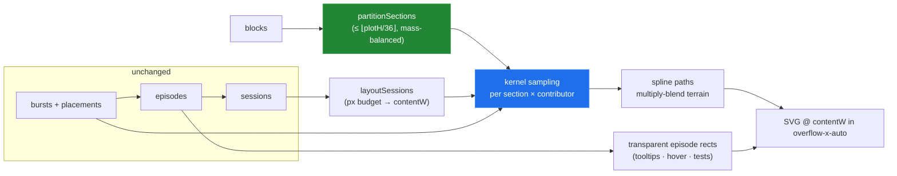

# Organic Edit Terrain — Section Rows, Elastic Time, Density Blobs

> [!TIP]
> **TL;DR** — Three changes to the edit map, one per axis. **Y:** stop giving every paragraph a
> row; partition the document into at most ⌊plotH / 36px⌋ contiguous <mark>sections</mark>
> balanced by text mass, so rows always fit without overlap. **X:** stop compressing history
> into a fixed width; give sessions a minimum pixel budget per active minute and per burst so
> the chart <mark>grows horizontally</mark> (scrolling inside the dock, pinned to the live
> edge) and individual bursts stay visible. **Paint:** replace the rectangles with a
> <mark>kernel-density terrain</mark> — each burst contributes a smooth bump; per-contributor
> lobes are summed, Catmull-Rom-smoothed, alpha-blended with `mix-blend-mode: multiply`, and
> allowed to overflow their row joyplot-style — so the map reads as multicolored blobs that
> morph and blend, per the reference mock. The rectangles don't die: they become an invisible
> hit-testing/tooltip layer above the paint. No new dependencies.

## Problem Statement

Three complaints against the shipped map ([0004](0004_%5Bx%5D_SPACE_TIME_EDIT_MAP_AND_DOCKED_CHROME.md)),
plus a reference image:

1. **Row explosion.** Rows are one-per-live-block. A 40-paragraph document in a 180px dock
   yields ~4px rows — "as if every line gets a row." Rows must be capped to what fits
   vertically without overlap, which means chunking the document into evenly weighted sections.
2. **Fixed width, coarse time.** The axis always normalizes to 100% width, so as history grows
   everything squeezes; an episode renders as one flat rect no matter how many bursts it folded.
   The chart should grow horizontally as edits accumulate, and most individual edits should be
   discernible — "maybe not every edit, but most of them."
3. **Aesthetics.** Strict rectangles read as a spreadsheet. The reference mock (chat
   attachment, 2026-08-13 — SuperDoc "Edits panel" concept) shows soft, overlapping,
   semi-transparent mounds that rise and fall and melt into each other, with labels floating on
   the lobes. Wanted: "multicolored blobs that morph and blend into one another."

> [!NOTE]
> The mock also shows a term/username filter box and an LLM-written "Top edits summary" rail
> with avatars and ±term counts. Both are real product ideas and **explicitly out of scope
> here** — they are data features, not chart geometry, and deserve their own exploration.

## Executive Summary

All three complaints are geometry-layer changes; the data pipeline (placements → episodes →
sessions) survives untouched underneath:

- **R1 — Section rows.** A pure `partitionSections(blocks, maxRows)` groups *contiguous* blocks
  into ≤ maxRows sections balanced by character mass, where
  `maxRows = max(3, ⌊plotH / 36⌋)` is measured, not configured. Episodes map
  `blockId → section` through the existing row-resolver, then section index. Labels become
  "first-block snippet · ¶3–7".
- **R2 — Elastic axis.** `buildSegments` gains a pixel-budget layout:
  $W_{content} = \max\!\big(W_{container},\ \sum_i \max(48,\ 24\,m_i,\ 10\,b_i) + 14c\big)$
  for sessions with $m_i$ active minutes and $b_i$ bursts, and $c$ cuts. The SVG renders at
  `contentW` inside the dock's existing `overflow-x-auto` idiom, auto-pinned to the right edge
  while the user hasn't scrolled away. Wider sessions mean bursts get room — and R3 makes them
  visible inside episodes.
- **R3 — Density terrain.** Per (section × contributor), every **burst** drops a raised-cosine
  kernel at its x-position; kernels sum into an intensity series sampled every 4px, clamped to
  zero inside cut seams, smoothed into a closed path, filled with the contributor color at
  ~0.65 opacity under `mix-blend-mode: multiply`. Pauses inside an episode show as dips; two
  authors on one section blend where they overlap; same-author bursts fuse into one lobe —
  the "morph and blend" is real math, not a filter trick. Episode rects remain as a transparent
  interaction layer (tooltips, future 0003 spotlight hover), and plot clicks still run through
  `tOf(x)` into History Mode.

## Current State In The Repository

| Piece | Today | The complaint it causes |
| --- | --- | --- |
| Rows | [EditMapPanel.tsx](../../src/components/EditMapPanel.tsx) makes one `MapRow` per live block, weight `clamp(len, 40, 400)`; [EditMap.tsx](../../src/components/EditMap.tsx) renormalizes with a best-effort `MIN_ROW_H = 12` | Row explosion — the 12px floor silently collapses when rows × 12 > plotH |
| Time axis | [sessions.ts](../../src/contributions/sessions.ts) lays sessions over a **fixed** `[0,1]` with `MIN_SESSION_FRAC = 0.05`, `CUT_FRAC = 0.015`; `xOf`/`tOf` are the piecewise maps | Fixed width; growing history compresses everything forever |
| Marks | One `<rect>` per episode per touched row, `MIN_MARK_W = 3`, lane-split on overlap ([EditMap.tsx](../../src/components/EditMap.tsx)) | Flat rectangles; a 12-burst episode is indistinguishable from a 1-burst one of equal span |
| Bursts | Folded into episodes by [episodes.ts](../../src/contributions/episodes.ts); per-burst placements exist in the store ([placementIndex.ts](../../src/spotlight/placementIndex.ts)) | The data for burst-level texture is **already client-side** — only the paint discards it |
| Scroll idiom | The Volume tab already scrolls its chart in its own container (V13, [EditsPanel.tsx](../../src/components/EditsPanel.tsx)) | Precedent for `overflow-x-auto` inside the dock |
| Live pulse | 0004 open question "does the map need a now-affordance" was deferred | The pinned live edge answers it for free |

> [!IMPORTANT]
> Nothing in the data model changes. Placements, episodes, sessions, History-Mode click
> mapping, and the reconciliation invariant (Σ episode weights = Σ burst weights) all stay.
> This exploration only re-projects them onto pixels — which is why the whole thing is a
> two-way door.

## External Research

- **Streamgraphs** — [Byron & Wattenberg, *Stacked Graphs – Geometry & Aesthetics*
  (IEEE TVCG 2008)](https://leebyron.com/streamgraph/stackedgraphs_byron_wattenberg.pdf) ·
  [project page](http://leebyron.com/streamgraph/): the canonical "organic" time-series look
  (the NYT movie box-office chart). Two transferable lessons: layer smoothing + a free
  baseline is what reads as organic, and legibility survives because each layer keeps
  continuous thickness. A full streamgraph replaces the y-axis meaning though — see Option C.
- **ThemeRiver / ridgeline plots ("joyplots")** — the reconciliation between "organic" and
  "keep document position on y": one smooth ridge per category row, with deliberate slight
  overlap between rows. Our sections are the categories.
- **Kernel density estimation** — bursts are events; a sum of fixed-width kernels over event
  times is the standard way to turn events into a smooth intensity curve. A raised-cosine
  kernel ($\tfrac{1}{2}(1+\cos)$ on a bounded support) needs no tails, no normalization
  subtleties, and ~6 lines of code.
- **The SVG "gooey" filter** — [CSS-Tricks](https://css-tricks.com/gooey-effect/) ·
  [Codrops](https://tympanus.net/codrops/2015/03/10/creative-gooey-effects/):
  `feGaussianBlur` + an alpha-contrast `feColorMatrix` makes adjacent shapes fuse like
  metaballs — tempting as a two-line retrofit on the existing rects. Disqualifying findings:
  the alpha-contrast step **degrades to plain blur in Safari and Firefox**, it fuses only
  within one filtered group (no cross-color blending), and it fights the translucent fills the
  blend look needs. Documented as Option B, rejected for the core.
- **`mix-blend-mode: multiply`** — well-supported on SVG elements in all evergreen browsers;
  overlapping translucent color fields produce believable pigment-style mixes. This, not a
  filter, is what makes two contributors "blend into one another."
- **Catmull-Rom → cubic Bézier** — the standard closed-form conversion gives d3's
  `curveCatmullRom` behavior in ~20 dependency-free lines; with 4px sampling the curve is
  smooth at any zoom.

## Key Findings

1. **Row capping is a partition problem, and "evenly" means text mass, not block count.**
   Contiguity is non-negotiable (a section is a document range), so this is the classic linear
   partition. A greedy sweep targeting $\bar{m} = \tfrac{\sum len}{maxRows}$ per section is
   ~15 lines and bounded at section mass < $\bar{m} + \max len$ — fine for a chart;
   the DP-optimal version is not worth its code.
2. **The burst data for finer granularity is already in the browser.** Episodes deliberately
   discard intra-episode structure *for folding*; the store still holds every burst and its
   placement. Painting bursts as kernel bumps inside episode lobes shows "most of the edits"
   at zero additional fetch cost — the 5s-gap server grouping remains the only floor on
   granularity, which matches "maybe not every edit."
3. **Elastic width changes the *meaning* of the axis fill.** 0004's "always fill the width"
   was the right call when history was small; growth means the invariant flips from "fit
   everything" to "never render below legibility density, scroll the rest." The two compose:
   `contentW = max(containerW, legibility budget)` — small histories still fill the dock
   exactly as today, so nothing regresses.
4. **Organic ≠ filter trickery.** The blob look decomposes into four independently cheap
   ingredients: kernel-summed intensity (fuses same-author marks, shows dips), spline
   smoothing (kills right angles), translucent multiply blending (cross-author color mixing),
   and joyplot row-overflow (~1.35 × rowH, breaks the grid feel). Each is a pure function or
   one CSS property; none needs a dependency or WebGL.
5. **Rectangles should be demoted, not deleted.** Native `<title>` tooltips, the future 0003
   spotlight hover, and (structural) test assertions all live on per-episode elements today.
   Keeping them as `fill="transparent"` hit areas above the terrain preserves every behavior
   and the SVG-title verification trick used to close 0004's V8.
6. **"Morph" is a freebie of fixed-cadence sampling.** Intensity series are arrays sampled on
   a fixed 4px grid; when new bursts arrive, lerping old→new arrays over ~300ms in one rAF
   loop morphs every blob smoothly. Optional polish, ~30 lines, zero layout thrash.

## Options And Tradeoffs

### The paint (the load-bearing choice)

| Option | Blends across authors? | Bursts visible? | Keeps space axis? | Browser risk | Verdict |
| --- | --- | --- | --- | --- | --- |
| **A. KDE ridgeline terrain per section** (kernels + spline + multiply) | ✅ real color mixing | ✅ dips & peaks | ✅ | None — plain paths + one CSS property | ✅ **Recommended** |
| B. Gooey filter over existing rects | ❌ same-group only | ❌ still flat | ✅ | 🛑 degrades to blur in Safari/Firefox | 🛑 Rejected (garnish at best) |
| C. Whole-panel streamgraph (Byron-Wattenberg wiggle, layers = contributors or sections) | ✅ | ✅ | ❌ y becomes volume | None | 🚧 Not here — but the natural **Volume-tab** successor; closest literal match to the mock |
| D. Canvas/WebGL metaballs | ✅ | ✅ | ✅ | New render stack, hit-testing rebuild | 🛑 Overkill at tens of episodes |

### Row capping

| Option | Notes | Verdict |
| --- | --- | --- |
| **Contiguous mass-balanced sections** (greedy) | Sections are document ranges; labels stay meaningful; ~15 lines + tests | ✅ Recommended |
| Fixed section count (e.g. always 8) | Ignores dock resizing — the drag handle exists precisely to trade height for detail | 🛑 |
| Per-block rows + vertical scroll | Preserves detail but a scrolling minimap defeats "where at a glance" | 🛑 |
| Hierarchical zoom (sections → blocks on click) | Genuinely good; genuinely a second milestone | 🚧 Future |

### The axis

| Option | Notes | Verdict |
| --- | --- | --- |
| **Pixel-budget growth + pinned live edge** | Fill when small, grow when dense; user scroll breaks the pin, returning to the edge restores it | ✅ Recommended |
| Fixed width + zoom control | More chrome, more state, worse default | 🛑 |
| Uniform px/minute (no session compression) | Reintroduces the dead air 0004 just removed | 🛑 |

## Recommendation

Ship R1 → R2 → R3 in order; each lands independently and the map stays presentable between
them.



Anatomy of one section row after R3:

```text
            Wright ▉                      ← contributor chip at tallest lobe (polish)
        ,-‾‾-,___                     ,-,
      ,'   ██████‾-,   dip = pause  ,'▒▒',        ← lobes may overflow row top ~1.35×
 ____/  ████████████',____,-‾-,____/▒▒▒▒▒▒'\____
 §2 "Middle: the body…" · ¶5–9      ▒ = second author, multiply-blended overlap
─────────────────────────┊┊─────────────────────  ← ┊┊ hatched cut seam (terrain → 0)
```

**Defaults** (all in one constants block, unit-tested):
`TARGET_ROW_H = 36px` · `MIN_ROWS = 3` · kernel half-width `max(4px, burstPx/2)` with
`σfloor = 8px` · sample step `4px` · `PX_PER_ACTIVE_MIN = 24` · `MIN_BURST_PX = 10` ·
`MIN_SESSION_PX = 48` · seam `14px` fixed · row overflow cap `1.35` · terrain opacity `0.65`.

## Example Code

### R1 — sections (pure, tested)

```ts
// src/contributions/sections.ts
export interface DocSection {
  index: number;
  blockIds: string[];      // contiguous
  label: string;           // "Middle: the body… · ¶5–9"
  mass: number;            // Σ clamp(len, 40, 400)
}

export function partitionSections(blocks: BlockText[], maxRows: number): DocSection[] {
  const masses = blocks.map((b) => Math.min(Math.max(b.text.length, 40), 400));
  const total = masses.reduce((a, b) => a + b, 0);
  const target = total / Math.max(1, Math.min(maxRows, blocks.length));
  const sections: DocSection[] = [];
  let acc = 0, start = 0;
  for (let i = 0; i < blocks.length; i++) {
    acc += masses[i]!;
    const remainingRows = Math.min(maxRows, blocks.length) - sections.length;
    const mustClose = blocks.length - i === remainingRows - 0; // leave room for the rest
    if ((acc >= target && sections.length < maxRows - 1) || mustClose || i === blocks.length - 1) {
      sections.push(makeSection(sections.length, blocks.slice(start, i + 1), acc));
      start = i + 1; acc = 0;
    }
  }
  return sections;
}
```

`EditMapPanel` computes `maxRows` from the measured plot height (already available via the
`ResizeObserver` in `EditMap` — lift the size state up or pass a callback), maps each episode's
row keys through `sectionOf`, and hands `EditMap` section rows. Synthetic rows (`removed`,
`elsewhere`) count against `maxRows` so the cap is honest.

### R2 — pixel-budget session layout

```ts
// sessions.ts — new sibling of buildSegments; xOf/tOf unchanged in shape, now in px
export function layoutSessions(
  spans: Span[], containerW: number, burstCount: (s: Session) => number,
): { contentW: number; segments: TimeSegment[] } {
  const sessions = mergeSessions(spans);                    // existing logic
  const px = sessions.map((s) => Math.max(
    MIN_SESSION_PX,
    ((s.t1 - s.t0) / 60_000) * PX_PER_ACTIVE_MIN,
    burstCount(s) * MIN_BURST_PX,
  ));
  const natural = sum(px) + (sessions.length - 1) * SEAM_PX;
  const contentW = Math.max(containerW, natural);
  // natural < containerW → stretch proportionally (today's behavior, in px)
  …
}
```

`EditMap` renders `<svg width={contentW}>` inside `<div className="overflow-x-auto">`; a small
`usePinnedToEnd(scrollRef, [contentW])` effect keeps `scrollLeft` at max while the user was
already at the end (tolerance ~24px), which doubles as the live-edge affordance.

### R3 — terrain sampling and path

```ts
// src/components/terrain.ts
/** Raised-cosine bump: support [c-w, c+w], peak 1 at c. */
const bump = (x: number, c: number, w: number) =>
  Math.abs(x - c) >= w ? 0 : 0.5 * (1 + Math.cos((Math.PI * (x - c)) / w));

export function sampleIntensity(
  bursts: Array<{ x0: number; x1: number; weight: number }>,
  contentW: number, step = 4, inCut: (x: number) => boolean,
): Float32Array {
  const n = Math.ceil(contentW / step) + 1;
  const out = new Float32Array(n);
  for (const b of bursts) {
    const c = (b.x0 + b.x1) / 2;
    const w = Math.max(8, (b.x1 - b.x0) / 2 + 8);
    const from = Math.max(0, Math.floor((c - w) / step));
    const to = Math.min(n - 1, Math.ceil((c + w) / step));
    for (let i = from; i <= to; i++) out[i] += b.weight * bump(i * step, c, w);
  }
  for (let i = 0; i < n; i++) if (inCut(i * step)) out[i] = 0;
  return out;
}

/** Closed area path: baseline → Catmull-Rom over samples → baseline. */
export function terrainPath(samples: Float32Array, step: number, baseY: number, scale: number): string { … }
```

Rendering per section row, per contributor:

```tsx
<g style={{ mixBlendMode: 'multiply' }}>
  <path d={terrainPath(samples, 4, rowBottom, rowH * 1.35 / chartMax)}
        fill={colorForContributor(id)} fillOpacity={0.65} />
</g>
{/* above the terrain: the old rects, now transparent hit areas with <title> */}
```

$O(\text{bursts} \times \text{kernel span} / 4)$ per contributor-section — sub-millisecond at
this app's scale, recomputed only on data/size change via the existing `memo`.

## Risks And Open Questions

| # | Risk | Impact | Likelihood | Mitigation |
| --- | --- | --- | --- | --- |
| R1 | Section boundaries shift as the document grows → rows "jump" between polls | Disorienting | Med | Boundaries derive from stable block order; recompute only when block list or maxRows changes; morph animation (P4) softens the rest |
| R2 | Pinned-edge scroll fights user scroll | Annoying | Low | Pin only when already at end ±24px; any manual scroll releases it |
| R3 | Multiply blending on white rows darkens large overlaps into mud | Ugly worst case | Low-Med | Cap stacked intensity at 2 layers of 0.65; palette is mid-saturation; fall back to `normal` blending behind a constant if a real room looks bad |
| R4 | Terrain hides exact extents (no hard edges) | Precision loss | Med | The transparent rect layer still carries exact tooltips; Volume tab keeps exact counts; hard-edge mode is one boolean if ever needed |
| R5 | `chartMax` normalization: one huge burst flattens everything else | Legibility | Med | Normalize on the 95th percentile of section-contributor maxima, clamp overflow to the 1.35 cap |
| R6 | Very tall docks (drag handle) → maxRows grows → relayout churn | Minor | Low | Quantize maxRows changes (hysteresis of one row) |

**Open questions**

- [ ] Should sections split at heading-styled blocks when available (`styleRef` is already on
      the block Y.Map) instead of pure mass? Better labels, less balance — probe a real doc.
- [ ] Does the pinned live edge need a subtle "now" pulse at the right margin, or is the
      growth itself enough? Decide by demo feel.
- [ ] Contributor chips on lobes (mock-style): always, on hover, or only when a lobe is the
      contributor's max? Start with hover-only to avoid clutter.

## Implementation Checklist

**Status:** `░░░░░░░░░░ 0/14 items`

### P1 — Section rows (~1 h)
- [x] `src/contributions/sections.ts`: `partitionSections` + `sectionOf` map; unit tests
      (contiguity, cap, balance bound, fewer-blocks-than-rows, empty)
- [x] `EditMapPanel`: measured `maxRows` (lift plot size), section rows, episode row keys
      mapped through sections; synthetic rows count against the cap
- [x] Labels: "snippet · ¶a–b"; gutter unchanged

### P2 — Elastic axis (~1 h)
- [x] `layoutSessions` in [sessions.ts](../../src/contributions/sessions.ts) (px budgets,
      `contentW`, stretch-to-fill when small) + unit tests (fill-when-small, grow-when-dense,
      per-burst floor, xOf/tOf round-trip in px)
- [x] `EditMap` renders at `contentW` in `overflow-x-auto`; `usePinnedToEnd` effect
- [x] Intermediate time ticks inside long sessions (~every 120px)

### P3 — Terrain (~1.5 h)
- [x] `src/components/terrain.ts`: `bump`, `sampleIntensity`, `terrainPath` (Catmull-Rom) +
      unit tests (kernel support, cut zeroing, path closure)
- [x] `EditMap`: terrain groups per section × contributor, multiply blend, 1.35 overflow cap,
      95th-percentile normalization; episode rects become transparent hit layer (titles kept)
- [x] Row separators demoted to faint baselines; seams still hatched over the terrain

### P4 — Polish (cut first)
- [x] Contributor chip at tallest lobe (hover-only)
- [x] Morph: 300ms rAF lerp of sample arrays on data change
- [x] README: decision rows updated (sections; elastic axis; terrain over rects)
- [x] Check off this exploration

## Validation Checklist

- [x] **V1** A 40-paragraph document in a 180px dock renders ≤ 5 rows, every label legible,
      zero overlap; dragging the dock taller adds rows (with hysteresis)
- [x] **V2** Σ section masses = Σ block masses and sections are contiguous (`pnpm test`)
- [x] **V3** A short history still fills the dock exactly (no regression vs 0004); a long
      multi-session history renders wider than the dock and scrolls
- [x] **V4** With the view at the live edge, a new burst grows the chart and stays pinned;
      after scrolling left, it doesn't yank back
- [x] **V5** A 3-burst episode with pauses shows three discernible peaks with dips between
      them (the finer-granularity ask)
- [x] **V6** Two contributors overlapping on one section produce a visibly blended hue, not
      occlusion; Safari/Firefox render identically to Chrome (no filter dependence)
- [x] **V7** Terrain is zero across every cut seam (no bleeding across collapsed gaps)
- [x] **V8** Click anywhere still opens History Mode at the correct timestamp (px-space
      `tOf` round-trip verified live)
- [x] **V9** Tooltips still name episode · author · span · bursts (transparent rect layer)
- [x] **V10** `pnpm test && pnpm typecheck` green; terrain sampling of a 500-burst room
      completes in < 5ms (console.time probe)

## References

**This repository**
- [0004 — Space-Time Edit Map & Docked Chrome](0004_%5Bx%5D_SPACE_TIME_EDIT_MAP_AND_DOCKED_CHROME.md)
  — the map this re-skins; its data pipeline is unchanged
- [EditMap.tsx](../../src/components/EditMap.tsx) · [EditMapPanel.tsx](../../src/components/EditMapPanel.tsx)
  · [sessions.ts](../../src/contributions/sessions.ts) · [episodes.ts](../../src/contributions/episodes.ts)
- Reference mock: chat attachment (2026-08-13) — SuperDoc "Edits panel" concept with organic
  term-labeled lobes and an LLM summary rail

**Prior art**
- [Byron & Wattenberg — Stacked Graphs: Geometry & Aesthetics (PDF)](https://leebyron.com/streamgraph/stackedgraphs_byron_wattenberg.pdf)
  · [streamgraph project](http://leebyron.com/streamgraph/)
- [The Gooey Effect — CSS-Tricks](https://css-tricks.com/gooey-effect/) ·
  [Creative Gooey Effects — Codrops](https://tympanus.net/codrops/2015/03/10/creative-gooey-effects/)
  (evaluated; rejected for Safari/Firefox alpha-contrast degradation)
- ThemeRiver / ridgeline plots — the per-row organic precedent reconciling density with a
  categorical y-axis
