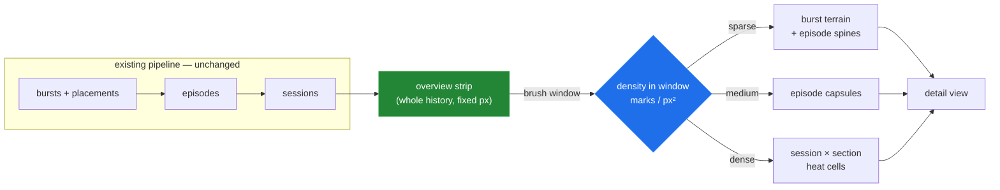
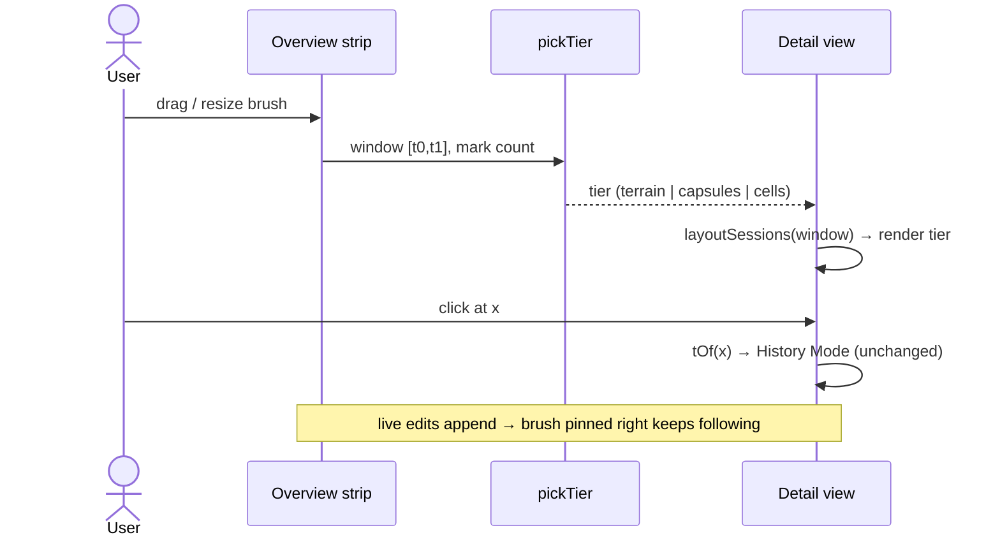

# Scale-Adaptive Edit Narrative — Coherent Space-Time Mapping From Memo To Manuscript

> [!TIP]
> **TL;DR** — The terrain (0005) made the marks pretty but left the *picture* incoherent: one
> act of editing shatters into disconnected lobes across rows, empty canvas dominates, and the
> axis carries almost no chrome. Fix coherence first, scale second. **Short term (P1–P2, ~a
> day):** give every episode a <mark>spine</mark> — one continuous rounded ribbon spanning the
> sections it touched — so related lobes read as one event; compress inactive sections
> vertically the same way idle time is compressed horizontally; and promote sessions to
> first-class axis objects with headers and labeled gaps. **Medium term (P3):** add an
> always-visible <mark>overview strip + brush</mark> and a density-triggered
> <mark>level-of-detail ladder</mark> (burst terrain → episode capsules → session heat cells)
> so a 5-minute memo and a 3-month manuscript both render at constant ink-per-pixel. **Long
> term:** per-character ownership bands (true history flow — the `attribution` data is already
> on the wire), Draftback-style playback, and an LLM summary rail. Everything reads from the
> existing bursts → placements → episodes → sessions pipeline; nothing below the paint changes.

## Problem Statement

The shipped map (0004 pipeline + 0005 terrain paint) still looks rough. From the screenshot of
a real session (2026-08-13):

1. **Disjointed.** An episode that touched ¶7–13 paints five separate lobes on five separate
   rows with nothing connecting them. The same instant appears five times vertically; the eye
   reads five events. Gestalt continuity — the thing that makes a chart read as *a story* — is
   absent by construction, because every mark lives inside its own row.
2. **Hard to read.** Most of the canvas is empty white; lobes float in a void of faint
   baselines. Height is normalized to a 95th-percentile ceiling nobody can see, so lobe height
   comparisons carry little meaning. With a single author the entire hue channel is spent
   saying "chris" thirteen times. The axis shows two clock times an hour apart and a subtle
   hatched seam; sessions — the real narrative units — have no visual identity.
3. **Doesn't scale.** The elastic axis grows without bound (a month of edits = tens of
   thousands of pixels of horizontal scroll with no overview of where you are), and row
   partitioning caps section count but not *meaningfulness* — on a 200-paragraph document each
   row is a 15-paragraph blur. There is no plan for what the map becomes when bursts number in
   the thousands.

The ask: a visualization that (a) works with the existing data model, (b) scales equally well
for small and large documents, (c) maps change + authorship to 2D in a way end users find
coherent, with (d) a short-term presentable step and (e) a long-run destination.

## Executive Summary

The redesign rests on five principles, then a phased plan:

- **P-1 · One event, one shape.** Anything the pipeline treats as one thing (an episode) must
  render as one connected shape. The episode *spine* — a vertical capsule at the episode's
  time-span, spanning every touched section, drawn beneath the lobes in the contributor's color
  at low alpha — restores continuity without abandoning the terrain.
- **P-2 · Compress emptiness on both axes.** 0004 cut idle time; nobody cut idle *space*.
  Sections untouched in the visible window shrink to slim bands (never vanish — document order
  must stay recognizable), giving active sections the vertical room the terrain needs.
- **P-3 · The axis is chrome, not math.** Sessions get headers ("Tue 4:02–4:41 PM · 38 min"),
  gaps get honest labels ("⋯ 6 days ⋯"), and the live edge gets a pulse. Users navigate by
  session, not by pixel.
- **P-4 · Constant ink per pixel (semantic zoom).** Render density decides representation:
  bursts as terrain when there's room, episodes as capsules when bursts would smear, session ×
  section heat cells when episodes would. Same data, three projections, automatic thresholds.
- **P-5 · Overview + detail.** A ~24px full-history strip (always fully visible, never
  scrolls) with a draggable brush window drives the detail view. Scale stops being a rendering
  problem and becomes a navigation problem — which is solvable.



---

## Current State In The Repository

| Piece | Where | What it gives us | What it costs us |
| --- | --- | --- | --- |
| Burst → episode fold | [episodes.ts](../../src/contributions/episodes.ts) (`foldEpisodes`, lineage, row resolver) | The human unit "I edited this paragraph", with member `burstIds` | Episodes are *split back apart* per row at paint time — the source of the disjointedness |
| Section partition | [sections.ts](../../src/contributions/sections.ts) (`partitionSections`, mass-balanced, ≤⌊plotH/36⌋) | Bounded row count at any document size | Every section gets height whether or not it was ever edited |
| Elastic time axis | [sessions.ts](../../src/contributions/sessions.ts) (`layoutSessions`, `xOf`/`tOf`) | Idle gaps cut; legibility floors per session/burst | Unbounded `contentW` growth; no overview of the scroll |
| Terrain paint | [terrain.ts](../../src/components/terrain.ts) + [EditMap.tsx](../../src/components/EditMap.tsx) | Organic per-burst texture, multiply blending, morph | Per-(row × contributor) series — marks can never connect across rows |
| Interaction layer | transparent episode rects in [EditMap.tsx](../../src/components/EditMap.tsx) | Tooltips, hover chip, History-Mode click | Also per-row: hovering one fragment of an episode highlights only that fragment |
| Geometry assembly | [EditMapPanel.tsx](../../src/components/EditMapPanel.tsx) (`buildMapData`) | Single seam where all projections are computed | The natural home for spines, y-compression, and LOD selection |
| Volume tab | [ContributionChart.tsx](../../src/components/ContributionChart.tsx), [bucket.ts](../../src/contributions/bucket.ts) | Exact per-author counts over time | Duplicates the "when/who" story with none of the "where" |
| Per-op attribution | `YHubDeltaOp.attribution` in [types/index.ts](../../src/types/index.ts) | Character-level authorship *already on the wire* | Unused — the long-run ownership view is waiting on it |

> [!IMPORTANT]
> Every option below is a re-projection of data the client already holds. The pipeline
> (placements → episodes → sessions), History-Mode `tOf` click mapping, and the reconciliation
> invariant (Σ episode weights = Σ burst weights) survive every phase. That is what keeps this
> a two-way door.

## External Research

Full survey below; four findings changed this document's recommendations.

> [!IMPORTANT]
> **Draftback's document map** is the single most relevant precedent: above its playback
> player it draws a scatter of every revision at x = when, <mark>y = where in the
> document</mark> — one continuous field, no pre-chunked rows — and calls the result "a visual
> fingerprint of a document." Continuous document-position y avoids per-row disjointedness *by
> construction*. Our section rows are a discretization of that field; the episode spine is the
> step back toward it. ([draftback.com](https://draftback.com/) · [Somers, "How I
> reverse-engineered Google Docs"](https://features.jsomers.net/how-i-reverse-engineered-google-docs/))

- **History Flow** (Viégas & Wattenberg, IBM, [CHI 2004](https://dl.acm.org/doi/10.1145/985692.985765)) —
  x = revisions, y = document composition, color = author, flows connecting persisted text.
  Two transferable lessons beyond what 0004 took: (1) they shipped **both spacing modes**
  (time-proportional and one-column-per-revision) because each hides patterns the other
  reveals — their famous vandalism finding *depended* on the toggle; (2) they spent a second
  channel (brightness) on text **age** on top of hue for author. Known scale failure: hue
  runs out past ~8–10 authors.
- **DocuViz** (UC Irvine, [CHI 2015](https://dl.acm.org/doi/10.1145/2702123.2702517)) — History
  Flow applied to Google Docs via a Chrome extension; proven useful for characterizing
  collaborator roles, and its documented weakness is ours too: with hundreds of sessions the
  columns thin out and flows get noisy — aggregation is mandatory at scale.
- **Chromogram** (Wattenberg et al., [INTERACT 2007](http://hint.fm/projects/chromogram/)) —
  thousands of edits as a sequence of tiny colored tiles. The lesson for the dense tier: **a
  compact color-coded tile grid scales to event counts where any bump/curve chart collapses** —
  which is exactly why Option C's heat cells exist.
- **Streamgraphs / ThemeRiver** ([Byron & Wattenberg, TVCG 2008](https://leebyron.com/streamgraph/stackedgraphs_byron_wattenberg.pdf) ·
  [Havre et al., InfoVis 2000](https://ieeexplore.ieee.org/document/885098/)) — the organic
  look 0005 borrowed; already covered there. Relevant here only as the Volume tab's eventual
  successor (layer ordering and baseline choice dominate legibility).
- **Session science** — Wikipedia edit activity arrives in punctuated bursts
  ([Geiger & Halfaker, CSCW 2013](https://dl.acm.org/doi/10.1145/2441776.2441873));
  inter-activity times are strongly bimodal with an empirically supported **~1-hour**
  between-session boundary ([Halfaker et al., WWW 2015](https://dl.acm.org/doi/10.1145/2736277.2741117)).
  Our `SESSION_GAP_MS = 5 min` is far below the literature's cut — see open questions.
- **EventLines** ([arXiv 2025](https://arxiv.org/abs/2507.17320)) — warps a discrete-event
  time axis to match event density, and its perception study makes one demand of any warped
  axis: <mark>the axis rendering must announce the warp</mark>. Our hatched seams whisper it;
  P2's labeled gaps say it out loud.
- **Horizon charts** ([Heer, Kong & Agrawala, CHI 2009](https://dl.acm.org/doi/10.1145/1518701.1518897)) —
  quantified how far small-multiple rows shrink before reading accuracy collapses, and the
  fix (layered horizon bands) when they must shrink further. This is the empirical backing
  for tier thresholds: below a few mm of row height, area/ridgeline encodings *measurably*
  stop working — switch representation, don't shrink ink.
- **Semantic zoom / overview+detail** — change *representation* with zoom level, keep layout
  stable across levels ([adaptive LOD, Information Visualization 2025](https://doi.org/10.1177/14738716251363236));
  the minimap-brush-detail pattern is standard and well-documented in plain SVG
  ([Observable Focus+Context](https://observablehq.com/@d3/focus-context) · [d3-brush](https://d3js.org/d3-brush));
  [@visx/brush](https://github.com/airbnb/visx) exists if hand-rolling ever chafes. The GitHub
  contributions calendar is the canonical density cap: never more than ~371 cells no matter
  the activity — bin size derives from the visible span, not from data volume.
- **Mainstream product patterns** — Google Docs groups revisions into **activity-session
  blocks** under named milestones, with the middle level collapsed by default
  ([support doc](https://support.google.com/docs/answer/190843?hl=en&co=GENIE.Platform%3DDesktop));
  Figma checkpoints every ~30 min and auto-collapses unnamed saves between named versions
  ([help](https://help.figma.com/hc/en-us/articles/360038006754-View-a-file-s-version-history));
  Word's per-machine author-color assignment is the documented **anti-pattern**
  ([docs](https://support.microsoft.com/en-us/office/track-changes-in-word-197ba630-0f5f-4a8e-9a77-3712475e806a))
  that Etherpad fixed with stable hash-derived HSL colors — which
  [color.ts](../../src/lib/color.ts) already does correctly. Keep hue count ≤ 8 + "others"
  gray; add a non-hue channel (Etherpad uses per-author underline patterns) before adding a
  ninth hue.
- **Playback genre** (Gource, code_swarm, git-story, Draftback playback) — the animated
  organic tools survived as *storytelling*, never as daily analysis UI; the binned "boring"
  views (calendar heatmap, contributors small-multiples) are what shipped and stayed. This
  ordering — analysis first, playback as delight — is why Option G is last.

## Key Findings

1. **The disjointedness is structural, not aesthetic.** `buildMapData` explodes each episode
   into per-row `hits` and per-row `marks` before the paint ever runs
   ([EditMapPanel.tsx](../../src/components/EditMapPanel.tsx)); `EditMap` then draws every
   fragment inside its own band. No amount of smoothing reconnects them. The fix has to happen
   at the geometry seam: emit one *spine* per episode (x-span × y-span over touched sections)
   alongside the existing per-row marks.
2. **Vertical emptiness is the dual of the problem 0004 already solved.** The axis compresses
   idle time; sections idle *in the visible window* deserve the same treatment. A
   weight-remap — active sections keep mass-proportional height, inactive ones clamp to a slim
   floor (~10px) — is ~10 lines in the existing `bands` memo and instantly doubles the room
   the terrain gets in the screenshot's layout.
3. **Height needs an anchor or it needs to go.** The 95th-percentile ceiling makes lobe
   heights *relative to a hidden statistic*. Users can only read ordinal height ("bigger
   burst"), which the lobe *area* already conveys. Flattening the dynamic range (√ or log on
   weight) plus a hoverable "≈ n characters" tooltip is cheaper than a y-legend and loses
   nothing anyone could actually read.
4. **Scale is a navigation problem wearing a rendering costume.** Any fixed rendering breaks
   at some density; the fix is structural: a fixed-width overview strip always shows the whole
   history (sessions as ticks/blocks, weight as intensity), and the detail view only ever
   renders the brushed window. Density inside the window — not document size, not history
   length — picks the representation tier. Both extremes then converge to the same bounded
   render cost.
5. **The single-author case is the common case and deserves its own look.** Rooms in the demo
   flow have one author for minutes at a time. When `contributors.length === 1`, hue is free:
   tint lobes by recency (older = desaturated) so "what changed lately" pops without a legend.
   The moment a second author arrives, hue snaps back to identity — the rule stays simple.
6. **Character-level authorship is already fetched, just discarded.**
   `YHubActivityEntry.delta.children[].attribution` names inserting/deleting authors per op.
   Normalize currently reduces this to a scalar `weight`. A future ownership view (history
   flow proper) needs no new server capability — only client-side bookkeeping of surviving
   spans, which is exactly what made IBM's history flow expensive and is why it's long-term.

## Options And Tradeoffs

### A. Coherence pass on the existing terrain (spines + y-compression + axis chrome)

Keep the terrain; fix the gestalt. One rounded-rect **spine** per (episode × contiguous
section run) drawn under the lobes (same hue, ~0.12 alpha, full row-span height, `rx` ≈ 8);
inactive-section **y-compression**; **session headers** and labeled gaps; recency tinting when
single-author; hover promotes the *whole* episode (all fragments + spine) instead of one rect.

- ✅ Ships in a day; no new components; every 0005 behavior and test survives.
- ✅ Directly attacks all three screenshot complaints.
- ❌ Does nothing for the unbounded-scroll problem — it makes the *current scale* presentable.

### B. Episode capsules (mid-density tier)

Replace per-burst lobes with one rounded capsule per episode spanning its touched sections,
intensity-textured inside (the burst kernels become an internal alpha gradient rather than
separate shapes). Effectively the spine *becomes* the mark.

- ✅ Maximum legibility per event; tooltip/hover surface is the visible shape itself.
- ✅ The natural middle tier of the LOD ladder — terrain collapses into it gracefully.
- ❌ As the *only* mode it loses the burst texture 0005 was asked for; keep it as a tier, not
  a replacement.

### C. Session × section heat cells (high-density tier)

At high density, render a regular grid: rows = sections, columns = sessions (not time-linear —
one column per session, History-Flow's "one column per revision" spacing). Cell fill = dominant
contributor hue; alpha = √weight; split diagonally when two authors share a cell; small
multiples of at most `sections × sessions` cells regardless of burst count.

- ✅ Bounded ink at any history length; familiar (GitHub contribution graph) idiom.
- ✅ Column-per-session is also the *overview strip's* geometry — one implementation, two uses.
- ❌ Abandons continuous time within a session (fine at this tier; the brush restores it).
- 🚧 If cells feel too coarse in practice, layered horizon rows are the literature-backed
  middle ground for rows too short for area encodings (Heer et al., CHI 2009).

### D. Author threads (storyline overlay)

One continuous polyline per contributor, x = time, y = the section they're editing, thickness
= activity, smoothly interpolating between consecutive episodes. Reads as narrative: "chris
wrote the intro, jumped to the conclusion, came back."

- ✅ The strongest possible answer to "coherent and intuitive" — continuity is the message.
- ✅ Fixed rows sidestep the NP-hard storyline-layout literature entirely.
- ❌ Degrades with >4 concurrent authors or rapid section-hopping (spaghetti); an overlay
  toggle, not the default.
- 🚧 Medium effort; worth prototyping after P3.

### E. Overview strip + brush (structural, orthogonal to paint)

A fixed-height (~24px) strip under the map: whole history compressed to container width, one
block per session (min 2px), intensity = session weight, colored segments per contributor
share. A draggable/resizable brush selects the detail window; the detail view renders only
that window at the LOD its density earns. Click = jump; drag on detail view = pan.

- ✅ Solves "equally well for small and large" *structurally*: small histories brush-select
  everything (strip is effectively invisible chrome); huge histories navigate by it.
- ✅ Kills the unbounded scrollbar and the pinned-edge fragility in one move; "live edge"
  becomes "brush pinned to the right end of the strip".
- ❌ One more chrome element in an already-docked panel; must collapse gracefully below
  ~480px width (the existing `labelW` breakpoint precedent).

### F. Ownership bands — true history flow (long run)

Sample document versions (session boundaries, via the existing
[fetchDocumentAt.ts](../../src/history/fetchDocumentAt.ts)), attribute every surviving
character using the delta `attribution` ops, and draw stacked per-author bands whose heights
are owned-character counts per section — the document as a striped organism growing through
time. This is the visualization Wikipedia's history flow made famous, and the only option that
shows *survivorship* (whose words remain) rather than *activity* (who typed).

- ✅ Uniquely valuable signal no activity view can fake; premium/report-mode material.
- ❌ Requires per-version reconstruction + span bookkeeping; real memory and correctness work.
- 🚧 Long-term; de-risk with an offline spike on a recorded room first.

### G. Playback (long run)

Scrub/play the document through time (History Mode already reconstructs any instant); the map
becomes the scrubber, the morph rig (0005) already animates between states. Draftback proved
the emotional power of watching a document assemble itself.

- ✅ Demo gold; reuses History Mode + morph almost entirely.
- ❌ Pure delight, zero analytical lift; strictly after the analytical view is right.

### Comparison

| Option | Fixes disjointed | Fixes empty/illegible | Fixes scale | Effort | Verdict |
| --- | --- | --- | --- | --- | --- |
| **A. Coherence pass** | ✅ spines | ✅ y-compression + chrome | ❌ | ~1 day | ✅ **Do now** |
| B. Episode capsules | ✅ | ✅ | 🚧 mid-tier only | ~1 day | ✅ As LOD tier |
| C. Heat cells | ✅ | ✅ | ✅ high tier | ~1 day | ✅ As LOD tier |
| D. Author threads | ✅✅ | 🚧 | ❌ | ~2 days | 🚧 Prototype later |
| **E. Overview + brush** | — | — | ✅✅ structural | ~1–2 days | ✅ **Do next** |
| F. Ownership bands | ✅ | ✅ | ✅ | weeks | 🚧 Long run |
| G. Playback | — | — | — | days | 🚧 Long run |

## Recommendation

Phase the work so the map is *more* presentable after every merge:

1. **P1 — Coherence (Option A).** Episode spines, whole-episode hover, inactive-section
   compression, √-flattened heights, single-author recency tinting. The screenshot's
   complaints die here.
2. **P2 — Axis chrome.** Session header band (label + duration), labeled idle gaps replacing
   the bare hatch, subtle live-edge pulse. Users start *reading* the axis instead of decoding
   it.
3. **P3 — Overview strip + brush (Option E) and the LOD ladder (B/C as tiers).** Density
   thresholds: terrain below ~0.15 marks/px of window width, capsules to ~0.5, heat cells
   beyond. Hysteresis (±20%) so the tier never flickers; the morph rig animates transitions.
4. **Long run.** Author-thread overlay (D) once multi-author rooms are common; ownership
   bands (F) after an offline attribution spike; playback (G) when demo polish pays;
   the 0005-noted LLM summary rail as a separate data exploration. And the deepest cut, if
   section rows ever feel like the wrong discretization: a Draftback-style **continuous
   document-position field** — y as a real position scale rather than section bands, marks as
   a density field over it — which dissolves the row problem entirely at the cost of losing
   the labeled-section gutter.

The 2D grammar, stated once and enforced everywhere:

| Channel | Meaning | Never used for |
| --- | --- | --- |
| x | time (session-elastic, brush-windowed) | anything else |
| y | document position (order-preserving, activity-elastic) | magnitude |
| hue | author identity (single-author rooms: recency tint) | magnitude |
| alpha / area | edit magnitude (√-flattened) | identity |
| connectedness | same act of editing (episode) | decoration |

## Example Code

### P1 — episode spines (geometry seam, [EditMapPanel.tsx](../../src/components/EditMapPanel.tsx))

```ts
/** One connected ribbon per episode × contiguous run of touched rows. */
export interface EpisodeSpine {
  id: string;
  contributorId: string;
  x0: number;
  x1: number;
  /** First and last row key of a contiguous touched run (inclusive). */
  rowKeyTop: string;
  rowKeyBottom: string;
}

function buildSpines(episodes: EditEpisode[], rowKeysOf: (e: EditEpisode) => string[],
  rowOrder: Map<string, number>): EpisodeSpine[] {
  const out: EpisodeSpine[] = [];
  for (const e of episodes) {
    const rows = rowKeysOf(e)
      .map((k) => ({ k, i: rowOrder.get(k) ?? -1 }))
      .filter((r) => r.i >= 0)
      .sort((a, b) => a.i - b.i);
    // Split into contiguous runs so a doc-wide episode doesn't paint over
    // untouched sections between its fragments.
    let runStart = 0;
    for (let j = 1; j <= rows.length; j += 1) {
      if (j === rows.length || rows[j]!.i !== rows[j - 1]!.i + 1) {
        out.push({
          id: e.id, contributorId: e.contributorId,
          x0: xOf(e.startedAt, segments), x1: xOf(e.endedAt, segments),
          rowKeyTop: rows[runStart]!.k, rowKeyBottom: rows[j - 1]!.k,
        });
        runStart = j;
      }
    }
  }
  return out;
}
```

Rendered beneath the terrain as `rx=8` rounded rects, contributor hue at `fillOpacity 0.12`,
promoted to `0.2` plus a 1px stroke when any fragment of the episode is hovered.

### P1 — inactive-section compression ([EditMap.tsx](../../src/components/EditMap.tsx) `bands` memo)

```ts
const ACTIVE_BOOST = 3;      // active sections claim ~3× their mass share
const INACTIVE_MIN_H = 10;   // idle sections never vanish — order stays visible

const activeKeys = new Set(marks.map((m) => m.rowKey));
const effective = rows.map((row) => ({
  row,
  w: activeKeys.has(row.key) ? row.weight * ACTIVE_BOOST : 0, // 0 → floor below
}));
// …then the existing clamp-and-renormalize, with INACTIVE_MIN_H as the floor
// for zero-weight rows in place of MIN_ROW_H.
```

### P3 — LOD selection (pure, testable)

```ts
export type MapTier = 'terrain' | 'capsules' | 'cells';

/** marks per px of window width; hysteresis so live growth can't flicker tiers. */
export function pickTier(markCount: number, windowPx: number, prev: MapTier): MapTier {
  const d = markCount / Math.max(windowPx, 1);
  const up = { terrain: 0.15, capsules: 0.5 };   // densify past these
  const down = { capsules: 0.12, cells: 0.4 };   // sparsify below these
  if (prev === 'terrain') return d > up.terrain ? 'capsules' : 'terrain';
  if (prev === 'capsules')
    return d > up.capsules ? 'cells' : d < down.capsules ? 'terrain' : 'capsules';
  return d < down.cells ? 'capsules' : 'cells';
}
```

### The interaction loop after P3



## Risks And Open Questions

| # | Risk | Impact | Likelihood | Mitigation |
| --- | --- | --- | --- | --- |
| R1 | Spines under multiply-blended lobes darken into mud where several overlap | Ugly worst case | Med | Spines render in `normal` blend beneath the multiply group; cap spine alpha at 0.12 |
| R2 | Y-compression makes section heights jump when an idle section wakes | Disorienting | Med | Reuse the 0005 morph rig for band heights (already lerps fixed-cadence arrays; heights are just another array) |
| R3 | LOD tier changes read as "the chart changed on me" | Trust | Med | Hysteresis + 300ms morph between projections; tier badge in the corner ("session view") |
| R4 | Overview strip + brush + dock + tabs = chrome soup in a 180px dock | Clutter | Med | Strip replaces the horizontal scrollbar (net zero); collapses under 480px with the existing `labelW` precedent |
| R5 | Session-column heat cells hide within-session order at the dense tier | Info loss | Low | That's what brushing *in* is for; cells are a navigation aid, not the terminal view |
| R6 | Recency tinting reads as a second author to a colorblind user | Misread | Low | Tint varies lightness only, never hue; legend says "older edits fade" |

**Open questions**

- [ ] Should the overview strip's x be uniform-per-session or elastic like the detail axis?
      (Uniform-per-session is History Flow's one-column-per-revision answer and keeps the
      strip O(sessions); History Flow's own lesson is that a *toggle* may eventually be
      warranted, since each spacing hides what the other shows.)
- [ ] `SESSION_GAP_MS` is 5 min; the literature's empirically supported between-session
      boundary is ~1 hour (Halfaker et al., WWW 2015). Our 5-min gaps may be splitting one
      human work session into many visual sessions — worth probing against a real room. A
      two-level scheme (5-min *sub-sessions* inside 1-hour *sessions*, only the latter earning
      seams and headers) would match both the data and the Google Docs grouping precedent.
- [ ] Do spines span *cut seams* when an episode crosses an idle gap? Current lean: yes, but
      dashed across the seam, since the episode fold already decided they're one act.
- [ ] At what contributor count does the author-thread overlay (D) become spaghetti? Needs a
      synthetic-room probe before building it.
- [ ] The 0005 mock's LLM "Top edits summary" rail — separate exploration, still unclaimed.

## Implementation Checklist

**Status:** `░░░░░░░░░░ 0/12 items`

### P1 — Coherence (~1 day)
- [ ] `buildSpines` in [EditMapPanel.tsx](../../src/components/EditMapPanel.tsx) (or a new
      `src/contributions/spines.ts`) + unit tests (contiguous-run splitting, row ordering,
      cut-seam behavior per the open question's resolution)
- [ ] [EditMap.tsx](../../src/components/EditMap.tsx): spine layer beneath terrain; hover on
      any episode fragment promotes the whole episode (spine + all lobes + chip)
- [ ] Inactive-section y-compression in the `bands` memo (+ morphed band heights)
- [ ] √-flattened weights at the terrain seam; tooltip gains "≈ n chars"
- [ ] Single-author recency tint (lightness ramp; hue untouched)

### P2 — Axis chrome (~0.5 day)
- [ ] Session header band: "4:02–4:41 PM · 38 min" per session ≥ 80px, date prefix when the
      history spans days
- [ ] Idle gaps: hatch replaced by a labeled pill ("6 days") centered in the seam
- [ ] Live-edge pulse at the right margin while connected

### P3 — Overview + LOD (~2 days)
- [ ] Overview strip component (session blocks, contributor share coloring, weight intensity)
      + brush state in [store/dock.ts](../../src/store/dock.ts)
- [ ] `pickTier` + capsule and cell renderers as siblings of the terrain in
      [EditMap.tsx](../../src/components/EditMap.tsx); morph between tiers
- [ ] Detail view renders brushed window only; live-edge = brush pinned right
- [ ] README decision rows + this exploration checked off

## Validation Checklist

- [ ] **V1** The screenshot scenario re-rendered: the ¶7–13 episode reads as one connected
      shape; blind test ("how many editing acts do you see?") answers match episode count
- [ ] **V2** A 13-section doc with 3 active sections gives active sections ≥ 2× their previous
      height; inactive sections remain visible and ordered
- [ ] **V3** Axis reads without the caption: session times, gap durations, live pulse
- [ ] **V4** A synthetic 5,000-burst / 40-session room stays under 16ms/frame at every tier,
      and the overview strip renders the whole history inside the container width
- [ ] **V5** A 2-paragraph, 4-burst memo renders effectively identically to today (no
      overview chrome tax on tiny histories)
- [ ] **V6** Tier transitions animate; no flicker across the hysteresis band under live
      polling
- [ ] **V7** History-Mode click round-trips through the brushed window (`tOf` on window
      segments) at every tier
- [ ] **V8** `pnpm test && pnpm typecheck` green; all 0005 validation cases still pass

## References

**This repository**
- [0004 — Space-Time Edit Map & Docked Chrome](0004_%5Bx%5D_SPACE_TIME_EDIT_MAP_AND_DOCKED_CHROME.md) —
  the pipeline and History-Flow framing this builds on
- [0005 — Organic Edit Terrain](0005_%5Bx%5D_ORGANIC_EDIT_TERRAIN.md) — the paint being made
  coherent here
- [EditMapPanel.tsx](../../src/components/EditMapPanel.tsx) ·
  [EditMap.tsx](../../src/components/EditMap.tsx) ·
  [terrain.ts](../../src/components/terrain.ts) ·
  [sessions.ts](../../src/contributions/sessions.ts) ·
  [episodes.ts](../../src/contributions/episodes.ts) ·
  [sections.ts](../../src/contributions/sections.ts)
- Screenshot: chat attachment (2026-08-13) — the shipped terrain on a real session

**Prior art**

- [Draftback](https://draftback.com/) · [Somers — How I reverse-engineered Google Docs](https://features.jsomers.net/how-i-reverse-engineered-google-docs/)
  — playback + the time × document-position map ("visual fingerprint of a document")
- [History Flow — Viégas & Wattenberg, CHI 2004](https://dl.acm.org/doi/10.1145/985692.985765) ·
  [project page](http://hint.fm/projects/historyflow/) — document space × time × author; dual
  spacing modes; brightness-for-age
- [DocuViz — Wang et al., CHI 2015](https://dl.acm.org/doi/10.1145/2702123.2702517) — History
  Flow for Google Docs; column-thinning at scale
- [Chromogram — Wattenberg et al., INTERACT 2007](http://hint.fm/projects/chromogram/) —
  thousands of edits as colored tiles; density ceiling of tile grids
- [Geiger & Halfaker — Edit Sessions, CSCW 2013](https://dl.acm.org/doi/10.1145/2441776.2441873) ·
  [Halfaker et al. — Inter-activity Time, WWW 2015](https://dl.acm.org/doi/10.1145/2736277.2741117)
  — punctuated bursts; the empirical ~1 h session boundary
- [EventLines — arXiv 2025](https://arxiv.org/abs/2507.17320) — density-warped event axes must
  announce the warp
- [Heer, Kong & Agrawala — Sizing the Horizon, CHI 2009](https://dl.acm.org/doi/10.1145/1518701.1518897)
  — row-height limits of area encodings; horizon bands as the small-row fallback
- [Adaptive level-of-detail time series — Information Visualization 2025](https://doi.org/10.1177/14738716251363236)
  — semantic zoom: swap representation, keep layout stable
- [Observable — Focus + Context](https://observablehq.com/@d3/focus-context) ·
  [d3-brush](https://d3js.org/d3-brush) · [visx](https://github.com/airbnb/visx) —
  overview + detail implementation patterns in plain SVG/React
- [Google Docs version history](https://support.google.com/docs/answer/190843?hl=en&co=GENIE.Platform%3DDesktop) ·
  [Figma version history](https://help.figma.com/hc/en-us/articles/360038006754-View-a-file-s-version-history)
  — milestone → session → revision hierarchy, middle level collapsed
- [Word track changes](https://support.microsoft.com/en-us/office/track-changes-in-word-197ba630-0f5f-4a8e-9a77-3712475e806a)
  (per-machine color anti-pattern) · Etherpad's stable hash-derived author colors — the
  convention [color.ts](../../src/lib/color.ts) already follows
- [Byron & Wattenberg — Stacked Graphs, TVCG 2008](https://leebyron.com/streamgraph/stackedgraphs_byron_wattenberg.pdf) ·
  [ThemeRiver — InfoVis 2000](https://ieeexplore.ieee.org/document/885098/) — the organic
  lineage behind 0005, and the Volume tab's eventual successor
- [Gource](https://gource.io/) · code_swarm — animated organic history: demo genre, not
  analysis UI; the reason playback is sequenced last
