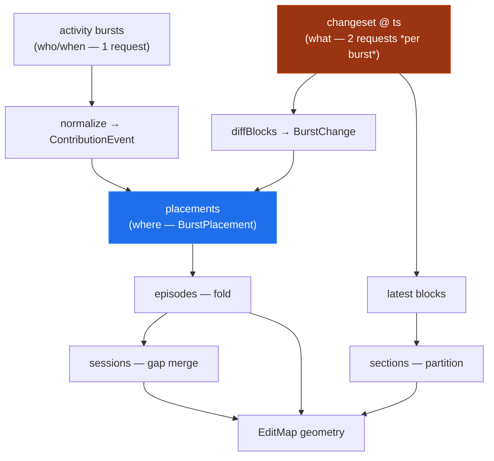
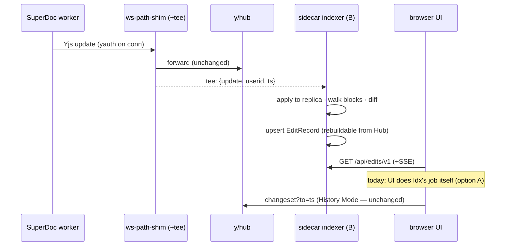

# The Edit-History Data Model — y/hub Anatomy, Its Gaps, And Whether We Need Our Own

> [!TIP]
> **TL;DR** — y/hub's model is three orthogonal facts: an **activity index** (who edited when,
> grouped into bursts), a **changeset store** (the document as it was at any timestamp), and a
> **connection attribution channel** (yauth → `by`, customAttributions → names). It answers
> *who/when* in one cheap request and *what/where* only by N×2 document reconstructions —
> which is why the placement backfill exists and why weights degrade to "1 burst" on SuperDoc
> rooms. That is not a reason to leave y/hub: it is a reason to name the thing we keep
> rebuilding — an <mark>`EditRecord` read model</mark> (burst × placement × char-weight ×
> author) — as an explicit contract, keep y/hub as the only system of record, and fix the
> cost in leverage order: reading `API.md` revealed the activity API's unused
> `ydoc=true&attributions=true` mode, which encodes **placements-and-weights for the whole
> history in one request** — spike that first; persist the client cache; and lift computation
> into a read-only subscriber sidecar only when a real deployment demands it. Replacing y/hub
> outright loses the only per-span, server-attributed, any-timestamp history API in the Yjs
> ecosystem — a hard no for now.

## Problem Statement

Three questions, in rising order of consequence:

1. **Anatomy** — what exactly is y/hub's data model, and how does it meet SuperDoc's
   worker-mounted Yjs collaboration in this codebase?
2. **Fitness** — is that model ideal for rendering edits in a UI? What is it missing for the
   features we want (0003's hover spotlight, 0006's coherent map and LOD ladder, char-accurate
   weights, ownership bands, playback, an LLM summary rail)?
3. **Architecture** — does it make sense to run a different data model separate from y/hub,
   and if so, what kind (client cache, server sidecar, replacement backend)?

## Executive Summary

- **y/hub's model is good at the two things it actually stores** — a per-room, per-user,
  timestamped activity log and a full version history queryable at any `to=ts`. Both are
  server-observed truths a client could not fake or reconstruct alone.
- **Everything the UI renders beyond "who/when" is *derived* client-side today** — placements
  (two reconstructions + a diff per burst), episodes, sessions, sections. The derivation
  pipeline is pure and tested, but its *fetch cost* is the scaling cliff: locating N bursts
  costs up to 2N changeset requests, capped at 500 placements and forgotten on every reload.
- **The single binding constraint is SuperDoc v2's opacity**, not y/hub's API. The editor's
  Y.Doc lives in an obfuscated Web Worker with no update tap (README decision 1), which
  forecloses the entire client-side Yjs-native toolbox (snapshots, PermanentUserData,
  attributed deltas) and forces every "what changed" question through the server.
- **We already own a privileged seam**: every Yjs sync message and every `yauth` identity
  passes through [server/ws-path-shim.mjs](../../server/ws-path-shim.mjs). A sidecar that tees
  updates there can materialize the read model once, for all clients, with char accuracy —
  without patching y/hub further and without becoming a second system of record (it is
  rebuildable from y/hub's changeset store at any time).
- **The recommendation is a contract, then a migration path**: define `EditRecord` now (the
  client already computes it; give it a name and a module boundary), persist the client's
  placement cache so reloads stop re-deriving, and lift computation into the sidecar when a
  real deployment needs it. Keep "replace y/hub" as the explicitly-scoped fallback it should
  be.

---

## Current State In The Repository

### The three y/hub facts and where they enter

| y/hub surface | Wire shape | Consumed by | What it answers |
| --- | --- | --- | --- |
| `GET /api/activity/v1/{org}/{docid}` (`group=true`, `groupMaxGap=5000`, `customAttributions=true`, `limit=2000`, JSON via `Accept`) | `{activity: [{from, to, by, customAttributions, delta?}]}` | [fetchActivity](../../src/collab/yhub.ts) → [normalize.ts](../../src/contributions/normalize.ts) → [store/activity.ts](../../src/store/activity.ts) | **who / when** (bursts) |
| `GET /api/changeset/v1/{org}/{docid}?to=ts&ydoc=true` | base64 Yjs update of the whole doc at `ts` | [fetchDocumentAt.ts](../../src/history/fetchDocumentAt.ts) → [burstDiff.ts](../../src/spotlight/burstDiff.ts) | **what the document was** (any instant) |
| WS `/api/ws/v1/{org}/{docid}?yauth=…&customAttributions=name:…` (via the shim's segment collapse) | Yjs sync protocol | SuperDoc v2's worker, mounted in [superdoc-mount.ts](../../src/collab/superdoc-mount.ts); auth patched in [server/yhub.js](../../server/yhub.js) | **who is this connection** (`by` = deviceId) |

### The derivation pyramid (all client-side, all recomputed per session)



The orange node is the cost center: [placementIndex.ts](../../src/spotlight/placementIndex.ts)
backfills newest-first at concurrency 2, caps at `MAX_PLACEMENTS = 500`, LRU-caches 64
reconstructions ([burstDiff.ts](../../src/spotlight/burstDiff.ts)) — and every browser
re-derives all of it from scratch on every reload, because placements live only in a Zustand
map ([store/activity.ts](../../src/store/activity.ts)).

### What the integration already worked around

| Friction | Where handled | Nature |
| --- | --- | --- |
| SuperDoc's 4-segment WS path vs y/hub's 2-segment rooms | [ws-path-shim.mjs](../../server/ws-path-shim.mjs) + [collapsedDocId](../../src/collab/yhub.ts) | Path shape only; must change together |
| Stock y/hub assigns *random comic-strip user ids* | [server/yhub.js](../../server/yhub.js) patch: `yauth` → userid | Attribution would otherwise be decorative |
| Display names without a user directory | `customAttributions: name:…` on the connection; parsed in [normalize.ts](../../src/contributions/normalize.ts) | Comma/colon-unsafe — [sanitizeAttributionValue](../../src/collab/yhub.ts) |
| `delta=true` renders SuperDoc rooms as content-unit *metadata*, never text | `weightOf` keeps the verified char-counting walk; fetch omits the flag (README decision 5) | Weights degrade to 1/burst on real traffic |
| No push channel consumed | 5s polling + local-edit debounce ([useActivityPolling.ts](../../src/contributions/useActivityPolling.ts)) | Deliberate: chart survives REST outage |
| SuperDoc's undocumented Y.Doc schema | runtime-discovered walk: `content` → story shards → `blocks[]` → `text` (+ `blockId`, split/merge lineage) in [burstDiff.ts](../../src/spotlight/burstDiff.ts) | `instanceof`-guarded against drift |

> [!WARNING]
> Two standing hazards worth restating from README decisions 5–6: the activity fetch is
> hard-capped at `limit=2000` bursts with no pagination handling — a long-lived room silently
> truncates history — and y/hub's delete/rollback endpoints are unauthenticated in this
> deployment, so the "system of record" is only as durable as the room URL is secret.

## External Research

Primary-source pass over [y/hub's `API.md`](https://github.com/yjs/yhub/blob/master/API.md)
(1009 lines, read in full) plus the surrounding ecosystem. Five results change this document.

### What y/hub actually is

y/hub is Kevin Jahns' successor to y-redis (that repo now carries the y/hub README):
WebSocket servers stream updates through Redis; workers compact into PostgreSQL/S3; **no
Y.Doc in server memory**. Every doc is keyed `(org, docid, branch)` and stored as **both a
gc'd and a non-gc'd version** — the non-gc version is what makes history a query. It is built
on `@y/y` (the yjs v14 line) whose new primitives — `IdSet`, `IdMap`/ContentMap,
`AttributionsRenderer`, attributed deltas ([attributing-content.md](https://github.com/yjs/yjs/blob/main/attributing-content.md)) —
are exactly the machinery behind the activity API. Attribution is assigned **server-side to
the authenticated identity on every write path**, which is why `by` is trustworthy in a way
client-asserted schemes (e.g. Tiptap's `changesBy`) are not.

### The API surface we are not using

> [!IMPORTANT]
> The activity API can return, in **one request**: per-entry attributed deltas
> (`delta=true`), per-entry attribution ContentMaps (`attributions=true`), and — the big one —
> `ydoc=true`: **one shared partially-gc'd document for the whole list plus a per-entry
> `renderedContent` IdSet** describing the content alive at that entry's `to`. The documented
> rendering contract is: apply the shared `ydoc` to a `gc:false` doc, then
> `toDelta({ renderer: Y.createAttributionsRenderer(contentMap, { renderedContent }) })`.
> Our placement pipeline reconstructs the full document **twice per burst** to recover
> what a single `activity?ydoc=true&attributions=true` response encodes. The catch: consuming
> it client-side needs `@y/y` (v14, currently rc) instead of our yjs 13 — and our block-walk
> schema knowledge still applies, since we, not the server, interpret content units.

Other surfaces relevant to us, verified from `API.md`:

- **Grouping is experimental.** `group=true` is flagged experimental; `groupMaxGap` defaults
  to **1000 ms** (we override to 5000); `groupMaxDuration` exists (we don't use it). Entries
  have **no server-side identifiers** — only `{from, to, by}` ranges — so our content-derived
  burst ids are a client invention with no stability guarantee across history rewrites.
  Fetching **ungrouped** and grouping client-side keeps the analytics model independent of an
  experimental server feature and lets 0006's two-level session idea tune gaps per-view
  without refetching.
- **`POST /api/rollback/v1`** is *selective undo*: revert everything matching
  `{from, to, by, contentIds, withCustomAttributions}`, distributed live as compensating
  changes. "Undo everything user U did between X and Y" is a server primitive we render
  nothing for today.
- **`POST /api/prune/v1`** is the retention lever: irreversibly compacts *churn* (content
  inserted **and** deleted within a range) without touching live content; the documented
  recipe prunes between activity timestamps to merge timeline steps. Retention is explicitly
  the integrator's job — there is no built-in sweeper.
- **No webhooks, no SSE.** Polling is the intended integration; the only push channel is the
  y-websocket protocol itself. And activity/changeset responses are **cached with a default
  `redis.cacheTtl` of 10 s** — our 5 s poll ([useActivityPolling.ts](../../src/contributions/useActivityPolling.ts))
  re-reads the cache every other tick.
- **Branches** (`branch=` param) are first-class forks for suggestion workflows — an unused
  primitive that maps directly onto track-changes-style review features.

### The ecosystem, for calibration

| Backend | Per-span attribution | Timestamped history query | Verdict for us |
| --- | --- | --- | --- |
| **y/hub** | ✅ server-attributed ContentMaps | ✅ any-`ts` changeset + activity feed | The only one offering both ([repo](https://github.com/yjs/yhub)) |
| Tiptap Cloud | ❌ per-version author list, client-supplied | 🚧 30 s autoversions | [Snapshot](https://tiptap.dev/docs/collaboration/documents/snapshot) |
| Liveblocks | ❌ per-version `authors[]` | 🚧 version list | [docs](https://liveblocks.io/docs/guides/how-to-add-version-history-to-your-app) |
| y-sweet | ❌ none documented | ❌ | [docs](https://docs.jamsocket.com/y-sweet) |
| Hocuspocus | ❌ DIY via hooks | ❌ DIY | [hooks](https://tiptap.dev/docs/hocuspocus/server/hooks) |
| y-partykit | ❌ | ❌ (update log or snapshot, no query API) | [docs](https://docs.partykit.io/reference/y-partykit-api/) |

Design references beyond Yjs: **Automerge** retains a hash-linked change DAG enabling
diff-between-any-heads and blame ([API](https://automerge.org/automerge/api-docs/js/) ·
[Ink & Switch Patchwork](https://www.inkandswitch.com/patchwork/notebook/2024-version-control/08/));
**Loro** offers frontier-based time travel and stable cursors
([versioning](https://loro.dev/docs/advanced/version_deep_dive)); **Eg-walker/diamond-types**
([EuroSys 2025](https://arxiv.org/abs/2409.14252)) store the *original editing trace* so
per-keystroke replay and attribution fall out of the storage format. The design lesson: a
grouped activity feed is a **lossy, pre-aggregated projection** — intra-burst ordering is gone
by the time we see it. y/hub's non-gc doc + ContentMap sits in between: full content history,
time only at server-recorded granularity. Also confirmed as principle: **wall-clock
timestamps and trusted identity are inherently server-side facts** — Yjs ops carry neither,
which is why client-only designs (option D) could never fully replace y/hub even without
SuperDoc's worker opacity.

At the editor layer, [prosemirror-changeset](https://github.com/ProseMirror/prosemirror-changeset)
is the canonical steps→reviewable-spans distiller (incremental, attaches arbitrary data per
span) and remains our fallback diff renderer for any pair of reconstructed docs; mark-based
track-changes ([Fidus Writer](https://github.com/fiduswriter/fiduswriter),
[@manuscripts/track-changes-plugin](https://www.npmjs.com/package/@manuscripts/track-changes-plugin))
keeps suggestion state *in* the document, which is what y/hub branches would sync for free.

## Key Findings

1. **The activity API has document-space data — in Yjs-ID space, and we don't consume it.**
   Our polled shape (`{from, to, by}`) says who and when, never where, so every spatial
   feature exists only because the client reconstructs the document twice per burst and
   diffs. But `API.md` shows the same endpoint can ship attribution ContentMaps, per-entry
   `renderedContent` IdSets, and one shared partially-gc'd `ydoc` for the entire list — the
   full "where and what" in a single response, addressed by Yjs item IDs rather than
   blockIds. The gap is not the API; it is that consuming those modes needs `@y/y` (yjs v14
   rc) client-side plus our block-walk to translate ID-space into block-space. That is a
   *spike*, not a wall — and it could delete the N×2 reconstruction entirely.
2. **Char-accurate weights are blocked by representation, not by API design.** The delta walk
   in [normalize.ts](../../src/contributions/normalize.ts) is correct and verified against
   plain-Yjs rooms; it fails on SuperDoc rooms because y/hub serializes content units as
   opaque metadata. Whoever can decode the SuperDoc schema *at delta time* — an upstream y/hub
   patch, or our own indexer applying updates to a live Y.Doc — gets real weights for free,
   because the client-side walk already knows the schema.
3. **The client already maintains a second data model; it just has no name and no
   persistence.** `ContributionEvent + BurstPlacement + latestBlocks` *is* an edit-history
   read model — derived, disposable, rebuildable. The architectural line the README draws
   ("no client-side snapshot store — no second system of record", decision 12) is about
   *truth*, not *caching*: a read model that can always be re-derived from y/hub violates
   nothing even when persisted.
4. **The shim is an interception seam we already operate.** Every sync message, every update,
   and every connection's `yauth` passes through
   [ws-path-shim.mjs](../../server/ws-path-shim.mjs). A tee there feeds a Y.Doc replica +
   per-update attribution log *without* touching SuperDoc (obfuscated) or y/hub (patched once
   already, in [server/yhub.js](../../server/yhub.js)). This is the only place in the whole
   system where updates and identity are visible together, in real time, in code we own.
5. **Client-side Yjs-native history is foreclosed until SuperDoc opens up.** Y.Snapshot +
   PermanentUserData need `gc: false` and access to the Doc/provider; SuperDoc v2 removed the
   `modules.collaboration` contract and runs the Doc in an obfuscated worker whose only public
   signal is an author-less, delta-less `onEditorUpdate` (README decision 1). Any design that
   assumes a client update tap is dead on arrival today — this is what makes server-observed
   history the *right* call and not merely the convenient one.
6. **y/hub's changeset-at-any-`ts` is the feature to protect — and nothing else in the
   ecosystem has it.** History Mode, burst diffs, and 0006's long-run ownership bands all
   lean on "the backend already stores every version; time travel is a query" (README
   decision 12). The ecosystem survey found y/hub is currently the *only* Yjs backend
   exposing per-span, server-attributed, timestamped history over HTTP; everyone else offers
   coarse whole-document versions (Tiptap, Liveblocks) or nothing (y-sweet, Hocuspocus core,
   PartyKit). Any migration target must match that or we build the version store ourselves —
   precisely the second system of record we refuse to become.
7. **Our burst ids are a client invention over an experimental feature, and history can be
   rewritten under them.** Server entries carry no identifiers; `group=true` is flagged
   experimental (default gap 1000 ms, not our 5000); `prune` merges timeline steps and
   `rollback` appends compensating edits. A persisted read model must therefore store its
   source window and re-derive on mismatch instead of trusting `${by}:${from}:${to}` ids to
   be eternal — and fetching *ungrouped* activity with client-side grouping would decouple us
   from the experimental flag while enabling 0006's per-view gap tuning.
8. **Our 5 s poll runs into a 10 s server cache.** Activity responses are cached with
   `redis.cacheTtl` defaulting to 10 s, so every other tick of
   [useActivityPolling.ts](../../src/contributions/useActivityPolling.ts) re-reads a cached
   body, and the local-edit debounce (1.2 s) usually cannot surface the user's own burst any
   faster. Either lower `redis.cacheTtl` in [server/yhub.js](../../server/yhub.js) or align
   the poll to the TTL — as configured, half the polls are free but useless.

## Options And Tradeoffs

### A. Status quo, hardened (client-side read model + persistence)

Name the read model (`EditRecord`), persist placements + activity in IndexedDB keyed by
burst id (immutable, so cache invalidation is trivial), handle `limit=2000` pagination, and
optionally raise `MAX_PLACEMENTS` since persisted placements amortize.

- ✅ No new infrastructure; a few hours' work; reload stops costing ~1000 requests.
- ✅ Placements are immutable *between history rewrites* — with the prune/rollback mismatch
  check (finding 7), a persistent cache stays honest.
- ❌ Char weights stay blocked (finding 2); every *new* browser still pays the full backfill.
- ❌ Multi-viewer rooms duplicate identical derivation work per client.

### A′. One-shot attributed fetch (`activity?ydoc=true&attributions=true` + `@y/y`)

Replace the N×2 changeset backfill with the API's own bulk mode: one request returns every
entry plus a shared partially-gc'd doc and per-entry `renderedContent` IdSets; the client
applies the doc under `@y/y` (yjs v14 rc), renders each entry via `AttributionsRenderer`, and
runs the existing block-walk to translate ID-space into blockIds. Placements and — because
attribution ops are marked in the ContentMap — potentially char weights, from a single
response.

- ✅ Deletes the cost center outright: O(1) requests instead of O(2N); server does no extra
  work it wasn't already doing.
- ✅ The same rendering contract y/hub itself uses for `delta=true` — but *we* interpret the
  content units, so SuperDoc's opacity (finding 2) may not bite here the way the
  server-rendered delta did. That is the hypothesis the spike must test.
- ❌ Requires `@y/y` (rc-quality) alongside or instead of yjs 13 in the history pipeline;
  content-unit interpretation client-side is unproven — same unknown that sank `delta=true`,
  now on our side of the wire where we hold the schema knowledge.
- 🚧 Highest-leverage spike in this document. If it works, options B/C shrink to "who serves
  the cache", and the demo may never need a server-side indexer at all.

### B. Sidecar indexer teeing at the shim (server-side read model)

The shim process (or a sibling worker in the same container) maintains a Y.Doc replica per
active room by applying the updates it already forwards, attributes each update via the
connection's `yauth`, runs the *existing* block-walk + diff logic at update time, and
materializes `EditRecord`s into a small store (SQLite/Postgres table). Serves
`GET /api/edits/v1/{org}/{docid}` (+ SSE for live push). Cold rooms backfill from y/hub's
changeset API — the read model is rebuildable, so y/hub remains the only truth.

- ✅ Placements computed once for all clients; char-accurate weights (finding 2); real-time
  push replaces 5s polling; the LLM summary rail gets a clean server-side data source.
- ✅ Reuses the proven pure functions (`diffBlocks`, lineage, fold) — they move, not change.
- ❌ New operational surface (a store, a replayer, room lifecycle); the demo doesn't need it.
- 🚧 The right shape *when* a real deployment or multi-viewer rooms arrive.
- 💡 Simpler variant surfaced by the API reading: instead of teeing frames at the shim, the
  indexer can **join each room as a plain read-only y-websocket client** (a vanilla client
  syncs against y/hub fine — the shim exists only for SuperDoc's path shape). It then sees
  both directions of every room's updates by construction, and labels bursts with identity
  and timestamps from the activity API. This dissolves the "can the tee see server→client
  updates?" question entirely and touches no shim code.

### C. Poll-based indexer (server-side, y/hub public APIs only)

Same read model as B, but computed by a worker that polls activity + changesets exactly as
the browser does today — no shim involvement.

- ✅ Least invasive server change; trivially rebuildable; can run anywhere.
- ❌ Inherits every blind spot of the public APIs: no char weights on SuperDoc rooms (the
  changeset diff sees text, so weights *can* be char-based via diff size — but attribution
  granularity stays burst-level), same reconstruction cost merely relocated.
- 🚧 A reasonable stepping stone if the shim tee proves fiddly; strictly dominated by B
  otherwise.

### D. Client-side Yjs-native (snapshots, PermanentUserData, attributed deltas)

- 🛑 Foreclosed by SuperDoc v2's worker opacity (finding 5). Re-evaluate only if SuperDoc
  ships a public Doc/provider contract; that event, not time, is this option's review
  trigger.

### E. Replace y/hub with a different backend

- 🛑 Not now. Whatever the candidate (see External Research for the field), the burden is
  matching changeset-at-any-`ts` plus per-user attribution plus self-hostability — and the
  migration invalidates the shim, the auth patch, and History Mode in one move. Nothing in
  the feature list requires it; the sidecar (B) obtains every missing capability while
  keeping the pieces that work.

### F. Upstream y/hub contribution: teach it SuperDoc content units

Patch y/hub's delta rendering to unfold SuperDoc v2 content units into text (the client-side
walk proves it's mechanical), restoring `delta=true` char counting — and ideally add a
blockId to attributed ops while in there.

- ✅ Fixes findings 1–2 at the source, for every consumer; we already run a patched
  [server/yhub.js](../../server/yhub.js), and y/hub is AGPL with our patches published.
- ❌ Depends on upstream schema knowledge staying stable (SuperDoc's format is undocumented);
  a fork we must maintain if upstream declines.
- 🚧 Worth a scoped spike; pairs with B rather than replacing it (B still wants the tee for
  push and for a store y/hub doesn't offer).

### Comparison

| Option | Char weights | Placement cost | Live push | New infra | Verdict |
| --- | --- | --- | --- | --- | --- |
| **A. Hardened client** | ❌ | amortized per browser | ❌ (poll) | none | ✅ **Do now** |
| **A′. `ydoc=true` one-shot** | 🚧 likely | O(1) requests | ❌ (poll) | `@y/y` dep | ✅ **Spike first** |
| **B. Subscriber/tee sidecar** | ✅ | once, server-side | ✅ SSE | small store | ✅ **When real** |
| C. Polling indexer | 🚧 diff-sized only | once, server-side | 🚧 | small store | 🚧 Fallback for B |
| D. Client Yjs-native | ✅ | zero | ✅ | none | 🛑 Foreclosed (worker) |
| E. Replace backend | loses per-span attribution everywhere | — | — | large | 🛑 Not now (nothing matches y/hub) |
| F. Upstream y/hub patch | ✅ | unchanged | ❌ | fork risk | 🚧 Pairs with A′ |

## Recommendation

> [!IMPORTANT]
> **Yes to a separate data *model*, no to a separate data *truth*.** Name the read model the
> client already computes, give it persistence, and plan its computation's migration to the
> shim sidecar — every stage rebuildable from y/hub, which stays the sole system of record.

1. **Now — the contract.** Extract `EditRecord` (below) into `src/contributions/editRecord.ts`
   as the single type the UI renders from; today it is assembled client-side exactly as now.
   Add IndexedDB persistence for `placements` + `events` keyed by burst id; handle activity
   pagination past 2000.
2. **Next — the spikes, in leverage order.** (a) **A′ first**: fetch
   `activity?ydoc=true&attributions=true` for a live room, apply under `@y/y`, translate
   ID-space to blockIds with the existing walk; if placements and char counts survive the
   content-unit question, the N×2 backfill dies without any server work. (b) The read-only
   subscriber replica (B's simple variant): join a room as a vanilla y-websocket client,
   derive `EditRecord`s live, compare against the polled pipeline. (c) File the upstream
   y/hub issue for content-unit unfolding in `delta=true` (F) either way. Also: fetch
   ungrouped activity and group client-side (finding 7), and align poll interval with
   `redis.cacheTtl` (finding 8).
3. **When real (accounts, multi-viewer rooms, retention pressure)** — promote the tee to the
   sidecar indexer (B): materialized `EditRecord` store + `GET /api/edits/v1/…` + SSE; the
   client's derivation pipeline becomes the server's, and the browser goes back to doing one
   cheap fetch.
4. **Standing review triggers** — SuperDoc publishing a Doc/provider contract reopens D;
   y/hub accepting the upstream patch shrinks B's scope; neither reopens E without a
   changeset-parity plan.



## Example Code

The contract, extracted from what [placementIndex.ts](../../src/spotlight/placementIndex.ts),
[normalize.ts](../../src/contributions/normalize.ts) and
[episodes.ts](../../src/contributions/episodes.ts) jointly imply today:

```ts
// src/contributions/editRecord.ts — the one shape the UI renders from.
// Assembled client-side today (option A); served by the sidecar later (B).
export interface EditRecord {
  /** Content-derived burst id — stable across sources. */
  id: string;
  contributorId: ContributorId;
  startedAt: number;
  endedAt: number;
  /** Chars when the source can count them (B/F), 1 per burst otherwise (A). */
  weight: number;
  /** Where it landed; [] = located-nowhere, undefined = not located yet. */
  changes?: Array<{
    blockId: string;
    offset: number;
    insertedLength: number;
    deletedLength: number;
  }>;
  /** Provenance, so mixed-fidelity histories stay honest in the UI. */
  source: 'activity+diff' | 'indexer' | 'delta';
}
```

The tee, in the shim's terms (spike scope — one room, in-memory):

```js
// server/ws-path-shim.mjs (sketch) — the upgrade handler already sees both
// directions of the socket; sync-protocol frames of type `update` get copied.
socket.on('message', (frame) => {
  upstream.write(frame);                    // existing forwarding, untouched
  const update = decodeSyncUpdate(frame);   // lib0/y-protocols, ~20 lines
  if (update) tee.emit('update', { docid, userid, ts: Date.now(), update });
});
// consumer: Y.applyUpdate(replica, update) → extractBlockTexts diff → EditRecord
```

## Risks And Open Questions

| # | Risk | Impact | Likelihood | Mitigation |
| --- | --- | --- | --- | --- |
| R1 | IndexedDB persistence resurrects stale history after a history rewrite — `rollback` appends compensating edits, `prune` *merges timeline steps* so cached burst ids stop matching | Wrong chart | Med | Store the source window with each record; on any fetch whose entries mismatch cached ranges, drop the room's cache and re-derive (finding 7) |
| R1b | `@y/y` (yjs v14 rc) instability in the A′ pipeline | Spike churn | Med | Confine `@y/y` to the history pipeline (`fetchDocumentAt`/`burstDiff` seam); the editor's own Yjs lives in SuperDoc's worker and is unaffected |
| R2 | Shim tee misparses sync frames (protocol versioning, message batching) | Missed edits | Med | Tee is additive — forwarding stays byte-identical; indexer reconciles against y/hub activity hourly and self-heals from changesets |
| R3 | Y.Doc replicas per active room in the shim process grow unbounded | Memory | Med | LRU by room activity; a dropped replica rebuilds from y/hub's changeset API on next update |
| R4 | SuperDoc schema drift breaks the block walk everywhere at once | All placements empty | Low | The `instanceof`-guarded walk already fails soft; `source` field lets UI show "volume-only" honestly |
| R5 | Upstream y/hub declines the content-unit patch; fork drifts | Maintenance | Med | The fork is one file today; keep the patch minimal and additive, re-evaluate at each y/hub release |
| R6 | Persisted client cache + future sidecar serve conflicting records during migration | Confusing charts | Low | `source` provenance + sidecar wins on conflict; both rebuildable, so a version bump can just clear the client cache |

**Open questions**

- [ ] ~~What is y/hub's retention policy?~~ **Answered by `API.md`:** none built in — history
      grows until the integrator prunes; the non-gc doc grows with every keystroke. New
      question: what prune cadence keeps a long-lived room's history bounded *without*
      merging the burst boundaries the map cares about? (Documented recipe: prune within
      retained windows, never across them.)
- [ ] Does the activity API paginate past `limit=2000` (cursor? `from` windowing?) — `API.md`
      documents `limit` but no cursor; verify `from`-windowing terminates cleanly.
- [ ] ~~Can the shim tee see both directions?~~ **Dissolved:** the subscriber variant of B
      joins rooms as a read-only y-websocket client and sees everything by construction.
- [ ] Does client-side `@y/y` rendering of a SuperDoc room's attributed content expose the
      typed text (A′'s hypothesis), or do content units stay opaque even with the raw
      ContentMap in hand? This is the single question the A′ spike exists to answer.
- [ ] Is SuperDoc's `reviewIndex` worker ([superdoc-mount.ts](../../src/collab/superdoc-mount.ts))
      a future public surface for change data? Its name suggests a track-changes index;
      worth a probe before investing in B.
- [ ] y/hub **branches** map naturally onto suggestion/review workflows — is that a future
      product feature for this app? If so, the read model needs a `branch` dimension from
      day one (cheap now, painful later).

## Implementation Checklist

**Status:** `░░░░░░░░░░ 0/10 items`

### Now — contract + hardening (option A)
- [ ] `src/contributions/editRecord.ts`: `EditRecord` type + assembly from the existing
      store; UI components consume it instead of raw `ContributionEvent`/`BurstPlacement`
- [ ] IndexedDB persistence for events + placements (keyed by burst id; version-stamped;
      rollback check per R1)
- [ ] Activity pagination past `limit=2000` (windowed `from` requests until short page)
- [ ] Surface `source` fidelity in the UI footer ("volume-only history" when placements
      are missing)

### Next — spikes (leverage order)
- [ ] **A′ spike:** `activity?ydoc=true&attributions=true` on a live room, applied under
      `@y/y`, ID-space → blockId translation via the existing walk; verdict on placements
      and char weights in one request
- [ ] Fetch ungrouped activity + client-side grouping (decouples from experimental
      `group=true`; enables 0006's per-view gap tuning)
- [ ] Align polling with `redis.cacheTtl` (lower TTL in [server/yhub.js](../../server/yhub.js)
      or raise `POLL_INTERVAL_MS`) — measure freshness either way
- [ ] Subscriber-replica spike: join one room as a vanilla y-websocket client; derive
      `EditRecord`s live; compare against the polled pipeline for the same session
- [ ] Upstream y/hub issue + patch probe for SuperDoc content-unit unfolding (option F)

### When real — sidecar (option B)
- [ ] Indexer service: replica lifecycle, `EditRecord` store, `GET /api/edits/v1`, SSE
- [ ] Client: prefer `/api/edits/v1` when present, fall back to self-derivation; delete
      the backfill once the sidecar is the default

## Validation Checklist

- [ ] **V1** Reload of a 200-burst room issues ≤ 5 network requests (was ~400+) with warm
      IndexedDB cache; map renders identically to cold-derived
- [ ] **V2** A room with > 2000 bursts shows full history (pagination), not a silent
      truncation
- [ ] **V3** Rollback test: `POST /api/rollback/v1/…` on a cached room → client detects and
      re-derives; no stale bursts survive
- [ ] **V4** Tee spike: ≥ 99% of bursts derived at the shim match the polled pipeline's
      placements for the same live session (id, blockIds, ±1s timing)
- [ ] **V5** Char-weight fidelity (B or F): two-writer probe measures 100+100 typed chars as
      100+100 (the same probe that caught the 2100-char triple-count, README decision 5)
- [ ] **V6** `pnpm test && pnpm typecheck` green; `EditRecord` assembly is pure and unit-
      tested; no UI component imports `YHubActivityEntry` directly anymore
- [ ] **V7** A′ spike verdict recorded here (works / partially / opaque), with the raw
      `renderedContent`/ContentMap evidence for one real burst attached to the PR

## References

**This repository**
- README "Key decisions & trade-offs" 1–6, 12 — the constraints this exploration builds on
- [src/collab/yhub.ts](../../src/collab/yhub.ts) · [superdoc-mount.ts](../../src/collab/superdoc-mount.ts)
  · [server/yhub.js](../../server/yhub.js) · [server/ws-path-shim.mjs](../../server/ws-path-shim.mjs)
- [normalize.ts](../../src/contributions/normalize.ts) · [store/activity.ts](../../src/store/activity.ts)
  · [useActivityPolling.ts](../../src/contributions/useActivityPolling.ts)
- [fetchDocumentAt.ts](../../src/history/fetchDocumentAt.ts) · [burstDiff.ts](../../src/spotlight/burstDiff.ts)
  · [placementIndex.ts](../../src/spotlight/placementIndex.ts)
- [0004 — Space-Time Edit Map](0004_%5Bx%5D_SPACE_TIME_EDIT_MAP_AND_DOCKED_CHROME.md) —
  where the placement pipeline was designed ·
  [0006 — Scale-Adaptive Edit Narrative](0006_%5B_%5D_SCALE_ADAPTIVE_EDIT_NARRATIVE.md) —
  the feature demand this model must serve

**External**

- [yjs/yhub](https://github.com/yjs/yhub) · [API.md](https://github.com/yjs/yhub/blob/master/API.md)
  — primary source for every y/hub claim above (activity/changeset/rollback/prune, `ydoc=true`
  contract, cacheTtl, branches, error semantics)
- [attributing-content.md](https://github.com/yjs/yjs/blob/main/attributing-content.md) —
  yjs v14 attribution design (IdSet, IdMap/ContentMap, AttributionsRenderer) ·
  [y-simple-attribution-server](https://github.com/yjs/y-simple-attribution-server) —
  minimal reference data model ·
  [FOSDEM 2026: BlockNote, ProseMirror and Yjs 14](https://fosdem.org/2026/schedule/event/8VKQXR-blocknote-yjs-prosemirror/)
- Yjs v13 history primitives: [document updates docs](https://docs.yjs.dev/api/document-updates) ·
  [prosemirror-versions demo](https://github.com/yjs/yjs-demos/tree/main/prosemirror-versions)
  (versions as snapshots in a Y.Array; needs `gc: false`)
- Backend comparison: [y-sweet](https://docs.jamsocket.com/y-sweet) ·
  [Hocuspocus hooks](https://tiptap.dev/docs/hocuspocus/server/hooks) ·
  [Tiptap Snapshot](https://tiptap.dev/docs/collaboration/documents/snapshot) ·
  [Liveblocks version history](https://liveblocks.io/docs/guides/how-to-add-version-history-to-your-app) ·
  [y-partykit](https://docs.partykit.io/reference/y-partykit-api/)
- CRDT history models: [Automerge JS API](https://automerge.org/automerge/api-docs/js/) ·
  [Ink & Switch — Patchwork on version control](https://www.inkandswitch.com/patchwork/notebook/2024-version-control/08/) ·
  [Loro version deep dive](https://loro.dev/docs/advanced/version_deep_dive) ·
  [Eg-walker (EuroSys 2025)](https://arxiv.org/abs/2409.14252) — the editing-trace-as-storage
  design that shows what burst feeds lose
- Editor layer: [prosemirror-changeset](https://github.com/ProseMirror/prosemirror-changeset) ·
  [ProseMirror track example](https://prosemirror.net/examples/track/) ·
  [Fidus Writer](https://github.com/fiduswriter/fiduswriter) ·
  [@manuscripts/track-changes-plugin](https://www.npmjs.com/package/@manuscripts/track-changes-plugin) ·
  [CriticMarkup](http://criticmarkup.com/)
- Full `API.md` snapshot retained in the session scratchpad during research (1009 lines)
