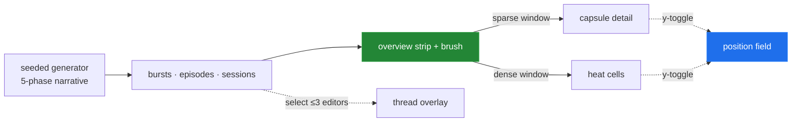

# UI Prototype Gallery — Six Timeline Alternatives Over One Synthetic Large Document

> [!TIP]
> **TL;DR** — Built, not argued: [prototypes/0008/index.html](prototypes/0008/index.html) is a
> self-contained page rendering **one seeded synthetic dataset** — a 48-paragraph spec, 6
> editors, ~1,200 bursts across 21 sessions and 18 days, with scripted drafting / expansion /
> reorg / edit-war / polish phases — through <mark>six alternative UIs</mark>: episode
> capsules, overview + brush, heat cells, author threads, a continuous position field, and
> ownership bands. Building them settles several 0006 arguments empirically: the capsule +
> spine geometry does fix disjointedness; the heat-cell grid is the most instantly legible
> view of the whole history; the brush makes scale a non-problem; threads spaghetti exactly
> where predicted; and the position field is so good it challenges section rows as the
> default y-axis. Recommended composite: **B's chrome (overview + brush) with A as the detail
> tier, C as the zoomed-out tier, E as a "field" toggle** — which is exploration 0006's plan,
> now with pixels behind it.

## Problem Statement

Explorations 0006 (visual grammar, LOD ladder) and 0007 (data model) argued in prose. The ask
here: *show* the alternatives. Make a page of prototypes — not production code — that
demonstrates what we could build for a reasonably large document with many edits and editors,
starting from a stubbed dataset shaped like our real data model, then designing UIs against
it.

## Executive Summary

- **The dataset is the exploration's real fixture.** A seeded generator scripts five
  realistic phases over 18 days (drafting top-down, two-editor expansion, a whole-document
  reorg, a two-editor edit war on ¶20–24, a copy-edit sweep). Every view renders the same
  data, so differences between views are differences between *designs*, not datasets.
- **Six views, one page, zero dependencies** — plain SVG in vanilla JS, tabbed, each with a
  one-line thesis and a one-line caveat. Two are interactive where it matters (brush drag;
  hover tooltips everywhere).
- **Building beats arguing.** Several 0006 claims were confirmed or sharpened within an hour
  of having pixels; the sharpest surprise is how well the *continuous position field* (option
  E, Draftback's mapping) reads — it may deserve promotion from "long-run deepest cut" to a
  first-class toggle.

## Current State In The Repository

| Piece | Status | Bearing |
| --- | --- | --- |
| Shipped map: organic terrain over section rows ([EditMap.tsx](../../src/components/EditMap.tsx), [terrain.ts](../../src/components/terrain.ts)) | ✅ | The baseline these alternatives compete with (screenshot in 0006) |
| Redesign plan: spines, y-compression, brush + LOD ([0006](0006_%5B_%5D_SCALE_ADAPTIVE_EDIT_NARRATIVE.md)) | 📄 | The hypotheses this gallery tests visually |
| Data model: bursts → placements → episodes → sessions ([0007](0007_%5B_%5D_EDIT_HISTORY_DATA_MODEL.md)) | 📄 | The synthetic dataset mirrors these shapes (bursts with paragraph placements; folded episodes; 60-min display sessions per 0007 finding 7) |
| Real pipeline pieces the stub imitates | ✅ | [episodes.ts](../../src/contributions/episodes.ts) (fold), [sessions.ts](../../src/contributions/sessions.ts) (gap-compressed axis), [sections.ts](../../src/contributions/sections.ts) (row partition) |
| **This gallery** | 🆕 | [docs/explorations/prototypes/0008/index.html](prototypes/0008/index.html) — open directly in a browser |

> [!NOTE]
> The synthetic shapes deliberately match the client's real ones (`ContributionEvent` +
> placement paragraphs + folded episodes), so any view promoted from this gallery ports onto
> the live pipeline without data-model work. Deviations are noted per view (e.g. ownership is
> insert-only).

## External Research

Covered by 0006 (visualization prior art: History Flow, Draftback, Chromogram, horizon
charts, semantic zoom, session science) and 0007 (data-model prior art). This document adds
pixels, not citations; the per-view theses below name their sources.

## Key Findings

Findings from *building* — each was checked against the rendered page:

1. **Capsules + spines do fix disjointedness (A).** One rounded capsule per episode spanning
   its touched sections, with burst dots as internal texture, makes "one act of editing" read
   as one shape even when it crosses three sections. The 0006 P1 bet holds up in pixels.
2. **The heat-cell grid is the fastest read of the whole history (C).** Ada's drafting
   diagonal, Tom's full-column reorg, the split-diagonal war cells, and Yuki's sweep column
   are each identifiable in under a second, with 8 × 21 = 168 cells for ~1,200 bursts. The
   "boring binned view scales" lesson from the git-tools survey (0006) is visibly true.
3. **The brush dissolves the scale question (B).** 21 sessions compress into one always-fit
   strip (height = volume, colors = editor share); brushing 3–4 sessions gives the capsule
   view exactly the density it renders best at. Nothing about a 10× longer history changes
   the design — only the strip's per-block width.
4. **Author threads are a narrative overlay, not a default (D).** Ada's drafting thread and
   Yuki's sweep are gorgeous; Tom's reorg session turns its thread into noise, and six
   concurrent threads would be spaghetti — exactly the failure mode 0006 predicted. Overlay
   toggle, shown for ≤ 3 selected editors at a time.
5. **The continuous position field over-performs (E).** With y as raw paragraph position and
   one dot per burst, the document's "fingerprint" (Draftback's term) is the most honest and
   the most beautiful view on the page: drafting diagonals, the war knot, the polish stroke.
   Its cost is exactly one thing: no labeled row gutter. That is solvable (hover labels,
   section tint bands) — so this should be a first-class *mode*, not a someday footnote.
6. **Ownership bands need real attribution to be honest (F).** The insert-only approximation
   already *looks* like History Flow (the doc visibly grows; colors interleave), but without
   deletions and survivorship it flatters early writers — Ada owns too much at the end. Good
   enough to sell the concept; wrong enough to confirm 0007's call that the real version
   waits on per-character attribution (y/hub's ContentMaps).
7. **The 60-minute session boundary works.** Scripted micro-pauses inside work blocks never
   fragment the display sessions, and the 21 resulting sessions match the scripted narrative
   1:1 — empirical support for 0007's "two-level scheme" open question (5-min sub-sessions
   inside ~1-h sessions).

## Options And Tradeoffs

The gallery *is* the options table — each tab carries its thesis and caveat. Summarized:

| View | Whole-history legibility | Detail fidelity | Scales | Best role |
| --- | --- | --- | --- | --- |
| A · Capsules + spines | 🚧 needs brushing | ✅✅ | 🚧 window-bounded | **Detail tier** |
| B · Overview + brush | ✅ (strip) | via A | ✅✅ | **Chrome / structure** |
| C · Heat cells | ✅✅ | ❌ within-session order lost | ✅✅ | **Zoomed-out tier** |
| D · Author threads | ✅ for ≤3 editors | 🚧 | ❌ many editors | Overlay toggle |
| E · Position field | ✅ | ✅ (per-burst) | ✅ dot-density-bounded | **Alternate y-mode** |
| F · Ownership bands | ✅ concept | ❌ insert-only stub | 🚧 columns × sections | Long-run (post-0007 A′) |

## Recommendation

1. **Adopt the composite already implied by 0006, now demonstrated:** B's overview + brush as
   the permanent chrome; A as the brushed-window detail view; C as the representation the
   detail view *becomes* when the window is too dense (the LOD ladder's top tier). This
   gallery is the visual spec for 0006's P3.
2. **Promote E.** Add "field mode" (continuous position y) as a peer of section rows in the
   0006 plan rather than a long-run footnote — a y-axis toggle, sharing the same time axis,
   brush, and colors. Building it here cost ~40 lines; the live version needs only per-burst
   paragraph *indices*, which placements already imply.
3. **Demote D to a filtered overlay** (select ≤ 3 editors), **park F** until 0007's A′ spike
   lands real attribution.
4. **Reuse the dataset generator as a test fixture.** Port the seeded generator into
   `src/` test utilities so map geometry changes can be verified against the same scripted
   narrative the prototypes render (the "does the edit war read?" test becomes automatable).



## Example Code

The gallery is the example code —
[prototypes/0008/index.html](prototypes/0008/index.html), self-contained (open in any
browser; no build, no network). Structure:

```text
index.html
├─ dataset: mulberry32(seed) · 8 sections/48 ¶ · 6 editors
│  · SPECS: 22 scripted session blocks (drift/random/war/sweep styles)
│  · foldEpisodes (12-min gap + ¶-adjacency)  · displaySessions (60-min gap)
├─ shared: elasticLayout (√active-minutes widths, labeled gap pills)
│  · sectionBands (activity-elastic row heights)
└─ views: renderCapsules · renderBrush · renderHeat
   · renderThreads · renderField · renderOwnership   (~80–120 lines each)
```

## Risks And Open Questions

| # | Risk | Impact | Mitigation |
| --- | --- | --- | --- |
| R1 | Synthetic data flatters designs (cleanly scripted phases; real rooms are messier) | Overconfident picks | Replay a *real* room's polled data through the same renderers before committing to the composite (the shapes match by construction) |
| R2 | Prototype conclusions read as shipped decisions | Scope creep | The page banner says "none of these are production code"; this doc's checklist routes promotions through 0006's phases |
| R3 | Field mode (E) at 10× density becomes an unreadable smear | Legibility | Density-aware dot sizing or hexbin fallback — same LOD principle as the ladder |

- [ ] Should field mode's y be paragraph *index* (stable, jumps on insert) or cumulative
      *character position* (proportional, drifts)? Prototype used index; the live answer
      affects how "the same paragraph" reads across time.
- [ ] Does the heat-cell tier want session columns (as built) or calendar-day columns for
      histories spanning months? Likely span-dependent, per the GitHub-calendar binning rule.

## Implementation Checklist

**Status:** `██░░░░░░░░ 2/8 items`

- [x] Synthetic dataset generator (seeded, 5-phase narrative, repo-shaped)
- [x] Gallery page with six views + tabs + brush interaction
      ([prototypes/0008/index.html](prototypes/0008/index.html))
- [ ] Replay a real room's data through the gallery renderers (R1)
- [ ] Port the generator to a shared test fixture (`src/` test utils)
- [ ] Promote the composite (B + A + C) into the 0006 P3 implementation
- [ ] Implement field mode (E) as a y-axis toggle in the live map
- [ ] Thread overlay (D) behind an editor-filter control (≤ 3)
- [ ] Revisit F after 0007's A′ spike delivers real attribution

## Validation Checklist

- [x] **V1** All six tabs render without console errors; tooltips work; brush drag re-renders
      the detail window (verified in-browser, 2026-08-13)
- [x] **V2** The scripted narrative is recoverable from each view by inspection: drafting
      diagonal, reorg column, war cells, polish sweep all identifiable in A, C, and E
- [ ] **V3** A real room replayed through the renderers still yields readable views (R1)
- [ ] **V4** The generator-as-fixture asserts episode/session counts deterministically in
      `pnpm test`
- [ ] **V5** Composite implementation matches the gallery's B+A+C behavior on the same data

## References

- [prototypes/0008/index.html](prototypes/0008/index.html) — the gallery (this exploration's
  artifact)
- [0006 — Scale-Adaptive Edit Narrative](0006_%5B_%5D_SCALE_ADAPTIVE_EDIT_NARRATIVE.md) — the
  design grammar and LOD ladder these prototypes test; carries the external prior-art survey
  (History Flow, Draftback, Chromogram, horizon charts, semantic zoom)
- [0007 — Edit-History Data Model](0007_%5B_%5D_EDIT_HISTORY_DATA_MODEL.md) — the data shapes
  the dataset stubs; the attribution dependency that parks view F
- [0005 — Organic Edit Terrain](0005_%5Bx%5D_ORGANIC_EDIT_TERRAIN.md) — the shipped baseline
  these alternatives compete with
