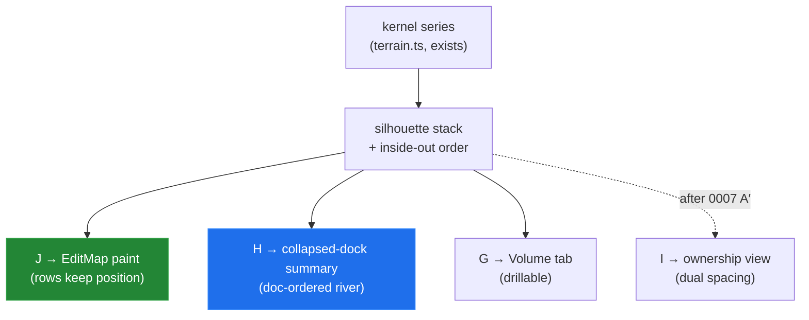

# Organic Stream Prototypes — Streamgraph And History-Flow Variants In The Gallery

> [!TIP]
> **TL;DR** — The 0008 gallery grows four organic stream views (tabs G–J of
> [prototypes/0008/index.html](prototypes/0008/index.html)), built on one shared kernel→
> silhouette-stack→Catmull-Rom pipeline: **G** a drillable editor streamgraph (Google Music
> Timeline's genres→artists interaction becomes editors→sections), **H** a doc-ordered
> "section river" whose layers are tinted by whoever dominated them over time, **I** view F's
> ownership columns rebuilt as smooth flowing bands with <mark>History Flow's two spacing
> modes as a live toggle</mark>, and **J** "section streamlets" — a symmetric mini-river per
> section row, the closest calm drop-in replacement for the shipped terrain's paint. Verdicts
> from building: J is the strongest candidate to replace the EditMap paint; H is the best
> single-picture summary of where/when/who; G belongs to the Volume tab; and I's toggle
> demonstrates in one click why the axis question (0006) has no single right answer.

## Problem Statement

0008's six alternatives lean structural (capsules, cells, brush). The reference points for
this round are the *organic* lineage — [History Flow](http://hint.fm/projects/historyflow/)'s
flowing author bands and the [Google Music Timeline](https://flowingdata.com/2014/01/17/music-timeline-of-plays-and-history/)'s
stacked genre stream — and the ask is to extend the existing prototype page with stream/area
variants rather than start a new artifact.

## Executive Summary

- **One stream engine, four views.** A shared ~90-line addition to the gallery: raised-cosine
  kernel deposition over the elastic session axis (gaps zeroed), Byron–Wattenberg silhouette
  baseline + inside-out ordering, closed Catmull-Rom band paths, and widest-point label
  placement. Each view is then a projection choice, not a new renderer.
- **The four variants split by what y means:** volume (G), document order as stack order
  (H), owned characters (I), and space-with-organic-paint (J). That axis-meaning split — not
  aesthetics — is what decides where each belongs in the product.
- **Interactions are the homages.** G drills a layer into its per-section decomposition
  (Music Timeline's signature move); I toggles equal-per-session vs time-proportional
  spacing (History Flow's signature lesson).

## Current State In The Repository

| Piece | Status | Bearing |
| --- | --- | --- |
| Gallery A–F ([prototypes/0008/index.html](prototypes/0008/index.html), [0008](0008_%5B_%5D_UI_PROTOTYPE_GALLERY.md)) | ✅ merged (PR #6) | The artifact this extends; same seeded dataset, tabs G–J appended |
| Shipped terrain paint ([terrain.ts](../../src/components/terrain.ts), [EditMap.tsx](../../src/components/EditMap.tsx)) | ✅ | J is its direct organic competitor: stacked symmetric streamlets vs overlapping multiply-blended lobes |
| Volume tab ([ContributionChart.tsx](../../src/components/ContributionChart.tsx), Recharts stacked areas) | ✅ | G is its successor concept (0005 already predicted "the natural Volume-tab successor" was a streamgraph) |
| Ownership view F (insert-only stub) | ✅ in gallery | I reuses its cumulative model, upgrades geometry, adds the spacing toggle |
| Header link to the gallery ([ShareBar.tsx](../../src/components/ShareBar.tsx), `scripts/copy-prototypes.mjs`) | ✅ merged | G–J ship to Pages automatically on the next deploy |

## External Research

Primary-source pass over the two references plus the underlying algorithms (paper PDFs and
d3-shape source read directly; archive.org was rate-limited, so one History Flow detail
rests on a secondary source, noted below).

### Google Music Timeline (2014, discontinued)

Built by Google Research's Big Picture group — Viégas & Wattenberg's team, the History Flow
authors ([announcement](https://research.google/blog/explore-the-history-of-pop-and-punk-jazz-and-folk-with-the-music-timeline/) ·
[FlowingData](https://flowingdata.com/2014/01/17/music-timeline-of-plays-and-history/) ·
[Andy Kirk's review](https://visualisingdata.com/2014/01/google-research-releases-the-music-timeline/) ·
[working snapshot](http://web.archive.org/web/20160101125614/http://research.google.com/bigpicture/music/)).
Verified from the announcement's screenshots:

- The **overview is a normalized (100%) stacked area** — flat top and bottom, share-of-
  libraries — *not* a centered streamgraph; smooth wavy interior boundaries and a pastel
  hue-family-per-genre palette do the "organic" work. The **drill-in view is the
  silhouette-style one**: click a genre and it re-renders mirrored around a centered
  baseline, subgenres stacked, selection highlighted, siblings muted, with breadcrumbs.
  Tab G's drill borrows this interaction (genres → artists becomes editors → sections).
- **Labels live inside the bands** at their thickest point, font-sized to thickness — plus a
  detail worth stealing someday: a **faint tiled watermark of the name repeated along the
  whole band**, so identity survives anywhere along the stream, not just at the widest point.
- Leader lines connect the stream to a row of album covers below — the "stream as index into
  artifacts" pattern that an edit timeline would echo as burst → document-diff links.

### History Flow — construction details

From the [CHI 2004 paper](https://www.pensivepuffin.com/dwmcphd/syllabi/info447_wi12/readings/wk05-ConflictInCollaborations/viegas.CooperationAndConflict.CHI04.pdf)
and [hint.fm/projects/historyflow](http://hint.fm/projects/historyflow/):

- Each version is a vertical **revision line**, length ∝ text length, segmented and colored
  by *original author of the surviving text*; **shaded connections** join corresponding
  segments on adjacent lines, and text with no correspondence simply isn't connected — the
  resulting **gap is the deletion/insertion signal**. View I's curved bands are this
  construction with Catmull-Rom interpolation.
- The **"space by date"** mode is described exactly as our toggle demonstrates:
  time-proportional spacing "de-emphasizes revisions that come in rapid succession and… can
  be quite revealing of the rhythms of collaboration."
- Diff granularity was the *sentence* (period/HTML-tag delimited) — coarser than our
  block-level placements; their crosshair-synced text panel is the overview↔detail link
  History Mode already gives us via `tOf` clicks.
- Beyond hue-per-author, an **age view** rendered text white (new) → dark gray (old) —
  independent support for 0006's recency-tint idea. (Color-mode list rests on a
  [secondary source](https://medium.com/the-data-experience/a-visualisation-example-histroy-flow-cb87627013e1);
  the primary IBM page is only in rate-limited archives.)

### Streamgraph algorithms, verified against paper + d3 source

From [Byron & Wattenberg 2008](https://leebyron.com/streamgraph/stackedgraphs_byron_wattenberg.pdf)
and [d3-shape](https://d3js.org/d3-shape/stack):

- **Silhouette** ($g_0 = -\tfrac{1}{2}\sum f_i$, ThemeRiver's baseline) is not just
  symmetric — the paper proves it minimizes the sum of squared silhouette deviations. The
  gallery uses this. The fancier **weighted wiggle** (`stackOffsetWiggle`) integrates
  baseline slope weighted by layer thickness; worth adopting only if the live J looks
  restless.
- **Inside-out ordering**: the paper's rationale is that naive onset-sorting creates "a
  distracting downward diagonal stripe pattern"; the fix places early-onset series mid-
  stream, later ones at the edges. d3's `stackOrderInsideOut` actually uses each series'
  **peak index** as the onset proxy and balances accumulated weight top vs bottom — a
  refinement over the gallery's simple alternate-sides version, worth porting if J ships.
- **Label placement**: Listening History brute-forced the largest in-layer font offline; the
  NYT interactive fell back to roll-over labels because that was too slow live.
  [d3-area-label](https://github.com/curran/d3-area-label) is the modern reference
  (bisection search for the largest rectangle between the layer's curves). The gallery's
  widest-point heuristic is the cheap version of the same idea.
- **Color practice**: both canonical streamgraphs encode *total volume* in
  darkness/saturation and *onset date* in hue. We cannot spend hue (it's authors', per
  0006's grammar) — which is exactly why H moves the who-channel into per-layer gradients.

### Adjacent prior art

- **NYT "Ebb & Flow of Movies"** (2008, Bloch/Byron/Carter/Cox;
  [archived interactive](https://archive.nytimes.com/www.nytimes.com/interactive/2008/02/23/movies/20080223_REVENUE_GRAPHIC.html))
  — the collected public confusion ("the vertical scale is basically irrelevant") is the
  standing caveat on any pure-volume stream, i.e. on G.
- **Last.fm Listening History** (Byron 2006, [project page](https://leebyron.com/streamgraph/))
  — the explicit design goal was a graphic that "felt organic and emotionally pleasing," and
  users read life events off its shape. The strongest precedent that an edit history can
  read as memoir, which is what the organic ask is really about.
- **Flow Circle** ([SIGGRAPH poster](https://history.siggraph.org/learning/flow-circle-circular-visualization-of-wiki-revision-history-by-lee-kim-park-and-lee/))
  and an [open History Flow reimplementation](https://iphylo.blogspot.com/2009/09/visualising-edit-history-of-wikipedia.html)
  — the flow idiom applied to wiki history beyond IBM's original.

## Key Findings

Findings from building and looking, on the same scripted dataset as 0008:

1. **Silhouette + inside-out is the entire "organic" trick.** With the kernel series already
   in hand (the shipped terrain computes the same shape), the difference between "spreadsheet
   area chart" and "river" is just baseline $g_0 = -\tfrac{1}{2}\sum f_i$ and onset-ordered
   layering — ~30 lines. The organic look is cheap; the design question is only ever what y
   means.
2. **J (section streamlets) beats the shipped paint on its own terms.** Same rows, same
   axis, same data as the terrain — but overlapping authors *stack* into one symmetric lens
   instead of multiply-blending into mud, and each row's river reads as one object rather
   than N overlapping lobes. It inherits 0006's coherence goal without the spine machinery.
   The cost: within a row, an author's *position* inside the stack is meaningless (stack
   order artifact) — tooltips/hover must carry identity, exactly as today.
3. **H (section river) is the best "one glance" summary so far.** Doc-ordered layers keep
   position meaning on the stack order; the per-session dominant-editor gradient answers
   "who" without a second encoding channel. It compresses A + C's stories into one picture —
   at the price of exact per-editor magnitudes (gradient shows the *leader*, not the mix).
   Deliberate choice: stack order = document order, *not* wiggle-minimized — aesthetics lose
   to meaning when layers are ordinal.
4. **G confirms 0005's prediction: the streamgraph is a Volume view.** As soon as y is pure
   volume, position vanishes and the map's core question ("where?") is unanswerable. But the
   Music-Timeline drill (click Ada → her stream splits into per-section shades) restores a
   *local* where — the drill interaction is worth keeping even in a Recharts-replacement
   Volume tab.
5. **I's spacing toggle settles the axis argument by demonstration.** Per-session spacing
   makes the ¶20–24 edit war a visible ripple across two adjacent columns; time-proportional
   spacing compresses the war into a sliver while making the quiet weekend gap enormous.
   History Flow shipped both modes twenty years ago for exactly this reason — and the toggle
   costs one boolean, which is the strongest argument that the live map's overview strip
   (0006 P3) should eventually offer both.
6. **Labels inside layers work at exactly one condition: thickness.** The widest-point
   placement (Music Timeline / NYT box-office style) lands every editor label in G and every
   section label in H on this dataset, but only because layers get ≥15px thick somewhere.
   The live map cannot rely on that — labels need the gutter fallback J keeps.

## Options And Tradeoffs

| View | y means | Where it belongs | Strengths | Costs |
| --- | --- | --- | --- | --- |
| **G · Editor streamgraph** | volume | Volume tab successor | Organic, drillable, label-in-layer | No document position |
| **H · Section river** | stack order = doc order | Candidate default "summary" view | where+when+who in one glance | Leader-only color; magnitudes approximate |
| **I · Smoothed history flow** | owned chars | Long-run ownership view (post-0007 A′) | Survivorship story; spacing lesson live | Insert-only stub; needs real attribution |
| **J · Section streamlets** | document space (rows) | **EditMap paint replacement** | Terrain's look, stacked legibility, zero new data | In-row stack order is artifact |

## Recommendation

1. **Promote J into the live map** as the terrain's successor paint: same
   `sampleIntensity` machinery ([terrain.ts](../../src/components/terrain.ts)) feeding a
   silhouette stack per (section × contributor) instead of overlapping lobes. This slots into
   0006 P1 as an alternative to (or simplification of) the spine work — prototype both
   against a real room before choosing.
2. **Adopt H as the collapsed/summary state.** When the dock is short (collapsed mode or
   narrow windows), one doc-ordered river with dominant-editor gradients says more per pixel
   than any row layout. Natural pairing: H when dock < ~120px tall, J when taller.
3. **Rebuild the Volume tab as G** (drops the Recharts dependency path for this chart,
   gains the drill) — low priority, clearly scoped.
4. **Keep I parked with F** until 0007's A′ spike delivers real per-character attribution,
   but carry its spacing toggle forward into the overview-strip design (0006 open question,
   now answered by demo: offer both).



## Example Code

The gallery additions are the example code — tabs G–J in
[prototypes/0008/index.html](prototypes/0008/index.html). The shared engine, in outline:

```js
// deposit: bursts → Float32Array over the elastic axis (gaps zeroed)
kernelSeries(bursts, layout)            // raised-cosine, same shape as terrain.ts
// stack: Byron–Wattenberg
insideOut(seriesList)                   // onset-sorted, alternating sides
stackSilhouette(seriesList, order)      // baseline −Σ/2 → {y0[], y1[]}
// paint: closed organic band + label anchor
bandPath(xs, y0, y1, yMap)              // Catmull-Rom top + reversed bottom
widestPoint(y0, y1, minPx, yMap)        // Music-Timeline label placement
```

Porting J to the live map touches only the paint layer of
[EditMap.tsx](../../src/components/EditMap.tsx): per section row, replace the per-contributor
`terrainPath` overlap with `stackSilhouette` over the existing per-contributor
`sampleIntensity` outputs, centered on the row midline.

## Risks And Open Questions

| # | Risk | Impact | Mitigation |
| --- | --- | --- | --- |
| R1 | J's stacked rendering hides *which* author is where inside a lens (stack order artifact) | Misread | Hover promotes the author's slice (raise + outline), tooltip unchanged; try onset order = narrative order |
| R2 | H's dominant-editor gradient erases minority contributors entirely | Fairness of the picture | Blend top-two stops when share ≥30% (as heat cells do), or diagonal-split gradient stops |
| R3 | Silhouette baseline needs vertical headroom; short docks squash streams into ribbons | Legibility | That is H's role (one river) — J only renders when rows ≥ ~28px, per the horizon-chart row-height findings (0006) |
| R4 | Smoothing across session boundaries can imply activity where there is none | Honesty | Kernels already zero inside gaps; keep seam pills above the streams (as built) |

- [ ] Should J's per-row stack order be inside-out (calmest) or first-onset (most
      narrative)? Prototype both against a real room.
- [ ] Does H replace the collapsed dock's current content, or become a third tab? Depends on
      how 0006 P3's tier ladder lands.
- [ ] Music-Timeline-style in-layer labels for the live map: worth it only if the dock ever
      gets tall enough for ≥15px layers — measure real usage first. (Their tiled-watermark
      fallback and d3-area-label's bisection fit are the two upgrade paths.)
- [ ] Should H (or a G variant) offer a **normalized 100% mode** — Music Timeline's actual
      overview geometry? Share-of-activity reads differently from absolute volume and may
      suit the collapsed dock better; one boolean in the stack scale.

## Implementation Checklist

**Status:** `██░░░░░░░░ 2/8 items`

- [x] Stream engine (kernel deposit, silhouette stack, inside-out order, band paths,
      widest-point labels) added to the gallery
- [x] Tabs G–J with drill-down (G) and dual-spacing toggle (I); header copy updated to ten
      views
- [ ] Replay a real room through G–J (shares 0008's R1 checklist item)
- [ ] Prototype J as an `EditMap` paint mode behind a constant, on the live pipeline
- [ ] A/B J's stack order (inside-out vs onset) on a real multi-author room
- [ ] H as the collapsed-dock rendering, gated on measured dock height
- [ ] Volume tab rebuild as G (drop Recharts for this chart; keep brush + summary)
- [ ] Carry I's spacing toggle into the 0006 P3 overview-strip design

## Validation Checklist

- [x] **V1** All four new tabs render on the shared dataset with zero console errors;
      G's drill-in/out and I's spacing toggle verified working in-browser (2026-08-13)
- [x] **V2** Layer labels land on every editor (G) and every section (H) at their widest
      points; streams collapse to zero inside idle-gap seams (no smoothing bleed)
- [x] **V3** The scripted narrative reads in the new views: war ripple visible in I
      (per-session spacing), Yuki's sweep as a full-width thin band in H and J
- [ ] **V4** A real room replayed through G–J still reads (shared with 0008 V3)
- [ ] **V5** Live-map J prototype: two overlapping authors on one section produce a stacked
      lens, tooltips intact, `pnpm test` green

## References

**This repository**
- [prototypes/0008/index.html](prototypes/0008/index.html) — tabs G–J (this exploration's
  artifact, extending 0008's)
- [0008 — UI Prototype Gallery](0008_%5B_%5D_UI_PROTOTYPE_GALLERY.md) — dataset + views A–F ·
  [0006 — Scale-Adaptive Edit Narrative](0006_%5B_%5D_SCALE_ADAPTIVE_EDIT_NARRATIVE.md) —
  the grammar these variants bend (y-meaning per channel) ·
  [0005 — Organic Edit Terrain](0005_%5Bx%5D_ORGANIC_EDIT_TERRAIN.md) — predicted the
  streamgraph as Volume successor ·
  [0007 — Edit-History Data Model](0007_%5B_%5D_EDIT_HISTORY_DATA_MODEL.md) — the
  attribution dependency gating I
- [terrain.ts](../../src/components/terrain.ts) · [EditMap.tsx](../../src/components/EditMap.tsx)
  · [ContributionChart.tsx](../../src/components/ContributionChart.tsx)

**External**

- [Google Music Timeline announcement](https://research.google/blog/explore-the-history-of-pop-and-punk-jazz-and-folk-with-the-music-timeline/)
  · [FlowingData post](https://flowingdata.com/2014/01/17/music-timeline-of-plays-and-history/)
  · [Andy Kirk review](https://visualisingdata.com/2014/01/google-research-releases-the-music-timeline/)
  · [archived interactive](http://web.archive.org/web/20160101125614/http://research.google.com/bigpicture/music/)
  — normalized overview, silhouette drill-in, in-band + watermark labels
- [History Flow project](http://hint.fm/projects/historyflow/) ·
  [Viégas & Wattenberg, CHI 2004 (PDF)](https://www.pensivepuffin.com/dwmcphd/syllabi/info447_wi12/readings/wk05-ConflictInCollaborations/viegas.CooperationAndConflict.CHI04.pdf)
  — revision lines, shaded connections, gaps as deletions, "space by date", age view
- [Byron & Wattenberg — Stacked Graphs: Geometry & Aesthetics (PDF)](https://leebyron.com/streamgraph/stackedgraphs_byron_wattenberg.pdf)
  · [d3-shape stack docs](https://d3js.org/d3-shape/stack) — silhouette optimality, weighted
  wiggle, inside-out ordering (d3's peak-index variant), label-placement practice
- [d3-area-label](https://github.com/curran/d3-area-label) — bisection largest-label fit
  inside a stream layer
- [NYT — The Ebb & Flow of Movies (2008, archived)](https://archive.nytimes.com/www.nytimes.com/interactive/2008/02/23/movies/20080223_REVENUE_GRAPHIC.html)
  — the "vertical scale is basically irrelevant" caveat on pure-volume streams
- [Last.fm Listening History (Byron, 2006)](https://leebyron.com/streamgraph/) — the
  organic-as-memoir precedent
- [Flow Circle (SIGGRAPH poster)](https://history.siggraph.org/learning/flow-circle-circular-visualization-of-wiki-revision-history-by-lee-kim-park-and-lee/)
  · [iPhylo History Flow reimplementation](https://iphylo.blogspot.com/2009/09/visualising-edit-history-of-wikipedia.html)
