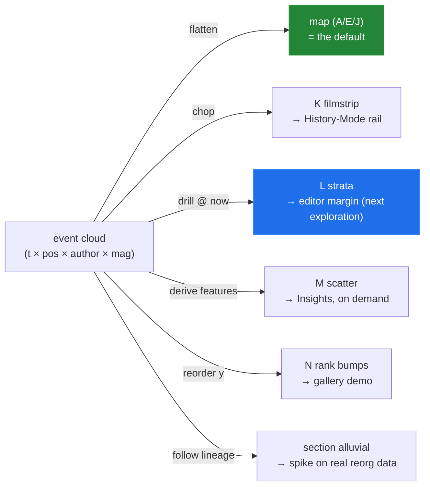

# Beyond Time × Position — Axis Alternatives And Unexplored Modalities

> [!TIP]
> **TL;DR** — The axis question has a principled answer. Our data is a 3D+ event cloud —
> (time × document position × author × magnitude) — and by the generalized space-time-cube
> framework (Bach et al. 2016), every possible chart is an <mark>operation on that cube</mark>:
> flatten it and you get the map; drill it at *now* and you get blame; chop it and you get a
> filmstrip; collapse time into derived features and you get a triage scatter. **Time ×
> position stays the right default for the map** — it is the only projection that preserves
> both continuous dimensions — but the alternatives aren't worse maps, they're answers to
> *different questions*. Four are now prototyped as gallery tabs K–N
> ([prototypes/0008/index.html](prototypes/0008/index.html)): **K** filmstrip (a document
> minimap per session), **L** document strata (blame + age + churn, no time axis — the view
> whose real home is the *editor margin*), **M** stability scatter (paragraphs in
> recency × churn space, CodeScene-style), **N** section rank bumps. The biggest unexplored
> prize isn't a chart at all: it is projecting history onto the document itself.

## Problem Statement

Every view so far (0004–0009) keeps x = time and y = document position (or collapses y into
volume). Are there *better* choices for those axes? And if the current axes are right, which
visualization modalities have we not explored at all?

## Executive Summary

- **A systematic answer, not a vibe.** Enumerate what each axis *could* encode, classify
  every candidate as a cube operation, and judge it by the question it answers. Conclusion:
  time × position is the only general-purpose projection; six other projections earn a place
  as question-specific companions, four of which are now built.
- **The strongest new idea inverts the frame entirely**: instead of drawing history in a
  panel *about* the document, draw history *on* the document — owner-tinted, age-faded
  paragraph strata (tab L), whose production form is editor-margin affordances in the
  Google-Docs/Etherpad/GitLens lineage.
- **One genuinely open research corner surfaced**: a section-to-section alluvial of content
  *movement* across reorganizations, powered by the split/merge lineage the data model
  already records — prior art exists for code (Code Flows) but no tool does it for documents.

---

## Current State In The Repository

| Piece | Status | Bearing |
| --- | --- | --- |
| Gallery A–J ([prototypes/0008/index.html](prototypes/0008/index.html)) | ✅ merged (PR #6, #7) | All keep x = time; y ∈ {position, volume, ownership} |
| **New tabs K–N** (this exploration) | 🆕 | Filmstrip · strata · scatter · rank bumps — the paradigm shifts, on the same seeded dataset |
| `paraStats` rollup (new, in the gallery) | 🆕 | Per-paragraph churn / owner / last-touch — the derived-feature layer K–M read from |
| Split/merge lineage ([episodes.ts](../../src/contributions/episodes.ts) `buildLineage`; `splitFromBlockId` in [burstDiff.ts](../../src/spotlight/burstDiff.ts)) | ✅ shipped, underused | The data for the content-movement alluvial nobody has built |
| Editor surface ([EditorPane.tsx](../../src/components/EditorPane.tsx), [HistoryPreview.tsx](../../src/components/HistoryPreview.tsx)) | ✅ | Where in-document overlays (L's destiny) would live |
| Attribution channel (0007: y/hub ContentMaps) | 📄 | Would upgrade L/M from churn-approximation to true blame |

## External Research

### The theory that settles the axis question

**Generalized space-time cubes** ([Bach, Dragicevic, Archambault, Hurter & Carpendale, CGF
2016](https://onlinelibrary.wiley.com/doi/abs/10.1111/cgf.12804) ·
[project page](https://aviz.fr/~bbach/spacetimecubes/) — 39 operations: drilling, cutting,
chopping, flattening, transforms): any dataset representable as 2D + time forms a conceptual
3D cube, and every 2D temporal visualization is an *operation* on it. The lineage runs from
[Hägerstrand's time-geography](https://onlinelibrary.wiley.com/doi/10.1002/9781118786352.wbieg0431)
through [Kraak's space-time cube revisited (ICC 2003)](https://icaci.org/files/documents/ICC_proceedings/ICC2003/Papers/255.pdf).
In this vocabulary our whole gallery becomes one table — see Key Finding 1.

### Age-on-artifact: what a timeline cannot say

- [git-of-theseus](https://github.com/erikbern/git-of-theseus) ·
  ["The half-life of code"](https://erikbern.com/2016/12/05/the-half-life-of-code.html) —
  cohort stack plots of surviving lines by year added, plus Kaplan-Meier survival curves
  (Linux code half-life ≈ 6.6 years; a fast-moving framework ≈ 0.32). The insight: *surviving
  content weighted by the artifact's own layout* answers "what is settled?" — a question
  timelines structurally cannot ask because they show dead text too.
- [GitLens](https://help.gitkraken.com/gitlens/gitlens-features/) (age-colored gutter
  heatmap, 90-day default threshold) and
  [IntelliJ annotate](https://www.jetbrains.com/help/idea/investigate-changes.html) (gutter
  colors toggle between **recency** and **author** — precisely the two encodings tab L
  fuses) put history in the *margin of the artifact* — the pattern L's production form
  follows, alongside Google Docs' per-editor highlights and Etherpad's authorship colors
  (both already surveyed in 0006).
- [CodeScene hotspots](https://docs.enterprise.codescene.io/versions/4.0.16/guides/technical/hotspots.html)
  (churn × complexity scatter) ·
  [code age](https://docs.enterprise.codescene.io/versions/4.3.18/guides/technical/code-age.html) ·
  [knowledge maps](https://docs.enterprise.codescene.io/versions/4.3.15/guides/social/knowledge-distribution.html)
  (file → main developer, feeding knowledge-loss analysis) — Tornhill's *Your Code as a
  Crime Scene* school: collapse time into derived features, then scatter the artifact's
  parts in that feature space. Tab M is this applied to prose; CodeScene's docs even flag
  "neither old nor new" as the risk zone, a nuance M's quadrants inherit. Their knowledge
  maps are also the precedent for an ownership/succession view when contributors leave.

### The rest of the field

- **Bump charts** encode *rank*, deliberately discarding magnitude
  ([Data Viz Project](https://datavizproject.com/data-type/bump-chart-2/) ·
  [when rank beats magnitude](https://www.flerlagetwins.com/2017/01/my-thoughts-on-bump-charts-and-when-to_45.html));
  the thick-ribbon **alluvial** hybrid restores it
  ([Wikipedia](https://en.wikipedia.org/wiki/Alluvial_diagram)). Tab N uses dot size for the
  magnitude that rank hides.
- **Rhythm views**: GitHub's punch card (day × hour) shipped in the
  [2012 graphs redesign](https://github.blog/2012-04-25-introducing-the-new-github-graphs/),
  was later removed from the UI, and survives only as the `/stats/punch_card` API — cite as
  historical precedent, and a hint that rhythm views are more charming than load-bearing.
- **Content movement across versions**: [Code Flows (Telea & Auber, EuroVis 2008)](https://onlinelibrary.wiley.com/doi/abs/10.1111/j.1467-8659.2008.01214.x)
  tracks code fragments across revisions as tube flows — drift, splits, merges. For
  documents, the History Flow / [DocuViz](https://dl.acm.org/doi/10.1145/2702123.2702517)
  family implies it, but **no off-the-shelf tool renders a section-to-section Sankey across
  a document reorganization** — open ground our lineage data could claim.
- **Margin revision maps in writing research**:
  [ArgRewrite's revision map](https://arxiv.org/pdf/2107.07018) tiles each *sentence*
  colored by revision category — the closest published analog to per-paragraph margin
  history, and evidence the idea works pedagogically.

## Key Findings

1. **Every view we have (or could build) is a named cube operation.** This is the answer to
   "can the axes be something else":

   | View | Cube operation (Bach et al.) | Question it answers |
   | --- | --- | --- |
   | A/E map, J streamlets | time-flattening + author-coloring | *the* general view: what happened where, when, by whom |
   | C heat cells | flatten + bin (aggregation) | same, at any scale |
   | G/H streams, F/I flow | space-flattening (position → volume/ownership) | how much / whose, over time |
   | **K filmstrip** | time-**chopping** | how did the document evolve, as scenes |
   | **L strata** | time-**drilling** at *now*, time → color | of what exists, what's settled vs fresh, whose is it |
   | **M scatter** | dimension replacement (time → derived features) | what needs attention |
   | **N rank bumps** | y-reordering (position → rank) | where is the energy going, relatively |

2. **Time × position survives the challenge.** Position is the only y that lets users
   navigate to what they see (click → paragraph), and time is the only x that makes the
   story causal. Every alternative either destroys navigation (volume, rank, features) or
   destroys narrative (drilling at now). So: keep it as the map's default — and stop
   relitigating it. The alternatives are *companions*, chosen per question, exactly as
   CodeScene pairs hotspots with its timelines.
3. **The document itself is the most underused canvas.** Tab L is deliberately axis-free:
   the current document, owner-tinted and age-faded, with a churn profile. Its dock version
   is informative; its *editor-margin* version (GitLens/Etherpad/ArgRewrite lineage) would be
   the single most end-user-intuitive history surface we could ship — no chart literacy
   required, history exactly where the user already looks. This deserves its own exploration
   and likely beats further dock work on product value.
4. **Feature-space triage needs one honesty rule.** M's recency axis ignores copy-edit-sized
   touches (< 40 chars), or Yuki's polish sweep would have reset every paragraph to "fresh"
   and blanked the quadrants — discovered live when the first render collapsed to one column.
   The general rule: derived axes must be robust to ceremonial edits, or they measure
   ceremony.
5. **The filmstrip is the cheapest "aha".** K is ~60 lines, needs no axis education, and the
   scripted narrative (drafting walk, all-pink reorg frame, two-color war frames) reads at a
   glance. As a History-Mode side rail (click a frame → jump to that session), it doubles as
   navigation — the same role Draftback's overview serves for playback.
6. **The lineage alluvial is our unclaimed novelty.** `splitFromBlockId` /
   `mergedIntoBlockId` already record content movement; nobody in the survey renders
   document-section Sankeys across reorgs. Prototype-worthy the moment a real room exercises
   splits and merges heavily — and a genuine differentiator, not a homage.

## Options And Tradeoffs

Beyond the built K–N, the remaining unexplored modalities, judged:

| Modality | Question | Verdict |
| --- | --- | --- |
| In-editor margin overlays (L's production form) | everything L answers, in situ | ✅ **Next exploration** — highest product value |
| Filmstrip as History-Mode navigation rail | which session do I want? | ✅ Fold into 0006 P3 chrome |
| Stability scatter panel (M) | triage / standup | 🚧 Ship as an "Insights" tab when asked for |
| Lineage alluvial (content movement) | what moved where in the reorg? | 🚧 Spike on real split/merge data |
| Editor × section knowledge matrix | who knows what (succession risk) | 🚧 With accounts/teams, not before |
| Rank bumps (N) | relative attention | ➖ Keep as gallery demo; magnitude-hiding limits it |
| Punchcard / calendar rhythm | when do we work? | 🛑 Charming, not load-bearing; GitHub removed theirs |
| Collaboration graph (editor–editor network) | social structure | 🛑 Six editors don't need force layouts |
| 3D space-time cube, spirals | novelty | 🛑 The cube is a *conceptual* frame; Bach et al. say so themselves |

## Recommendation

1. **Declare the axis question settled** (finding 2): time × position is the map; record
   this here so future explorations argue about *companions*, not the default.
2. **Spin off "history on the document"** as its own exploration: margin blame/age gutter +
   per-paragraph churn affordance in [EditorPane.tsx](../../src/components/EditorPane.tsx),
   using L as the visual spec and 0007's attribution work as the data upgrade path.
3. **Attach K to History Mode** (a filmstrip rail = clickable session navigation) inside
   0006 P3's chrome work rather than as a new surface.
4. **Hold M, N, and the lineage alluvial** as demand-driven: M when someone asks "what needs
   review?", the alluvial when a real room shows heavy restructuring.

## Example Code

Tabs K–N in [prototypes/0008/index.html](prototypes/0008/index.html). The shared derived
layer, `paraStats()`, is the piece that ports to production (per paragraph: total churn,
per-editor chars, owner, last touch, last *substantial* touch) — ~25 lines over the existing
placement data, and exactly the shape the margin-overlay exploration will need.

## Risks And Open Questions

| # | Risk | Impact | Mitigation |
| --- | --- | --- | --- |
| R1 | Companion-view sprawl: fourteen tabs is a gallery, not a product | Confusion | The recommendation names one default + demand-gated companions; the gallery stays a lab |
| R2 | L without real attribution shows *churn-weighted* owners, not true blame | Mild dishonesty | Label it "most active" until 0007 A′ lands ContentMaps; then it becomes blame |
| R3 | Margin overlays compete with SuperDoc's own rendering pipeline (worker-owned DOM) | Feasibility | The spin-off exploration must start with a feasibility probe of decoration APIs |

- [ ] Does the 40-char "substantial edit" threshold for M generalize, or should it be a
      percentile of the room's burst-size distribution?
- [ ] K's frames are per-session; for months-long rooms, per-day or per-week frames? (Same
      binning rule as the heat cells: derive from span.)
- [ ] Should L's age fade use last-touch (activity) or content age (survival, à la
      git-of-theseus)? They tell different stories; the margin exploration should mock both.

## Implementation Checklist

**Status:** `██░░░░░░░░ 2/7 items`

- [x] `paraStats` derived layer + tabs K–N in the gallery; header copy updated to fourteen
      views
- [x] M's recency clock made robust to copy-edit sweeps (< 40-char touches don't reset it)
- [ ] Spin off "history on the document" exploration (margin blame/age/churn in
      [EditorPane.tsx](../../src/components/EditorPane.tsx); L as visual spec; SuperDoc
      decoration-API feasibility probe first)
- [ ] Filmstrip rail wired into 0006 P3 chrome plan (click frame → History Mode at that
      session)
- [ ] Real-room replay through K–N (extends 0008/0009's shared item)
- [ ] Lineage-alluvial spike once a real room shows heavy split/merge activity
- [ ] Note the settled-axis decision in the README decision list when 0006 P1 ships

## Validation Checklist

- [x] **V1** All fourteen tabs render on the shared dataset, zero console errors
      (verified in dev, 2026-08-13); M spreads across its full recency range after the
      substantial-edit fix
- [x] **V2** The scripted narrative reads in the new views: drafting walk + reorg frame +
      war frames in K; Architecture's churn spike in L; war paragraphs as big multi-editor
      dots in M
- [ ] **V3** Real-room replay keeps K–N readable (shared with 0008 V3)
- [ ] **V4** The margin-overlay exploration exists and cites L as its spec

## References

**This repository**
- [prototypes/0008/index.html](prototypes/0008/index.html) — tabs K–N (this exploration's
  artifact) · [0008](0008_%5B_%5D_UI_PROTOTYPE_GALLERY.md) (dataset, A–F) ·
  [0009](0009_%5B_%5D_ORGANIC_STREAM_PROTOTYPES.md) (G–J) ·
  [0006](0006_%5B_%5D_SCALE_ADAPTIVE_EDIT_NARRATIVE.md) (the grammar; in-document overlay
  precedents) · [0007](0007_%5B_%5D_EDIT_HISTORY_DATA_MODEL.md) (attribution upgrade path)

**External**
- [Bach et al. — Generalized Space-Time Cubes (CGF 2016)](https://onlinelibrary.wiley.com/doi/abs/10.1111/cgf.12804)
  · [project page](https://aviz.fr/~bbach/spacetimecubes/) ·
  [Kraak 2003](https://icaci.org/files/documents/ICC_proceedings/ICC2003/Papers/255.pdf) ·
  [Hägerstrand overview](https://onlinelibrary.wiley.com/doi/10.1002/9781118786352.wbieg0431)
- [git-of-theseus](https://github.com/erikbern/git-of-theseus) ·
  [The half-life of code](https://erikbern.com/2016/12/05/the-half-life-of-code.html) ·
  [GitLens features](https://help.gitkraken.com/gitlens/gitlens-features/) ·
  [IntelliJ annotate](https://www.jetbrains.com/help/idea/investigate-changes.html)
- [CodeScene hotspots](https://docs.enterprise.codescene.io/versions/4.0.16/guides/technical/hotspots.html)
  · [code age](https://docs.enterprise.codescene.io/versions/4.3.18/guides/technical/code-age.html)
  · [knowledge distribution](https://docs.enterprise.codescene.io/versions/4.3.15/guides/social/knowledge-distribution.html)
- [Bump charts](https://datavizproject.com/data-type/bump-chart-2/) ·
  [rank vs magnitude](https://www.flerlagetwins.com/2017/01/my-thoughts-on-bump-charts-and-when-to_45.html)
  · [alluvial diagrams](https://en.wikipedia.org/wiki/Alluvial_diagram)
- [Code Flows — Telea & Auber, EuroVis 2008](https://onlinelibrary.wiley.com/doi/abs/10.1111/j.1467-8659.2008.01214.x)
  · [ArgRewrite revision map](https://arxiv.org/pdf/2107.07018) ·
  [GitHub 2012 graphs](https://github.blog/2012-04-25-introducing-the-new-github-graphs/)
