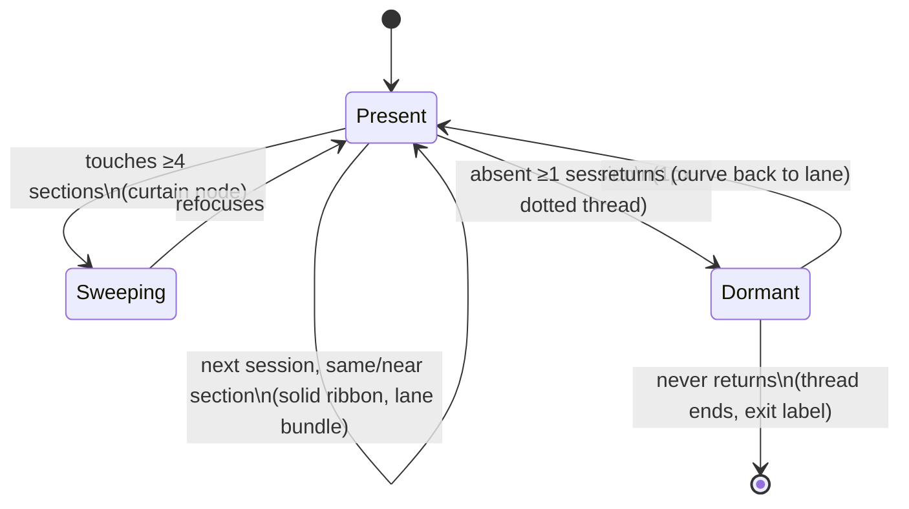

# Author Storylines Deep-Dive — Threads As A First-Class View

> [!TIP]
> **TL;DR** — Option D's weaknesses were all fixable, and the fixes are now built as gallery
> tab **O** ([prototypes/0008/index.html](prototypes/0008/index.html)): co-editing
> <mark>bundles</mark> into adjacent sub-lanes (the xkcd scene idiom, barycenter-sorted to
> damp crossings), whole-document passes render as translucent <mark>curtains</mark> instead
> of zigzag spaghetti, absence renders as thin dotted <mark>dormant threads</mark> (presence
> is never ambiguous), ribbon thickness carries volume, and hover-solo + editor chips manage
> clutter. Fixing the y-axis to document sections sidesteps the storyline literature's
> NP-hard layout problem entirely — what's left is a ~150-line renderer. Recommended path:
> ship storylines as a <mark>narrative lens</mark> on the same map surface (a paint mode over
> the capsule/streamlet base, sharing axis, brush, and colors), not a separate chart.

## Problem Statement

0008's option D (author threads) drew one polyline per editor through the sections they
edited and was scored "beautiful for ≤3 editors, spaghetti at the reorg — overlay, not
default." The user likes it most. Expand it: what does a serious storyline treatment look
like, what does the literature say, what are its real semantics and limits, and where does
it fit in the product?

## Executive Summary

- **Why threads feel right:** they are the only view whose marks are *people* rather than
  events. Continuity is identity — "follow Ada" is a primitive no other view offers. The
  narrative-chart lineage (xkcd 657 → storyline-layout research) exists precisely because
  entity-following is how humans read collaboration.
- **What was wrong with D was rendering, not concept.** Each failure mode maps to a known
  storyline technique: spaghetti → scene bundling + crossing minimization; reorg noise →
  a degenerate node type (the curtain); ambiguous absence → dormant-line semantics; equal
  thin lines → importance-weighted thickness.
- **Our problem is easier than the literature's.** General storyline layout must *choose* y
  for every entity group per time step (NP-hard; genetic algorithms and quadratic programs
  in the papers). Our y is pinned to document sections — only sub-lane order within a
  section is free, and a single barycenter pass handles it.
- **Product placement:** a lens, not a tab. Threads share every convention with the map
  (elastic session axis, section bands, author hues, brush) — so they should toggle on the
  same surface, with the capsule/streamlet paint dimming beneath them.

## Current State In The Repository

| Piece | Status | Bearing |
| --- | --- | --- |
| View D ([prototypes/0008/index.html](prototypes/0008/index.html), 0008) | ✅ merged | The naive baseline: one polyline per editor, no bundling, no dormancy, no interaction |
| **View O** (this exploration) | 🆕 | The deep-dive prototype: bundling, curtains, dormant threads, ribbons, solo, filters |
| Episode fold ([episodes.ts](../../src/contributions/episodes.ts)) | ✅ shipped | The live data unit a production thread node maps to (the prototype uses session × editor granularity) |
| Section bands ([sections.ts](../../src/contributions/sections.ts)) + elastic axis ([sessions.ts](../../src/contributions/sessions.ts)) | ✅ shipped | The fixed y and shared x that make the layout tractable |
| Hover/hit layer ([EditMap.tsx](../../src/components/EditMap.tsx)) | ✅ shipped | Where hover-solo and thread hit-testing would land in production |
| 0006 P3 plan (brush + LOD) | 📄 | The chrome a storyline lens inherits for free |

## External Research

Primary-source pass over the storyline literature (papers read in full where noted). Three
results shape the design; one confirms it occupies open ground.

### The lineage

- **[xkcd 657 "Movie Narrative Charts"](https://xkcd.com/657/)** (2009) — the origin both
  research threads cite. The encoding, stated in the comic itself: x = time, and "the
  vertical grouping of the lines indicate which characters are together at a given time" —
  <mark>y is co-presence grouping, not literal space</mark>. Lines converging = meeting;
  dashed lines before a character's first appearance = unknown prior location (a convention
  tab O echoes for dormancy). The *12 Angry Men* chart (twelve parallel lines that never
  separate) is the deadpan proof that bundling *is* the message.
- **[Tanahashi & Ma, InfoVis 2012](https://www.ncbi.nlm.nih.gov/pubmed/26357177)** — first
  formalization: legibility = minimize **crossings**, **wiggles**, and **wasted space**,
  optimized with a genetic algorithm. Cost: ~130–172 s on 8–14-character movie datasets.
- **[StoryFlow — Liu et al., InfoVis 2013](https://www.shixialiu.com/publications/storyflow/index.html)**
  ([PDF](https://www.shixialiu.com/publications/storyflow/paper.pdf), read in full) — the
  production-grade answer: split the layout into **ordering** (constrained multi-layer
  crossing minimization via barycenter sweeps over a session table + location tree),
  **alignment** (weighted longest-common-subsequence DP for straightness), and
  **compaction** (constrained quadratic programming for exact y) — 0.16 s where the GA took
  129.79 s, enabling real-time interaction. Their *location tree* is exactly our section
  hierarchy; their *sessions* are our co-editing bundles. Our prototype implements only the
  ordering stage (one barycenter pass) because fixing y to document sections **pins the
  alignment and compaction stages for free**.
- The algorithmic core is genuinely hard in general: crossing minimization is NP-hard
  ([Gronemann et al., GD 2016](https://arxiv.org/abs/1608.08027)) and wiggle-count
  minimization NP-complete ([Dobler et al. 2025](https://arxiv.org/abs/2508.19802)) — the
  formal defense of finding 1's "pin y, skip the solver" move. The defining constraint in
  this literature — *entities interacting at time t must be consecutive in the y-order at
  t* — is precisely what O's sub-lane bundles implement.

### The closest precedent — and what it validates

> [!IMPORTANT]
> **[Ogawa & Ma, "Software Evolution Storylines" (SoftVis 2010)](https://vis.cs.ucdavis.edu/papers/softvis_storylines.pdf)**
> (read in full) is our design's structural twin: lines = developers, x = timesteps,
> developers **cluster when they commit to the same files**, layout by greedy heuristic
> (they rejected both force-directed and GA). Three of its details land directly:
> **"furlough lines"** — dashed connectors for a developer who skips timesteps but returns,
> distinguishing temporary absence from departure (tab O's dormant threads, independently
> reinvented, now with a citable name); their warning that **timestep-window choice**
> distorts presence (short windows → everyone "drops in and out"; long → everyone looks
> ever-present) — our session-vs-episode granularity switch is that dial; and their honest
> scaling limit (Eclipse/Mozilla defeated it) — our top-N-threads rule is the mitigation.
> One correction to our design vocabulary: they thicken lines into metro "tubes" for
> aesthetics and labeling only — <mark>thickness-as-magnitude is an extension we're adding,
> not established storyline practice</mark>; adjacent stream techniques carry that burden of
> proof.

### Later work, tools, and the open space

- [iStoryline (InfoVis 2018)](https://pubmed.ncbi.nlm.nih.gov/30136956/) and
  [PlotThread (VIS 2020, RL-assisted)](https://arxiv.org/abs/2009.00249) chase hand-drawn
  expressiveness — relevant only if storylines become marketing material.
  [Story Curves (InfoVis 2017)](https://storycurve.namwkim.org/) is a different axis pair
  (narrative order vs story order) — not our shape.
  [SpreadLine (VIS 2024)](https://arxiv.org/abs/2408.08992) documents the *other* absence
  convention (thin idle lines that circumvent blocks, buying continuity with extra
  crossings) — the alternative we declined in favor of furlough dashes.
- **JS implementations**: [abcnews/d3-layout-narrative](https://github.com/abcnews/d3-layout-narrative)
  (xkcd-style layout, maintenance mode) and
  [iStoryline.js](https://github.com/tangtan/iStoryline.js) (research-grade, stale) exist;
  both solve the free-y problem we don't have, so the ~150-line hand roll stays the right
  call. Note: KnightLab's StorylineJS is an annotated line chart, **not** prior art here.
- **The open ground, confirmed**: no published storyline visualization of *document
  editing* surfaced — History Flow is the transpose (document-centric, authors as color),
  and Ogawa & Ma is code-centric. Editors-as-threads over a document-section location tree
  with a StoryFlow-style ordering pass appears to be unclaimed territory.

## Key Findings

Findings from building tab O against the scripted dataset:

1. **Fixing y to sections dissolves the hard problem.** The literature's core struggle is
   assigning vertical positions so lines are straight, crossings few, wiggles small — an
   optimization over a free y. Our y is *meaningful* (document space), so the only free
   variable is sub-lane order inside a (session × section) bundle. A single
   barycenter-style sort against each thread's previous y — five lines of code — produces
   calm braids on this dataset. We inherit the storyline *idiom* without the storyline
   *solver*.
2. **The curtain is the missing node type.** A storyline node normally answers "where is
   this entity?" A whole-document sweep has no *where* — forcing one produces the zigzag
   that killed D. Typing nodes as `focus` (≤3 nearby sections → a point in a lane) vs
   `sweep` (≥4 sections → a translucent full-span pill the thread passes through) turned
   the two worst moments (Tom's reorg, Yuki's polish) into the two most legible. Threshold
   is 4 sections or a span of 4 — tune against real rooms.
3. **Dormancy must be drawn, not implied.** D connected consecutive episodes with identical
   strokes whether 10 minutes or 6 days apart — reading as continuous work across a weekend.
   O renders same-session-adjacent segments as solid ribbons and gap-crossing segments as
   1px dotted threads: presence, absence, and return are now three visually distinct states.
   The literature has a name for this — Ogawa & Ma's <mark>"furlough lines"</mark> — and a
   documented alternative (SpreadLine's thin idle lines) we deliberately declined: dashes
   cost less ink and read as "away" rather than "idling here."
4. **Bundled co-presence is the payoff.** During the ¶20–24 war, Marcus's and Priya's thick
   ribbons run side-by-side in the Architecture band for two sessions — instantly readable
   as "these two, together, there," which is exactly what xkcd's scene bundles encode and
   what no other gallery view states as directly.
5. **Solo/filter is not optional chrome.** Six always-on threads are legible on this
   dataset but the dotted dormant lines already add haze; hover-solo (all others fade to
   0.12 opacity) and per-editor chips are what keep the view usable as editor count grows.
   Production should add a "top-N by volume + others" default above ~6 editors.
6. **The thread is a navigation device waiting to be wired.** Every node is (editor,
   session, section) — precisely a History-Mode target plus a scroll target. "Click a node →
   History Mode at that session, scrolled to that section, that editor's changes
   spotlighted" composes three shipped/planned features into the product's best answer to
   "what did Ada do?"

## Options And Tradeoffs

How storylines could enter the product:

| Option | Shape | Verdict |
| --- | --- | --- |
| **Lens on the map** — toggle that draws threads over a dimmed capsule/streamlet base, same axis/brush/rows | One surface, shared conventions, threads add narrative on demand | ✅ **Recommended** |
| Separate tab (like Volume) | Another top-level mode competing for attention | 🛑 Tab sprawl; threads share too much with the map to justify a fork |
| Threads as the *default* map paint | Boldest identity; people-first | 🚧 Attractive for multi-author rooms, but single-author rooms (the demo common case) reduce to one line — the terrain/capsules carry more information there. Revisit when real rooms are routinely multi-author |
| Per-editor mini-storylines (small multiples) | One row per editor, y = section | 🛑 Loses the co-presence bundling that is the whole point |

Node granularity within the lens:

| Granularity | Effect | Verdict |
| --- | --- | --- |
| Session × editor (as prototyped) | Calm, one node per work block | ✅ Default |
| Episode-level ([episodes.ts](../../src/contributions/episodes.ts)) | Finer wiggles inside sessions; noisier | 🚧 Use when brushed window < ~2 sessions |
| Burst-level | Spaghetti returns | 🛑 |

## Recommendation

1. **Ship storylines as the map's narrative lens** in the 0006 P3 chrome: a `Threads`
   toggle; when on, the base paint drops to ~0.25 opacity and threads render above, reusing
   the live axis (`layoutSessions`), rows, and colors. Prototype geometry ports nearly
   verbatim — nodes from episodes grouped per session, curtains from the episode row-span
   already computed in [EditMapPanel.tsx](../../src/components/EditMapPanel.tsx).
2. **Wire node clicks to History Mode** (finding 6): `onPickTime(session.t0)` exists today;
   add the editor-spotlight once 0003's hover-spotlight lands.
3. **Adopt O's semantics as spec:** focus/sweep node typing (threshold 4), dotted dormancy,
   barycenter sub-lanes, ribbon thickness by √volume, hover-solo, chips with top-N default.
4. **A/B the granularity switch** (session-level vs episode-level nodes under a narrow
   brush) on a real room before hardcoding either.



## Example Code

Tab O in [prototypes/0008/index.html](prototypes/0008/index.html) (~150 lines). The two
pieces that constitute the spec:

```js
// Node typing: a session's work is a point OR a curtain, never a zigzag.
const secs = touchedSections.sort(asc);
const span = secs.at(-1) - secs[0] + 1;
const node = (secs.length >= 4 || span >= 4)
  ? { mode: 'sweep', sec0: secs[0], sec1: secs.at(-1) }   // translucent pill
  : { mode: 'focus', sec: argmaxVolume(secs) };            // lane point

// Sub-lane bundling: co-present editors sit adjacent, ordered by where each
// came from (one barycenter pass — the whole crossing-minimization story).
bundle.sort((a, b) => (lastY.get(a) ?? bandY) - (lastY.get(b) ?? bandY));
bundle.forEach((eid, i) =>
  place(eid, bandCenter + (i - (bundle.length - 1) / 2) * LANE_GAP));
```

## Risks And Open Questions

| # | Risk | Impact | Mitigation |
| --- | --- | --- | --- |
| R1 | Dormant dotted threads haze the canvas in long histories | Clutter | Cap dormancy rendering to the brushed window; beyond it, end the thread with an exit label (literature's exit convention) |
| R2 | Sub-lane offsets (±13px) collide in thin section bands | Overlap | Lane gap scales with band height; below ~28px bands, bundle collapses to one lane with a shared multi-color node |
| R3 | Session-granular nodes hide intra-session back-and-forth (the war's turn-taking) | Fidelity | The granularity switch (episode nodes under narrow brush); the war still reads via two parallel ribbons |
| R4 | >8 editors → chip row and thread count both overflow | Scale | Top-N by volume + "others" bundle thread (gray), consistent with 0006's ≤8-hues rule |

- [ ] Is the sweep threshold (4 sections / span 4) right for real documents with more
      sections? Consider a fraction (≥⅓ of sections) instead of an absolute.
- [ ] Should a curtain claim lane space (pushing focus nodes aside) or float behind them, as
      prototyped?
- [ ] Do exit labels need timestamps ("Sam · left Aug 11") for rooms where contributors
      genuinely depart?
- [ ] Thickness-as-magnitude is our extension, not established storyline practice (Ogawa &
      Ma thicken for aesthetics only) — verify on a real room that varying ribbon width
      doesn't read as varying *certainty* or fight the bundling adjacency cue.

## Implementation Checklist

**Status:** `██░░░░░░░░ 2/8 items`

- [x] Tab O prototype: focus/sweep typing, barycenter bundles, dormant threads, ribbons,
      curtains, hover-solo, editor chips; gallery copy updated to fifteen views
- [x] Interactions verified: solo dims others to 0.12, chips add/remove threads live
- [ ] Real-room replay of O (extends the shared 0008 V3 item)
- [ ] `Threads` lens toggle in the live map (0006 P3 chrome): threads over dimmed base
      paint, from episode data in [EditMapPanel.tsx](../../src/components/EditMapPanel.tsx)
- [ ] Node click → History Mode at that session (`onPickTime`), scrolled to section
- [ ] Granularity switch: episode-level nodes when the brushed window < 2 sessions
- [ ] Top-N + "others" thread default above 6 editors
- [ ] Editor-spotlight on node click once 0003 lands

## Validation Checklist

- [x] **V1** Tab O renders on the shared dataset, zero console errors; Tom's reorg and
      Yuki's sweep render as curtains, not zigzags (verified in dev, 2026-08-13)
- [x] **V2** The war reads as two adjacent parallel ribbons across two sessions; hover-solo
      isolates either author's full arc
- [ ] **V3** A real multi-author room keeps ≤2 crossings per session boundary at ≤4 editors
      (the barycenter pass holding up outside scripted data)
- [ ] **V4** Live lens: toggling Threads preserves brush position and History-Mode clicks;
      `pnpm test` green
- [ ] **V5** Blind test: a viewer unfamiliar with the room answers "who wrote the intro,
      who reorganized, who polished" correctly from the threads alone

## References

**This repository**
- [prototypes/0008/index.html](prototypes/0008/index.html) — tab O (this exploration's
  artifact) · [0008](0008_%5B_%5D_UI_PROTOTYPE_GALLERY.md) (option D, the baseline) ·
  [0006](0006_%5B_%5D_SCALE_ADAPTIVE_EDIT_NARRATIVE.md) (option D's origin; the P3 chrome
  the lens rides on) · [0010](0010_%5B_%5D_BEYOND_TIME_AND_POSITION.md) (why threads answer
  a question no other projection does)
- [episodes.ts](../../src/contributions/episodes.ts) · [sections.ts](../../src/contributions/sections.ts)
  · [sessions.ts](../../src/contributions/sessions.ts) · [EditMapPanel.tsx](../../src/components/EditMapPanel.tsx)

**External**

- [xkcd 657 — Movie Narrative Charts](https://xkcd.com/657/) ·
  [explainxkcd 657](https://www.explainxkcd.com/wiki/index.php/657:_Movie_Narrative_Charts)
  — the origin; y = co-presence grouping, dashed pre-introduction lines
- [Tanahashi & Ma — Design Considerations for Optimizing Storyline Visualizations, InfoVis 2012](https://www.ncbi.nlm.nih.gov/pubmed/26357177)
  — crossings/wiggles/whitespace criteria; the GA baseline
- [Liu et al. — StoryFlow, InfoVis 2013](https://www.shixialiu.com/publications/storyflow/index.html)
  · [paper PDF](https://www.shixialiu.com/publications/storyflow/paper.pdf) — order → align
  → compact pipeline; location tree = our section hierarchy; 0.16 s vs 130 s
- [Ogawa & Ma — Software Evolution Storylines, SoftVis 2010](https://vis.cs.ucdavis.edu/papers/softvis_storylines.pdf)
  · [ACM](https://dl.acm.org/doi/10.1145/1879211.1879219) — developers as threads,
  co-commit bundling, furlough lines, the timestep-window warning, the scaling limit
- [Gronemann et al. — Crossing Minimization in Storyline Visualization, GD 2016](https://arxiv.org/abs/1608.08027)
  · [Dobler et al. — Optimizing Wiggle in Storylines, 2025](https://arxiv.org/abs/2508.19802)
  — the NP-hardness results our pinned-y design sidesteps
- [SpreadLine, VIS 2024](https://arxiv.org/abs/2408.08992) — the idle-line absence
  convention (declined) · [iStoryline, InfoVis 2018](https://pubmed.ncbi.nlm.nih.gov/30136956/)
  · [PlotThread, VIS 2020](https://arxiv.org/abs/2009.00249) ·
  [Story Curves, InfoVis 2017](https://storycurve.namwkim.org/)
- [abcnews/d3-layout-narrative](https://github.com/abcnews/d3-layout-narrative) ·
  [iStoryline.js](https://github.com/tangtan/iStoryline.js) — existing JS layouts (solve
  the free-y problem we don't have); KnightLab StorylineJS is unrelated despite the name
- [History Flow, CHI 2004](https://dl.acm.org/doi/10.1145/985692.985765) — the transpose of
  this design (document-centric, authors as color)
