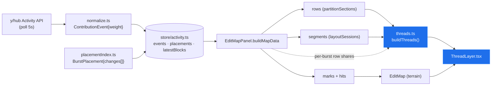
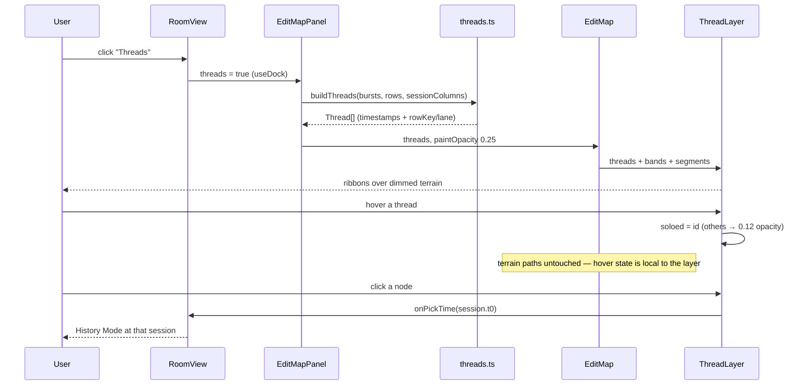
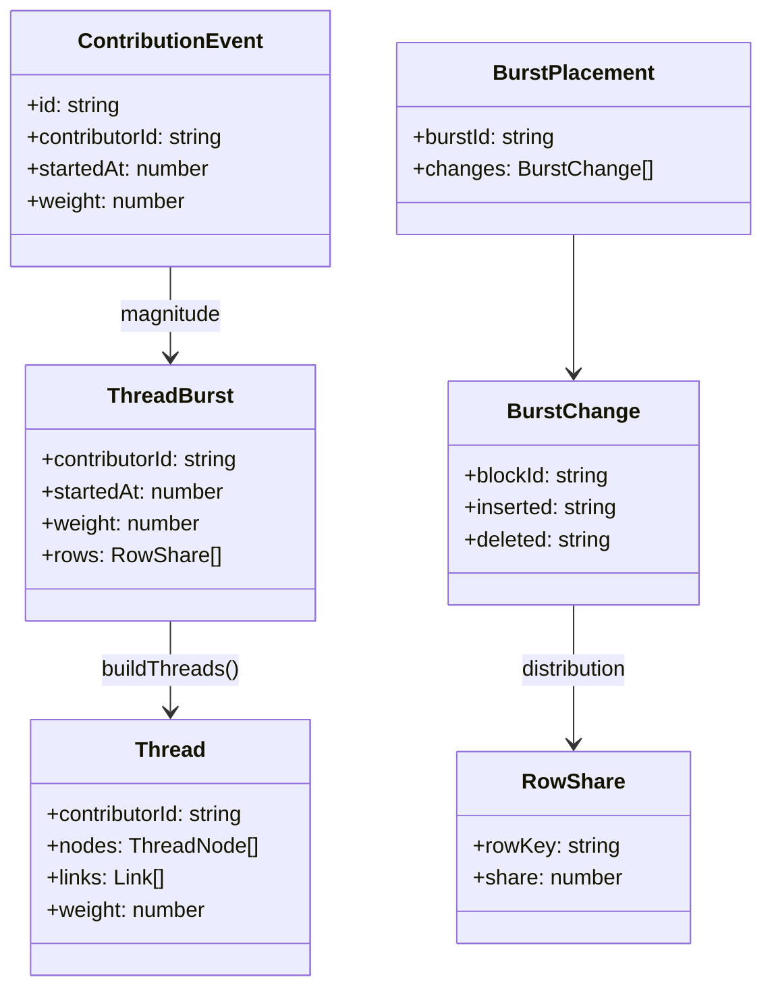

# Author Threads — What It Takes To Implement Option D

> [!TIP]
> **TL;DR** — About <mark>620 lines across 8 files and one focused day</mark>, with **no new
> dependencies and no new data fetching**. The whole layout collapses into one pure,
> pixel-free module (`src/contributions/threads.ts`) that the existing
> [EditMapPanel.tsx](../../src/components/EditMapPanel.tsx) already has every input for.
> Five things the prototype gets for free that the live app does not: sessions are not a
> list, rows are *measured* (so the sweep threshold must be relative), the terrain's
> `marks` double-count weight across rows, contributor colours collide ~79 % of the time at
> five editors, and the 0006 P3 brush chrome that 0011 assumed does not exist yet. Each has
> a small, specific fix below.

## Problem Statement

[0011](0011_%5B_%5D_AUTHOR_STORYLINES_DEEP_DIVE.md) settled the *design* of author threads
and built it as gallery tab **O** in
[prototypes/0008/index.html](prototypes/0008/index.html): focus/sweep node typing,
barycenter sub-lanes, furlough dashes, ribbon thickness, hover-solo, editor chips. It
recommended shipping threads "as a narrative lens on the same map surface … in the 0006 P3
chrome."

That recommendation is a design, not a plan. This document answers the engineering
question: **given the code that exists today, what exactly has to be written, changed, and
tested to put option D in the live dock?** It is grounded in a file-by-file read of the
shipped map pipeline rather than in the prototype's conveniences.

## Executive Summary

- **The layout is a pure function and should be written as one.** Every decision — session
  bucketing, focus vs sweep, lane order, dormancy, relative thickness — can be computed
  without touching a pixel. Keep `x` as a timestamp and `y` as `(rowKey, lane)`, resolve
  both in the renderer, and the entire algorithm becomes testable under the repo's existing
  `environment: 'node'` vitest config ([vite.config.ts](../../vite.config.ts)).
- **No new dependencies.** The prototype's connector, `C mx,ay mx,by bx,by`, *is* d3's
  `curveBumpX`; two of them mirrored vertically make a true tapered ribbon. Pulling in
  `d3-shape` to get 14 characters of path syntax would be the wrong trade in a repo whose
  only chart dependency is Recharts.
- **No new network calls.** Threads consume `events`, `placements`, and `latestBlocks` —
  all three already in [store/activity.ts](../../src/store/activity.ts) and already flowing
  into `buildMapData`.
- **Five real gaps** between prototype and product, each cheap individually but each a
  silent bug if skipped. They are the substance of this document.
- **Effort: ~620 LOC, ~1 day** for the lens; ~1.5 days including the colour-collision fix
  and the History-Mode click wiring.

---

## Current State In The Repository

| Piece | Status | What threads need from it |
| --- | --- | --- |
| [EditMapPanel.tsx](../../src/components/EditMapPanel.tsx) `buildMapData` | ✅ shipped | The assembly seam. Already computes episodes, rows, `rowKeyForBlock`, segments — every thread input |
| [EditMap.tsx](../../src/components/EditMap.tsx) | ✅ shipped | Owns `bands` (rowKey → `{y, h}`), the scroll container, and the transparent episode hit layer whose idiom the thread hit paths copy |
| [episodes.ts](../../src/contributions/episodes.ts) `foldEpisodes` | ✅ shipped | The node unit at fine granularity; `burstIds` gives the per-session regrouping |
| [sessions.ts](../../src/contributions/sessions.ts) `layoutSessions` / `xOf` / `tOf` | ✅ shipped | The x axis. Note it returns **segments**, not sessions — see Finding 1 |
| [sections.ts](../../src/contributions/sections.ts) `partitionSections` | ✅ shipped | The y bands — but a *measured* count, not a fixed 8 (Finding 2) |
| [placementIndex.ts](../../src/spotlight/placementIndex.ts) + [burstDiff.ts](../../src/spotlight/burstDiff.ts) | ✅ shipped | `BurstChange { blockId, inserted, deleted }` — exact per-block volume the prototype had to fake (Finding 3) |
| [color.ts](../../src/lib/color.ts) `colorForContributor` | ✅ shipped | Deterministic hue — with an 8-entry palette and hash-mod assignment (Finding 4) |
| [EditsPanel.tsx](../../src/components/EditsPanel.tsx) legend solo | ✅ shipped | The exact chip pattern (`aria-pressed`, `opacity-40`, `line-through`) the editor filter should reuse |
| [store/dock.ts](../../src/store/dock.ts) | ✅ shipped | Persisted chrome prefs — the natural home for the `Threads` toggle |
| 0006 P3 brush + LOD | ❌ not built | 0011's "ship it in the P3 chrome" has no chrome to ship into (Finding 5) |
| Component tests (`.tsx`) | ❌ not possible | vitest runs `environment: 'node'`, `include: ['src/**/*.test.ts']` — everything worth testing must live in a `.ts` module |

### Where the data already flows



Everything blue is new. Everything else exists and is untouched except for two props.

---

## External Research

[0011](0011_%5B_%5D_AUTHOR_STORYLINES_DEEP_DIVE.md) covers the storyline literature
(xkcd 657 → Tanahashi & Ma → StoryFlow → Ogawa & Ma) and is not repeated here. This pass
was about rendering mechanics.

> [!IMPORTANT]
> **SVG has no variable-width stroke, and never got one.** The proposals
> ([Schepers](http://schepers.cc/differentstrokes.html),
> [www-svg 2013](https://lists.w3.org/Archives/Public/www-svg/2013May/0002.html),
> [SVG WG ACTION-2583](https://www.w3.org/Graphics/SVG/WG/track/actions/2583)) stalled;
> nothing shipped. A thread whose thickness encodes volume must therefore be a **filled
> area**, not a stroked line — which is exactly what the prototype's per-segment
> constant-width strokes are approximating.

- **Hit-testing thin lines.** The standard technique is a duplicate path with
  `stroke="transparent"`, a fat `stroke-width`, and `pointer-events="stroke"`
  ([Smashing Magazine](https://www.smashingmagazine.com/2018/05/svg-interaction-pointer-events-property/),
  [CSS-Tricks almanac](https://css-tricks.com/almanac/properties/p/pointer-events/)). Caveat
  worth knowing: some engines historically ignored `stroke-width` for
  `pointer-events="stroke"` hit areas ([Mozilla bug 347374](https://bugzilla.mozilla.org/show_bug.cgi?id=347374)),
  so the transparent-fat-stroke form (which is painted, and therefore hit-tested normally)
  is the safe one — and it is the same trick `EditMap` already uses for episode rectangles.
- **React + SVG reconciliation.** The published comfort ceiling for SVG chart libraries in
  React is roughly 5 000 nodes before hover-driven re-renders stutter
  ([LogRocket 2026 survey](https://blog.logrocket.com/best-react-chart-libraries-2026/)).
  A thread layer at session granularity emits on the order of
  $|editors| \times (2|sessions| + 3)$ nodes — under 200 for any realistic room. Performance
  is a non-issue; the only discipline needed is keeping hover state out of the terrain's
  render path.
- **Curve choice.** `d3.linkHorizontal` / `curveBumpX` is the canonical connector for bump
  and storyline charts ([d3-shape/link](https://d3js.org/d3-shape/link),
  [d3-shape#152](https://github.com/d3/d3-shape/issues/152)). Its definition — cubic with
  control points at the horizontal midpoint and the endpoints' own y — is the one line the
  prototype already writes by hand.

---

## Key Findings

### 1. Sessions must be read off the axis, never re-derived

`layoutSessions(episodes, bursts, containerW)` merges **episode spans** into sessions
internally and returns only `TimeSegment[]`. A thread module that called
`mergeSessions(bursts)` for itself would get a *different* session list — bursts and
episodes have different spans — and its nodes would land beside the columns the axis draws.

> [!WARNING]
> The fix is one helper and one test, but getting it wrong produces a subtly misaligned
> chart that looks like a rounding bug and is not.

```ts
/** The session columns the axis actually drew, in order. */
export const sessionColumns = (segments: TimeSegment[]) =>
  segments.filter((s) => s.kind === 'session');

/** Which column a burst belongs to; -1 if it fell inside a collapsed seam. */
export const columnOf = (t: number, cols: TimeSegment[]) =>
  cols.findIndex((c) => t >= c.t0 && t <= c.t1);
```

### 2. Rows are measured, so the sweep threshold must be relative

The prototype has eight fixed sections and types a node as a sweep at "≥ 4 sections or a
span of 4". Live, `maxRows = max(3, floor((height − AXIS_H) / 36))` — a 260 px dock yields
about 6 rows, a short one yields 3, and the count changes when the user drags the dock
handle. An absolute threshold of 4 makes *every* episode a sweep at 3 rows and almost none
at 8.

Recommended rule, with the degenerate case named explicitly:

$$\text{sweep} \iff |rows| \ge 4 \ \wedge\ \big(|touched| \ge \max(3, \lceil |rows| / 2 \rceil) \ \vee\ \text{span} \ge \max(3, \lceil |rows| / 2 \rceil)\big)$$

This resolves 0011's open question ("consider a fraction ≥ ⅓ instead of an absolute") —
⅓ is too eager at six rows, where two adjacent sections is ordinary focused work. Half the
rows, floor of three, never below four rows total.

Two synthetic rows also exist that the prototype has no analogue for:

| Row | Threads should |
| --- | --- |
| `__removed__` | Treat as a normal band. Editing deleted content *is* a place a person was |
| `__unplaced__` | **Exclude from node typing.** "We don't know where" must not read as "everywhere" — a sweep is a claim, and this row is an absence of evidence |

### 3. `marks` double-counts weight — threads must not inherit that

[EditMapPanel.tsx:122](../../src/components/EditMapPanel.tsx#L122) pushes the burst's full
`weight` onto *every* row it touched. For a blurred kernel-density terrain that is
harmless. For a thread it is not: a sweep across six rows would report 6× its true volume
and dominate the thickness scale.

The live data supports something strictly better than the prototype's even split.
`BurstPlacement.changes` carries `{ blockId, inserted, deleted }` per block, so the *shape*
of a burst across rows is exactly known:

```ts
const share = (c: BurstChange) => c.inserted.length + c.deleted.length;
```

> [!NOTE]
> Use the placement changes for **distribution** and `ContributionEvent.weight` for
> **magnitude**. They come from independent sources — `weightOf()` counts attributed ops in
> the y/hub delta, the placement diffs two server reconstructions — and can disagree.
> Normalising the shares to sum to 1 and multiplying by `weight` keeps the R8 invariant
> [episodes.ts](../../src/contributions/episodes.ts) already cites: thread volumes reconcile
> with the Volume tab.

### 4. The colour palette collides, and threads are the view that can't survive it

`colorForContributor` hashes the deviceId into an 8-entry palette. Collisions are not an
edge case — with $k$ contributors drawn uniformly from 8 hues:

$$P(\text{collision}) = 1 - \frac{8!}{(8-k)!\,8^{k}}$$

| Contributors | 2 | 3 | 4 | 5 | 6 |
| --- | --- | --- | --- | --- | --- |
| P(two share a hue) | 13 % | 34 % | 59 % | **79 %** | 92 % |

The terrain tolerates this because multiply-blended lobes were never meant to be traced
back to one person by hue alone; the hover chip names them. Threads cannot: *"follow Ada"*
is the entire value proposition, and it breaks the moment Ada and Sam are both blue.

Fix — a deterministic, collision-free assignment that stays identical on every client
(the contributor list is server-derived and ordered identically everywhere):

```ts
/** Hash preference, greedily de-duplicated over the present contributors. */
export function assignColors(ids: string[]): Map<string, string> {
  const sorted = [...ids].sort();                 // determinism, not arrival order
  const taken = new Set<number>();
  const out = new Map<string, string>();
  for (const id of sorted) {
    let i = hashIndex(id);                        // today's colorForContributor slot
    for (let n = 0; n < PALETTE.length && taken.has(i); n += 1) i = (i + 1) % PALETTE.length;
    taken.add(i);
    out.set(id, PALETTE[i]!);
  }
  return out;                                     // beyond 8 contributors, reuse + top-N
}
```

This is a change with blast radius — the terrain, the Volume tab, and the legend all read
`colorForContributor` — so it ships as an additive function the thread lens opts into
first, and graduates to the default only after a look at a real room.

### 5. There is no brush to hang the lens on

0011 recommended shipping "in the 0006 P3 chrome" (overview strip + brush + LOD ladder).
None of it is built; the map today is a single always-scrolling terrain. Consequences:

- **Do it anyway.** Threads do not depend on the brush — they need rows, an x axis, and
  colours, all of which exist. Waiting on P3 is what turns explorations into backlog.
- **0011's R1 mitigation ("cap dormancy to the brushed window") has nothing to cap to.**
  Substitute: dormant dashes render across skipped sessions unconditionally, and a thread
  that has been absent for the last third of the axis ends with an exit label instead of a
  dash. Revisit when P3 lands.
- **The granularity switch (episode nodes under a narrow brush) is out of scope.** Ship
  session × contributor nodes only.

### 6. Row repartitioning under live polling is the real stability risk

`partitionSections` is a greedy equal-mass split recomputed from `latestBlocks` on every
poll, and the row *count* changes whenever the dock is resized. Terrain hides boundary
drift — it is a blur. A thread will visibly snap between bands when a paragraph grows
enough to move a boundary.

Mitigation is already idiomatic in this codebase: `EditMap` has `useMorphedSeries`, a 300 ms
eased lerp with a snap fallback when array lengths change (0005 R3). Node `y` values want
exactly that treatment — lerp when the same `(contributorId, session.t0)` key persists,
snap when rows are added or removed.

### 7. Everything worth testing can be pixel-free

If `buildThreads` returns nodes carrying a **timestamp** and a **`(rowKey, lane)`** pair
rather than `x`/`y`, the module has no dependency on band heights, plot height, or the
scroll container — and the renderer's job shrinks to two lookups. The barycenter pass still
works: bands are stacked in row order, so `(rowIndex, lane)` is order-isomorphic to `y`.

That is what makes the whole feature testable in a repo whose vitest config is
`environment: 'node'` and `include: ['src/**/*.test.ts']` — component tests are not
available today, and this design does not need them.

---

## Options And Tradeoffs

### Where the lens lives

| Option | Shape | Verdict |
| --- | --- | --- |
| **Toggle over the terrain, inside `EditMap`** | Base paint drops to ~0.25 opacity; `ThreadLayer` renders above it, shares bands/segments/scroll | ✅ **Recommended** — one surface, zero new axis code, matches 0011's call |
| Third dock tab (`Map / Volume / Threads`) | Independent component, own axis assembly | 🛑 Duplicates band + axis logic; tab sprawl in a 260 px dock |
| Replace the terrain as default paint | Boldest | 🛑 Single-author rooms — the demo common case — reduce to one line |
| Separate route / full-screen view | Room to breathe | 🚧 Real appeal at ≥6 editors, but it is a different product surface. Not now |

### Ribbon rendering

| Option | Fidelity | Cost | Verdict |
| --- | --- | --- | --- |
| Constant-width stroke per thread | No volume encoding | ~0 | 🛑 Throws away 0011's finding 4 |
| **Per-segment stroke, endpoint-averaged** (the prototype) | Steps at each node, hidden by node dots | ~0 | 🚧 Fine fallback if time runs out |
| **Mirrored bump-curve fill** | True taper, exact | +20 LOC | ✅ **Recommended** — and it lets node dots shrink, which is what makes the bundling adjacency cue legible |
| Import `d3-shape` for `area` + `curveBumpX` | Same output | +1 dep, ~30 KB | 🛑 Not for 14 characters of path syntax |

### Node granularity

| Granularity | Nodes | Verdict |
| --- | --- | --- |
| **Session × contributor** | ~`editors × sessions` | ✅ Default, as 0011 specified |
| Episode-level | ~`episodes` | 🚧 Needs the brush to be worth it (Finding 5) |
| Burst-level | hundreds | 🛑 Spaghetti returns |

### Layout module placement

| Option | Verdict |
| --- | --- |
| Inline in `buildMapData` | 🛑 `buildMapData` is already 80 lines and untested; adding layout makes both worse |
| **`src/contributions/threads.ts`, pixel-free, called by the panel** | ✅ **Recommended** — matches `sections.ts` / `sessions.ts` / `episodes.ts` precedent, testable under the current vitest config |

---

## Recommendation

Ship the lens in this order. Steps 1–4 are the feature; 5–6 are the polish that makes it
worth having.

1. **`src/contributions/threads.ts`** — the pure layout, pixel-free, with `threads.test.ts`
   alongside. Session bucketing from segments (Finding 1), relative sweep typing
   (Finding 2), weight distribution from placement changes (Finding 3), barycenter lanes,
   dormancy links, top-N by total weight.
2. **`src/components/ThreadLayer.tsx`** — curtains, mirrored-bump ribbons, dormant dashes,
   nodes, entry/exit labels, transparent fat-stroke hit paths, local `soloed` state.
3. **Two props on `EditMap`** — `threads?: ThreadGeometry` and `paintOpacity = 1` (multiplies
   the terrain's `fillOpacity`). When threads are on, the episode hit layer goes
   `pointerEvents: 'none'`: one hover semantics at a time.
4. **Chrome** — a `Threads` toggle persisted in [store/dock.ts](../../src/store/dock.ts),
   and make the contributor legend already in the dock header
   ([RoomView.tsx:81](../../src/components/RoomView.tsx#L81)) clickable, copying
   `EditsPanel`'s `aria-pressed` chip pattern verbatim.
5. **Node click → History Mode.** `onPickTime(session.t0)` already exists and already
   works; a node click is one call. The editor spotlight waits on
   [0003](0003_%5B_%5D_TIMELINE_HOVER_EDIT_SPOTLIGHT.md).
6. **`assignColors`** (Finding 4), opt-in from the thread lens only.

> [!IMPORTANT]
> The one decision that shapes everything else: **`buildThreads` returns timestamps and
> `(rowKey, lane)`, never pixels.** It is what keeps the algorithm inside the repo's
> existing test setup, and it is what lets `ThreadLayer` stay a dumb renderer.



---

## Example Code

### The module's contract

```ts
// src/contributions/threads.ts

/** One contributor's work in one session column. */
export type ThreadNode =
  | { kind: 'focus'; session: number; t: number; rowKey: string;
      lane: number; laneCount: number; weight: number }
  | { kind: 'sweep'; session: number; t: number; rowKey0: string; rowKey1: string;
      weight: number };

export interface Thread {
  contributorId: ContributorId;
  nodes: ThreadNode[];
  /** nodes[i-1] → nodes[i]; `dormant` when session columns were skipped. */
  links: Array<{ from: number; to: number; dormant: boolean }>;
  /** Σ node weight — the top-N cut and the legend order. */
  weight: number;
}

export interface ThreadGeometry {
  threads: Thread[];
  /** Denominator for the √-scaled ribbon width. */
  maxNodeWeight: number;
}

/** Pixel-free by construction: `t` is unix ms, y is (rowKey, lane). */
export function buildThreads(
  bursts: ThreadBurst[],          // { contributorId, startedAt, weight, rows: {rowKey, share}[] }
  rows: MapRow[],                 // document order; index is the y ordinal
  columns: TimeSegment[],         // sessionColumns(segments)
  opts?: { topN?: number; hidden?: ReadonlySet<ContributorId> },
): ThreadGeometry;
```

<details>
<summary>Node typing and the barycenter pass — the two load-bearing loops</summary>

```ts
const SWEEP_MIN_ROWS = 4;

function sweepThreshold(rowCount: number): number {
  return Math.max(3, Math.ceil(rowCount / 2));
}

// Per (column × contributor): distribute weight over rows, then type the node.
function typeNode(perRow: Map<string, number>, rowIndex: Map<string, number>, rowCount: number) {
  const touched = [...perRow.keys()]
    .filter((k) => k !== UNPLACED_ROW_KEY)            // Finding 2: absence ≠ everywhere
    .map((k) => rowIndex.get(k)!)
    .sort((a, b) => a - b);
  if (touched.length === 0) return null;

  const span = touched.at(-1)! - touched[0]! + 1;
  const cut = sweepThreshold(rowCount);
  if (rowCount >= SWEEP_MIN_ROWS && (touched.length >= cut || span >= cut)) {
    return { kind: 'sweep' as const, row0: touched[0]!, row1: touched.at(-1)! };
  }
  // Focus: the row that took the most characters, not the median row.
  let best = touched[0]!, bestV = -1;
  for (const [key, v] of perRow) {
    const i = rowIndex.get(key);
    if (i != null && v > bestV) { best = i; bestV = v; }
  }
  return { kind: 'focus' as const, row: best };
}

// Sub-lane order inside one (column × row) bundle: sort by where each thread
// came from. One barycenter pass is the whole crossing-minimisation story —
// see 0011 finding 1 for why the NP-hard solver is unnecessary here.
bundle.sort((a, b) => (lastOrdinal.get(a) ?? rowOrdinal) - (lastOrdinal.get(b) ?? rowOrdinal));
bundle.forEach((id, i) => place(id, { lane: i, laneCount: bundle.length }));
```

</details>

### The tapered ribbon, without d3

Two vertically-offset bump curves, joined and filled. Vertical offset of a cubic is exactly
a cubic, so the only approximation is the linear taper between endpoint half-widths — the
same approximation `d3.area().curve(curveBumpX)` makes.

```tsx
/** Tapered connector from (x0,y0) at width w0 to (x1,y1) at width w1. */
function ribbonPath(x0: number, y0: number, w0: number,
                    x1: number, y1: number, w1: number): string {
  const mx = (x0 + x1) / 2;
  const a = w0 / 2, b = w1 / 2;
  return (
    `M${x0},${y0 - a} C${mx},${y0 - a} ${mx},${y1 - b} ${x1},${y1 - b}` +
    `L${x1},${y1 + b} C${mx},${y1 + b} ${mx},${y0 + a} ${x0},${y0 + a} Z`
  );
}

const widthOf = (w: number, max: number) => 1.6 + 6.5 * Math.sqrt(w / max);
```

### Render order inside the SVG

```text
┌──────────────────────────────────────────────────────────────┐
│ row baselines                                                │
│ terrain lobes            ← fillOpacity × paintOpacity (0.25)  │
│ idle-gap seams · session ticks                                │
│ ── thread layer ──────────────────────────────────────────── │
│   curtains (sweep pills, fill-opacity 0.18)                   │
│   dormant dashes → ribbons → node dots → entry/exit labels    │
│   transparent fat-stroke hit paths  (pointer-events: stroke)  │
│ episode hit layer        ← pointerEvents:'none' while on      │
│ hover chip                                                    │
└──────────────────────────────────────────────────────────────┘
```

### Types at a glance



---

## Effort

| File | Change | LOC | Notes |
| --- | --- | --- | --- |
| `src/contributions/threads.ts` | 🆕 new | ~170 | Pure layout; no React, no pixels |
| `src/contributions/threads.test.ts` | 🆕 new | ~180 | ~10 cases, table-driven like `sections.test.ts` |
| `src/components/ThreadLayer.tsx` | 🆕 new | ~150 | SVG + local solo state |
| `src/components/EditMap.tsx` | ✏️ edit | +25 / −2 | Two props; gate the episode hit layer |
| `src/components/EditMapPanel.tsx` | ✏️ edit | +45 | Row shares from placements; call `buildThreads` |
| `src/components/RoomView.tsx` | ✏️ edit | +25 | Toggle + clickable legend chips |
| `src/store/dock.ts` | ✏️ edit | +6 | Persist `threads` |
| `src/lib/color.ts` | ✏️ edit | +25 | `assignColors` (additive) |
| **Total** | | **~620** | **~1 day**, ~1.5 with colours and History-Mode clicks |

---

## Risks And Open Questions

| # | Risk | Impact | Likelihood | Mitigation |
| --- | --- | --- | --- | --- |
| R1 | Row boundaries drift every poll; threads snap between bands | Trust | High | Morph node `y` with the existing `useMorphedSeries` idiom (Finding 6); snap only when the row set changes |
| R2 | Colour collisions make two editors indistinguishable | **Feature-defeating** | 79 % at 5 editors | `assignColors` (Finding 4) |
| R3 | Thin bands (`MIN_ROW_H = 12`) can't hold two sub-lanes | Overlap | Med | Lane gap = `clamp(band.h / 5, 6, 13)`; below ~28 px collapse the bundle to one lane with a shared multi-colour node (0011 R2) |
| R4 | Cold backfill: only `placements.size / events.size` bursts are located, so threads reshape as placements arrive | Confusion | Med | Build threads from **placed** bursts only; the panel already renders a "Locating edits… (n/m)" note |
| R5 | `pointer-events: stroke` hit-area inconsistency across engines | Hover misses | Low | Use painted transparent fat strokes, not `pointer-events="stroke"` on the visible path |
| R6 | Single-author rooms reduce to one line over a dimmed terrain | "Why is this here?" | High in demos | Hide the toggle below 2 contributors, or auto-off; the terrain is strictly better there |
| R7 | Weight double-count if `marks` is reused as the thread input | Wrong thickness | Med | Distinct input type (`ThreadBurst`), asserted in tests (Finding 3) |

Open questions this document cannot settle from the repo alone:

- [ ] Is `max(3, ⌈rows/2⌉)` the right sweep cut on a real 3-row dock, or should sweeps be
      suppressed below 5 rows rather than 4?
- [ ] Should a curtain claim lane space or float behind focus nodes, as prototyped?
      (Inherited from 0011; still open.)
- [ ] Does `assignColors` graduate to the global default, and if so does changing a
      contributor's colour mid-room read as a bug?
- [ ] Does thickness-as-magnitude survive contact with real character counts, where one
      paste can be 50× a session of typing? Consider $\log$ rather than $\sqrt{}$ if so.
- [ ] Should the dormancy dash render at all before the 0006 P3 brush exists, or is an exit
      label sufficient on a scrolling axis?

---

## Implementation Checklist

**Status:** `░░░░░░░░░░ 0/14 items`

- [x] `sessionColumns` + `columnOf` helpers in [sessions.ts](../../src/contributions/sessions.ts), with tests
- [ ] `ThreadBurst` assembly in `buildMapData`: per-row shares from `BurstPlacement.changes`,
      normalised and scaled by `ContributionEvent.weight` (Finding 3)
- [ ] `src/contributions/threads.ts` — session bucketing, focus/sweep typing with the
      relative threshold, barycenter lanes, dormancy links, top-N cut
- [ ] `src/contributions/threads.test.ts` — see Validation
- [ ] `ThreadLayer.tsx` — curtains, `ribbonPath` ribbons, dormant dashes, node dots,
      entry/exit labels
- [ ] Transparent fat-stroke hit paths + hover-solo (local state, others → 0.12 opacity)
- [ ] `EditMap` props: `threads`, `paintOpacity`; episode hits `pointerEvents:'none'` when on
- [ ] `threads: boolean` in [store/dock.ts](../../src/store/dock.ts), persisted via `partialize`
- [ ] `Threads` toggle in the dock header; hidden below 2 contributors (R6)
- [ ] Contributor legend chips become filters, reusing `EditsPanel`'s `aria-pressed` pattern
- [ ] Node click → `onPickTime(session.t0)`
- [ ] `assignColors` in [color.ts](../../src/lib/color.ts), consumed by the thread lens
- [ ] Node-`y` morphing on row repartition (Finding 6)
- [ ] README: one paragraph on the Threads lens, beside the Map/Volume description

## Validation Checklist

- [ ] **V1** `pnpm test` green — the 59 existing tests plus the new `threads.test.ts`
- [ ] **V2** `pnpm build` green under the strict tsconfig (`tsc --noEmit && vite build`)
- [ ] **V3** Unit: a burst spanning 6 of 6 rows produces **one** sweep node whose weight
      equals the event weight — not 6× (Finding 3 / R7)
- [ ] **V4** Unit: with 3 rows, no node is ever typed `sweep`; with 8 rows, a 4-row episode
      is focus and a 5-row episode is sweep (Finding 2)
- [ ] **V5** Unit: a contributor absent for sessions 2–4 yields exactly one link with
      `dormant: true` spanning them, not three
- [ ] **V6** Unit: two contributors bundled in the same row get distinct lanes, and the lane
      order matches their previous row ordinals (the barycenter pass)
- [ ] **V7** Unit: `__unplaced__` never contributes to sweep typing
- [ ] **V8** Live: a two-contributor room renders two traceable, distinctly-coloured threads;
      toggling Threads preserves scroll position and the live-edge pin
- [ ] **V9** Live: clicking a node enters History Mode at that session; "Return to live" works
- [ ] **V10** Live: at `width < 480` (`labelW = 0`) threads still render and entry labels
      don't clip off the left edge
- [ ] **V11** Live: thread volumes summed per contributor match the Volume tab's totals
- [ ] **V12** Blind test (0011 V5): a viewer unfamiliar with the room answers "who drafted,
      who reorganised, who polished" from the threads alone

---

## References

**This repository**

- [0011](0011_%5B_%5D_AUTHOR_STORYLINES_DEEP_DIVE.md) — the design this document implements
  (tab O semantics, storyline literature) · [0008](0008_%5B_%5D_UI_PROTOTYPE_GALLERY.md) —
  option D, the baseline · [0006](0006_%5B_%5D_SCALE_ADAPTIVE_EDIT_NARRATIVE.md) — the P3
  chrome that does not exist yet · [0005](0005_%5Bx%5D_ORGANIC_EDIT_TERRAIN.md) — the terrain
  the lens dims · [0003](0003_%5B_%5D_TIMELINE_HOVER_EDIT_SPOTLIGHT.md) — the editor
  spotlight a node click eventually triggers
- [prototypes/0008/index.html](prototypes/0008/index.html) — tab O, the source geometry
- [EditMap.tsx](../../src/components/EditMap.tsx) · [EditMapPanel.tsx](../../src/components/EditMapPanel.tsx)
  · [EditsPanel.tsx](../../src/components/EditsPanel.tsx) (the chip pattern) ·
  [RoomView.tsx](../../src/components/RoomView.tsx)
- [episodes.ts](../../src/contributions/episodes.ts) · [sections.ts](../../src/contributions/sections.ts)
  · [sessions.ts](../../src/contributions/sessions.ts) · [placementIndex.ts](../../src/spotlight/placementIndex.ts)
  · [burstDiff.ts](../../src/spotlight/burstDiff.ts) · [color.ts](../../src/lib/color.ts)
  · [store/dock.ts](../../src/store/dock.ts) · [vite.config.ts](../../vite.config.ts)

**External**

- [Smashing Magazine — Managing SVG Interaction With The Pointer Events Property](https://www.smashingmagazine.com/2018/05/svg-interaction-pointer-events-property/)
  · [CSS-Tricks — `pointer-events`](https://css-tricks.com/almanac/properties/p/pointer-events/)
  · [Mozilla bug 347374 — `pointer-events="stroke"` and `stroke-width`](https://bugzilla.mozilla.org/show_bug.cgi?id=347374)
  — why the hit layer is a painted transparent fat stroke
- [Schepers — SVG variable stroke-width proposal](http://schepers.cc/differentstrokes.html)
  · [www-svg, May 2013 — thoughts on variable-width strokes in SVG2](https://lists.w3.org/Archives/Public/www-svg/2013May/0002.html)
  · [SVG WG ACTION-2583](https://www.w3.org/Graphics/SVG/WG/track/actions/2583) — the feature
  that never shipped, hence filled ribbons
- [d3-shape — links](https://d3js.org/d3-shape/link) · [d3-shape#152 — `curveBump`](https://github.com/d3/d3-shape/issues/152)
  — the canonical bump connector we hand-roll
- [LogRocket — Best React chart libraries, 2026](https://blog.logrocket.com/best-react-chart-libraries-2026/)
  — the ~5 000-SVG-node reconciliation ceiling this layer sits three orders of magnitude under
